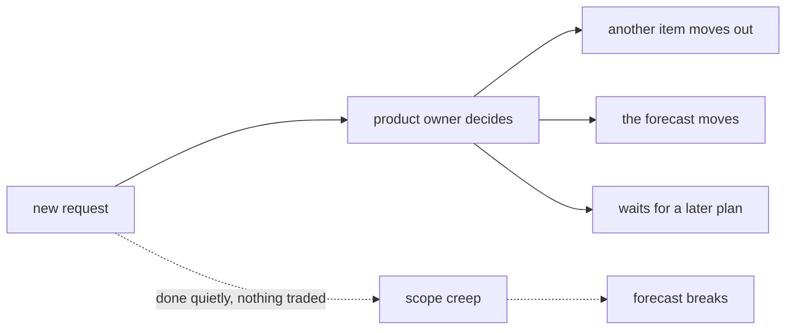

## Before you start

- [[management.l2.schedule-buffer]] — you know a buffer is room for the uncertainty of planned work, and that a new request goes to the product owner instead of taking buffer days.
- [[management.l1.meetings-and-communication]] — you know meeting notes record the decision, its reason, the actions with names, and what is still open.

## The situation

It is Sprint 14, and you are working on the cancel feature. The sprint goal is that customers can cancel their own unpaid orders without calling. A colleague from customer care stops by: "While you're in there, could customers cancel a paid order and just get their money back? It's one more button." It sounds small, and you are already in that code. If you say yes quietly, nobody else will even know. Can you simply add it, and if not, what should happen to a request like this?

## Core concepts

- scope — the set of work a plan covers; anything outside it is not in this plan, however useful.
- trade — what gives when work is added: another item moves out, the forecast moves, or the addition waits for a later plan.
- **scope creep** — scope growing a little at a time through additions that trade nothing back in the plan.

## How it works



A plan is a set of work that fits the time and people available. The forecast you learned to make is built on it: this many points, this many sprints. Adding work to that set without changing anything else makes the plan false, even if each addition looks tiny.

So when work is added, something must give. There are three honest ways. Another item of the same size moves out of the plan. The forecast moves, and the people waiting for it hear so. Or the addition waits for a later plan and goes into the list of future work. Which one to choose is decided with the product owner, the person who decides the order of the work, because the product owner is the one who weighs one item against another.

This is not a rule against change. The 2020 Scrum Guide says that during a sprint no changes are made that would endanger the Sprint Goal, the one outcome the sprint is meant to deliver, and that scope may be clarified and renegotiated with the Product Owner as more is learned. Change is expected; what it rules out is change that quietly breaks the goal.

The dashed path in the diagram is the other way scope grows. Someone asks for one small thing, and it is done without asking what gives. Then another. That is scope creep. Each addition looks cheap on its own, and none of them was ever weighed against anything. Together they can make a forecast that was honest when it was made turn out wrong.

## In the Đơn Hàng system

The request in the situation was answered before it came up. In `docs/team/meeting-notes-example.md`, the meeting decided that a `paid` order cannot be cancelled from the app, and that the customer must request a refund instead. The reason follows the decision:

```markdown file=docs/team/meeting-notes-example.md tag=stage-1 lines=13-15
Hoàn tiền cần đối soát với cổng thanh toán; đội chưa có phần đó. Cho phép hủy
mà không hoàn tiền sẽ tạo ra đơn đã hủy nhưng đã thu tiền — trạng thái không ai
xử lý được.
```

A refund needs checking against the payment gateway, which the team does not have yet. Allowing a cancel without a refund would create an order that is cancelled but already paid for, a state nobody can handle. So refunds stay out of this sprint. In the notes' action table, the product owner will write a story for the refund flow before the next sprint. That is a scope decision with its reason: the work is not refused, it waits for a later plan.

Be exact about where things stand. At this tag the app has no cancel button at all, so it cannot cancel a paid order, but the API's `PATCH /api/v1/orders/{id}/cancel` still cancels one. The notes give a developer the job of adding a status check to the cancel API in this sprint; at this tag that check is not in the code yet.

`docs/team/lifecycle-example.md` tells the same story from the design step of the cancel feature:

```markdown file=docs/team/lifecycle-example.md tag=stage-1 lines=12-13
Đội thống nhất: chỉ hủy được đơn ở trạng thái `new`; đơn đã `paid` phải qua bộ
phận hoàn tiền. Quyết định này được ghi lại vì nó thu hẹp phạm vi rất nhiều.
```

Only orders in state `new` can be cancelled; `paid` ones go through the refund department. The second sentence is the point: the decision was written down because it narrows the scope a lot. Narrowing was a choice the team recorded, not a failure it hid.

## Beginners often think…

- **"A small extra request is quicker to just do than to take to the product owner."** → Actually a small request done quietly is exactly how scope creep starts: nothing was traded, so the plan is now false. You notice this when a sprint that "only had a few small extras" ends with its planned items carried over.
- **"In Scrum, nothing about the sprint's work may change once the sprint starts."** → Actually the 2020 Scrum Guide lets scope be clarified and renegotiated with the Product Owner as more is learned; what it rules out is change that endangers the Sprint Goal. You notice this when a team refuses to move a smaller part of an item to a later plan, once it understands the item better, only because "the sprint has started".
- **"Narrowing what a feature does is admitting the team failed."** → Actually narrowing is a scope decision, and `lifecycle-example.md` records it as one, with its reason. You notice this when a team that treats every narrowing as failure keeps its full scope and misses its forecast instead.

## Try it (3 minutes)

Think back to the refund forecast: 30 points left, 6 to 8 points a sprint, from 4 to 5 sprints (divide by each end of the range and round up).

1. During the work, three small requests arrive, of 2, 2 and 1 points, and each is added without anything moving out. Compute the new range.
2. Write down what the product owner could have done with each request instead.

Expected result: 35 / 8 ≈ 4.4 rounds up to 5 and 35 / 6 ≈ 5.8 rounds up to 6, so from 5 to 6 sprints, a whole sprint later on both ends. Step 2: move a same-sized item out, accept and announce the new forecast, or keep the request for a later plan.

The customer care colleague from the situation comes back a week later and asks why the button is still not there. What do you answer?

<details><summary>Suggested answer</summary>

That the team decided, in the meeting whose notes are in `docs/team/meeting-notes-example.md`, not to let the app cancel paid orders yet, because a refund needs checking against the payment gateway and the team does not have that part. Refunds are planned as a later story, which the product owner is writing. If the request matters more than that, the product owner is the person to talk to about moving it earlier.

</details>

## Connections

- [[management.l2.schedule-buffer]] — prerequisite: the buffer is not room for new work; this lesson is what happens to new work instead.
- [[management.l1.meetings-and-communication]] — prerequisite: the meeting notes that recorded this scope decision and its reason.
- [[management.l2.forecasting-with-velocity]] — the forecast that moves when work is added without trading.
- [[management.l2.requirements-document]] — where a larger piece of work writes down what is out of scope before it starts.

## Five-line summary

1. When work is added to a plan, something must give: an item moves out, the forecast moves, or the addition waits.
2. The 2020 Scrum Guide rules out changes that endanger the Sprint Goal, but lets scope be renegotiated with the Product Owner.
3. The meeting notes keep refunds out of the sprint, with a reason, and turn them into a later story.
4. At stage-1 the app has no cancel button, but the API's cancel endpoint still cancels a paid order.
5. Scope creep is work added bit by bit with nothing traded back; each piece looks cheap, together they break the forecast.
