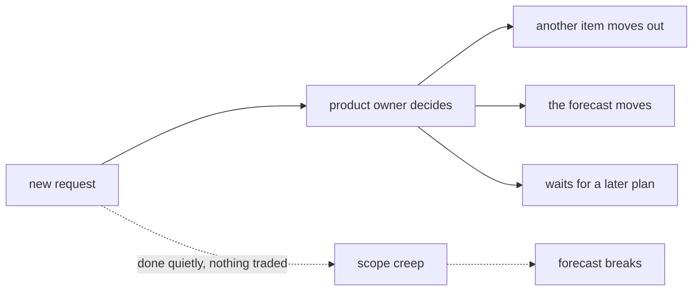

## Bạn cần biết trước

- [[management.l2.schedule-buffer]] — bạn biết thời gian dự phòng là chỗ cho độ bất định của việc đã lên kế hoạch, và một yêu cầu mới đi tới product owner chứ không lấy ngày dự phòng.
- [[management.l1.meetings-and-communication]] — bạn biết biên bản họp ghi quyết định, lý do, các việc cần làm kèm tên người, và những gì còn bỏ ngỏ.

## Tình huống

Đang là Sprint 14, và bạn đang làm tính năng hủy đơn. Mục tiêu sprint là khách tự hủy được đơn chưa thanh toán mà không cần gọi điện. Một đồng nghiệp bên chăm sóc khách hàng ghé qua: "Nhân tiện bạn đang sửa chỗ đó, cho khách hủy luôn đơn đã thanh toán rồi trả tiền lại được không? Thêm một nút thôi mà." Nghe thì nhỏ, và bạn đang ở sẵn trong đoạn code đó. Nếu bạn lặng lẽ đồng ý, chẳng ai khác biết. Bạn có cứ thế thêm vào được không, và nếu không, một yêu cầu như vậy nên đi đâu?

## Khái niệm cốt lõi

- phạm vi — tập công việc mà một kế hoạch bao gồm, và thứ gì nằm ngoài đó thì không thuộc kế hoạch này, dù hữu ích đến đâu.
- đánh đổi — thứ phải nhường khi có việc được thêm vào: một việc khác bị đưa ra, dự báo dịch đi, hoặc phần thêm chờ tới một kế hoạch sau.
- **scope creep** — phạm vi phình dần từng chút qua những thứ thêm vào mà không đổi lại gì trong kế hoạch.

## Cơ chế hoạt động



Kế hoạch là một tập công việc vừa với thời gian và số người hiện có. Dự báo bạn đã học cách lập dựa trên đó: chừng này điểm, chừng này sprint. Thêm việc vào tập đó mà không đổi gì khác sẽ làm kế hoạch thành sai, dù từng thứ thêm vào trông tí hon.

Vì vậy khi có việc được thêm, phải có gì đó nhường chỗ. Có ba cách trung thực. Một việc khác cùng cỡ bị đưa ra khỏi kế hoạch. Dự báo dịch đi, và những người đang chờ được báo điều đó. Hoặc phần thêm chờ tới một kế hoạch sau và nằm trong danh sách việc tương lai. Chọn cách nào thì quyết cùng product owner, người quyết định thứ tự công việc, vì product owner là người cân việc này với việc kia.

Đây không phải quy tắc cấm thay đổi. Scrum Guide 2020 nói trong sprint không có thay đổi nào làm nguy hại tới Sprint Goal, tức kết quả duy nhất mà sprint nhắm tới, và phạm vi có thể được làm rõ và thương lượng lại với Product Owner khi biết thêm. Thay đổi là chuyện được chờ đợi. Điều bị loại là thay đổi lặng lẽ làm hỏng mục tiêu.

Đường nét đứt trong sơ đồ là cách thứ hai khiến phạm vi phình ra. Ai đó xin một thứ nhỏ, và nó được làm mà không ai hỏi phải đổi lại gì. Rồi thêm một thứ nữa. Đó là scope creep. Mỗi thứ thêm vào trông rẻ khi đứng riêng, và chưa thứ nào từng được cân với thứ gì. Gộp lại, chúng có thể khiến một dự báo vốn trung thực lúc được lập hóa ra sai.

## Trong hệ thống Đơn Hàng

Yêu cầu trong tình huống đã được trả lời trước khi nó xuất hiện. Trong `docs/team/meeting-notes-example.md`, cuộc họp quyết định đơn `paid` không hủy được từ ứng dụng, và khách phải yêu cầu hoàn tiền. Lý do đi ngay sau quyết định:

```markdown file=docs/team/meeting-notes-example.md tag=stage-1 lines=13-15
Hoàn tiền cần đối soát với cổng thanh toán; đội chưa có phần đó. Cho phép hủy
mà không hoàn tiền sẽ tạo ra đơn đã hủy nhưng đã thu tiền — trạng thái không ai
xử lý được.
```

Hoàn tiền cần đối chiếu với cổng thanh toán, phần đội chưa có. Cho hủy mà không hoàn tiền sẽ tạo ra đơn đã hủy nhưng đã thu tiền, một trạng thái không ai xử lý được. Nên hoàn tiền nằm ngoài sprint này. Trong bảng việc phải làm của biên bản, product owner sẽ viết story cho luồng hoàn tiền trước sprint sau. Đó là một quyết định về phạm vi kèm lý do: việc không bị từ chối, nó chờ một kế hoạch sau.

Hãy nói cho chính xác tình trạng hiện tại. Ở tag này, ứng dụng không có nút hủy nào, nên không hủy được đơn đã thanh toán, nhưng `PATCH /api/v1/orders/{id}/cancel` của API vẫn hủy được. Biên bản giao cho một lập trình viên thêm phần kiểm trạng thái vào API hủy trong sprint này. Ở tag này, phần kiểm đó chưa có trong code.

`docs/team/lifecycle-example.md` kể cùng câu chuyện đó từ bước thiết kế của tính năng hủy:

```markdown file=docs/team/lifecycle-example.md tag=stage-1 lines=12-13
Đội thống nhất: chỉ hủy được đơn ở trạng thái `new`; đơn đã `paid` phải qua bộ
phận hoàn tiền. Quyết định này được ghi lại vì nó thu hẹp phạm vi rất nhiều.
```

Chỉ đơn ở trạng thái `new` mới hủy được, còn đơn `paid` phải qua bộ phận hoàn tiền. Câu thứ hai mới là điểm chính: quyết định được ghi lại vì nó thu hẹp phạm vi rất nhiều. Thu hẹp là một lựa chọn đội đã ghi lại, không phải một thất bại đội giấu đi.

## Người mới hay nghĩ rằng…

- **"Một yêu cầu thêm nhỏ thì cứ làm luôn cho nhanh, khỏi mang tới product owner."** → Thực ra một yêu cầu nhỏ được làm lặng lẽ chính là cách scope creep bắt đầu: không có gì được đổi lại, nên kế hoạch giờ đã sai. Bạn sẽ nhận ra khi một sprint "chỉ có vài thứ thêm nho nhỏ" kết thúc với các việc đã lên kế hoạch bị chuyển sang sprint sau.
- **"Trong Scrum, sprint đã bắt đầu thì công việc trong đó không được đổi gì cả."** → Thực ra Scrum Guide 2020 cho phép làm rõ và thương lượng lại phạm vi với Product Owner khi biết thêm, còn điều nó loại là thay đổi làm nguy hại Sprint Goal. Bạn sẽ nhận ra khi một đội từ chối dời một phần nhỏ của một việc sang kế hoạch sau, dù đã hiểu việc đó rõ hơn, chỉ vì "sprint bắt đầu rồi".
- **"Thu hẹp những gì một tính năng làm là thừa nhận đội đã thất bại."** → Thực ra thu hẹp là một quyết định về phạm vi, và `lifecycle-example.md` ghi nó đúng như vậy, kèm lý do. Bạn sẽ nhận ra khi một đội coi mọi lần thu hẹp là thất bại cứ giữ nguyên toàn bộ phạm vi, rồi trễ dự báo.

## Thử ngay (3 phút)

Nhớ lại dự báo hoàn tiền: còn 30 điểm, 6 đến 8 điểm mỗi sprint, từ 4 đến 5 sprint (chia cho từng đầu của khoảng rồi làm tròn lên).

1. Trong lúc làm, ba yêu cầu nhỏ tới, 2, 2 và 1 điểm, và mỗi cái được thêm vào mà không có gì bị đưa ra. Tính khoảng mới.
2. Ghi ra product owner lẽ ra có thể làm gì với từng yêu cầu.

Kết quả mong đợi: 35 / 8 ≈ 4,4 làm tròn lên 5 và 35 / 6 ≈ 5,8 làm tròn lên 6, nên từ 5 đến 6 sprint, trễ trọn một sprint ở cả hai đầu. Bước 2: đưa một việc cùng cỡ ra, chấp nhận và báo dự báo mới, hoặc giữ yêu cầu cho một kế hoạch sau.

Đồng nghiệp bên chăm sóc khách hàng trong tình huống quay lại một tuần sau và hỏi sao vẫn chưa có nút đó. Bạn trả lời thế nào?

<details><summary>Gợi ý đáp án</summary>

Rằng đội đã quyết, trong cuộc họp có biên bản ở `docs/team/meeting-notes-example.md`, chưa cho ứng dụng hủy đơn đã thanh toán, vì hoàn tiền cần đối chiếu với cổng thanh toán mà đội chưa có phần đó. Hoàn tiền được lên kế hoạch thành một story sau, product owner đang viết. Nếu yêu cầu này quan trọng hơn thế, product owner là người nên gặp để bàn chuyện đưa nó lên sớm hơn.

</details>

## Liên hệ

- [[management.l2.schedule-buffer]] — bài cần trước: thời gian dự phòng không phải chỗ cho việc mới, và bài này nói việc mới đi đâu.
- [[management.l1.meetings-and-communication]] — bài cần trước: biên bản họp đã ghi quyết định phạm vi này cùng lý do của nó.
- [[management.l2.forecasting-with-velocity]] — dự báo sẽ dịch khi có việc thêm vào mà không đổi lại gì.
- [[management.l2.requirements-document]] — nơi một khối việc lớn hơn ghi ra những gì nằm ngoài phạm vi trước khi bắt đầu.

## Tóm tắt 5 dòng

1. Khi thêm việc vào kế hoạch, phải có gì đó nhường chỗ: một việc bị đưa ra, dự báo dịch đi, hoặc phần thêm phải chờ.
2. Scrum Guide 2020 loại thay đổi làm nguy hại Sprint Goal, nhưng cho thương lượng lại phạm vi với Product Owner.
3. Biên bản họp để hoàn tiền ngoài sprint, có lý do, và biến nó thành một story sau.
4. Ở stage-1 ứng dụng không có nút hủy, nhưng endpoint hủy của API vẫn hủy được đơn đã thanh toán.
5. Scope creep là việc thêm từng chút mà không đổi lại gì, mỗi phần trông rẻ, gộp lại thì làm hỏng dự báo.
