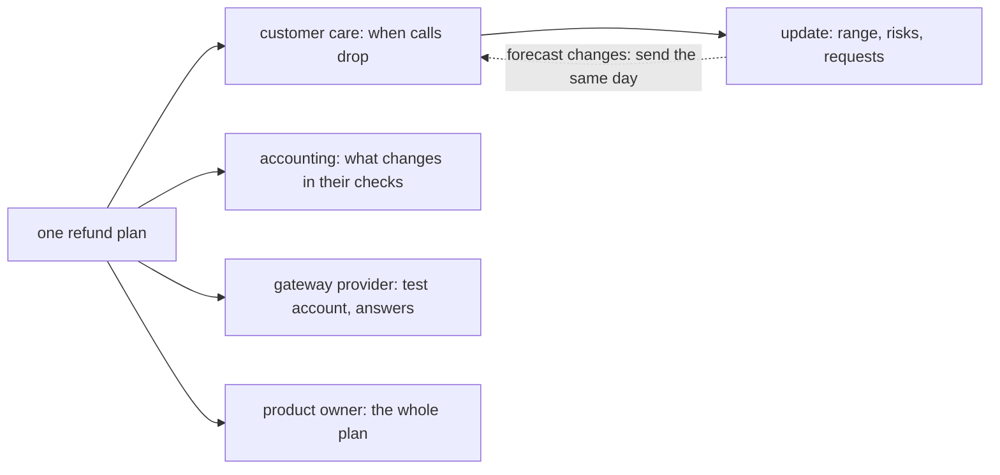

## Before you start

- [[management.l2.risk-responses]] — you know each refund risk has a response and one owner, and that R4, refused refunds, is transferred to customer care.
- [[management.l2.forecasting-with-velocity]] — you know the refund work is forecast as a range, 4 to 5 sprints, 8 to 10 weeks from the start of Sprint 15.
- [[management.l1.meetings-and-communication]] — you know how to write a short update: what you are doing, what blocks you, what comes next.

## The situation

Sprint 15 planning is over, and the product owner asks you to let customer care know about the refund plan. Your first draft reads: "Refunds: 30 points, velocity 6–8, so 4–5 sprints. R1 high/high, reduce via test environment. R4 transferred to you." You also consider simply forwarding the whole sprint board, though customer care answers phone calls all day and has never seen one. Accounting, the gateway's provider and the operations team are waiting too, each for something different. How do you tell each of them about the same plan?

## Core concepts

- **stakeholder** — anyone affected by the work or able to affect it, including people outside the team such as customer care, accounting or the payment gateway's provider.
- stakeholder table — a short list of the plan's stakeholders, what each cares about, what the team needs from them, and when and how they hear from the team.
- update — a short message to one stakeholder with the forecast as a range, the risks that could move it, and what the team needs from them, in their words.

## How it works



Start with who the stakeholders are. Some are inside the team, like the product owner. Many are outside it: people whose work changes when the plan lands, and people whose answers the plan depends on. In the situation above, customer care is affected by the work, and the gateway's provider can affect it. Both are stakeholders, even though neither sits in sprint planning.

Each stakeholder cares about a different part of the same plan. Customer care wants to know when customers can ask for refunds themselves, because that is when the calls drop. Accounting wants to know what changes in how they check refunds against their records. The provider needs to know what refund requests the team will send and how many. The product owner needs all of it. Sending everyone everything makes each reader dig for their part, and some will miss it.

An update to one stakeholder carries three things: the forecast as a range, the risks that could move it, and what the team needs from them. It is written in words the reader uses. Your first draft fails that test: "velocity", "points" and "R1" mean nothing to customer care.

Finally, stakeholders hear about a change from the team, as soon as the team knows. The dashed arrow is that rule. A range that moves after the first week with the gateway is news on that day, not when the old range arrives. The diagram follows customer care's update as the example; each stakeholder gets its own, with the same three parts.

## In the Đơn Hàng system

`docs/team/stakeholder-update-example.md` starts with a stakeholder table made at Sprint 15 planning:

```markdown file=docs/team/stakeholder-update-example.md tag=stage-2 lines=8-14
| Bên liên quan | Quan tâm điều gì | Đội cần gì từ họ | Báo khi nào, bằng cách nào |
|---|---|---|---|
| Chăm sóc khách hàng | Khi nào khách tự yêu cầu hoàn tiền được, để bớt cuộc gọi | Người xử lý yêu cầu bị cổng thanh toán từ chối; những câu khách hay hỏi về hoàn tiền | Email ngắn sau mỗi sprint review, và ngay khi dự báo đổi |
| Kế toán | Đối soát thay đổi gì; mỗi khoản hoàn tiền do ai yêu cầu, lúc nào | Mẫu danh sách hoàn tiền họ cần, trước cuối Sprint 15 | Một buổi 30 phút trong Sprint 15, sau đó email khi có thay đổi |
| Bên cung cấp cổng thanh toán | Đội gọi API hoàn tiền đúng cách và với lượng yêu cầu bao nhiêu | Tài khoản môi trường test trong tuần đầu Sprint 15; câu trả lời về idempotency key và thời hạn hoàn tiền | Email kỹ thuật khi cần |
| Product owner | Toàn bộ kế hoạch: phạm vi, dự báo, rủi ro | Quyết định phạm vi; hỏi các bên ngoài đội những câu còn mở | Sprint planning, sprint review, và daily khi có vướng |
| Bộ phận vận hành | Đơn `shipped` khách từ chối nhận có được hoàn tiền không | Câu trả lời cho câu hỏi đó, dù đợt này chưa làm | Qua product owner, trước Sprint 16 |
```

Five stakeholders, four columns: who, what they care about, what the team needs from them, and when and how they hear. Customer care cares about when customers can ask for refunds themselves, to cut calls; the team needs someone to handle refunds the gateway refuses, and the questions customers ask most. Accounting cares about what changes in checking refunds, and who asked for each one and when; the team needs the list format they want before the end of Sprint 15. The gateway's provider gets technical email; the operations team is reached through the product owner. Operations must answer whether refused `shipped` orders get refunds, a scope question the product owner decides, while the provider answers technical questions the developers can ask directly. Customer care hears after each sprint review, and at once when the forecast changes.

The update the team sent customer care:

```markdown file=docs/team/stakeholder-update-example.md tag=stage-2 lines=18-34
> Chào anh chị bên chăm sóc khách hàng,
>
> Khách sẽ tự yêu cầu hoàn tiền cho đơn đã thanh toán ngay trong ứng dụng, dự
> kiến trong khoảng tuần thứ 8 đến tuần thứ 10 kể từ tuần này. Đây là một
> khoảng, chưa phải một ngày; chúng tôi sẽ báo anh chị ngay khi khoảng này đổi.
>
> Điều có thể làm chậm: phần kết nối với cổng thanh toán là việc chúng tôi chưa
> làm bao giờ. Tuần này chúng tôi thử trước với cổng thanh toán, nên tuần sau sẽ
> biết rõ hơn.
>
> Chúng tôi cần anh chị hai việc trước cuối tuần sau:
> 1. Chọn một người nhận các yêu cầu hoàn tiền bị cổng thanh toán từ chối, để
>    gọi lại cho khách như anh chị vẫn làm.
> 2. Gửi chúng tôi năm câu khách hay hỏi nhất về hoàn tiền, để email gửi khách
>    trả lời sẵn những câu đó.
>
> Trong lúc chờ, khách gọi xin hoàn tiền vẫn được xử lý như hiện nay.
```

The three parts are all there. The forecast is a range, week 8 to week 10 from now, said plainly to be a range and not a date, with a promise to tell them when it changes. The risk is the gateway, work the team has never done, and it will know more after this week's trial. The requests are two, with a deadline: pick one person for refused refunds, and send the five questions customers ask most. The last line tells them what happens meanwhile: refund calls are handled as today.

The file's closing lines point out that the update has no "sprint", "story point" or "velocity", because the reader does not use those words, and that if the forecast changes after the week with the gateway, the team sends a new update that same day.

## Beginners often think…

- **"Talking to stakeholders is the product owner's job, not something a developer needs to think about."** → Actually, in the risk register the developer doing the integration owns R2 and asks the gateway's provider directly, and anyone can draft the update to customer care, as in the situation. You notice this when a technical question waits a week because it had to go through someone who could not answer it.
- **"Stakeholders want as much detail as possible, so I send everyone the full sprint board."** → Actually each stakeholder needs a different part of the plan, in their own words; the board hides that part among everyone else's. You notice this when customer care asks "so when can customers do it?" after receiving every story on the board.
- **"It's better to wait until we're sure the date slips before telling anyone."** → Actually stakeholders hear about a change from the team as soon as the team knows, so they can adjust their own plans. You notice this when customer care learns of a delay from a customer on the day they were promised.

## Try it (3 minutes)

Open `docs/team/stakeholder-update-example.md`.

1. In the update to customer care, find the forecast, the risk and the requests.
2. Suppose the first week with the gateway goes badly, because the gateway behaves differently from its documentation, and the forecast moves to week 10 to week 12. Write the first two sentences of the new update to customer care, in their words.

Expected result: step 1 — forecast: week 8 to week 10 from now, a range and not a date; risk: the gateway connection, which the team has never built; requests: one person for refused refunds, and the five most common refund questions, before the end of next week. Step 2 — something like: "The self-service refund is now expected between week 10 and week 12 from our first message, two weeks later than we said. The payment gateway behaves differently from its documentation, and we need that time to adapt." No sprints, points or risk numbers.

When should that new update be sent?

<details><summary>Suggested answer</summary>

The same day the team knows the forecast has moved, as the example file says, not at the next sprint review and certainly not in week 8. Customer care may be planning its own staffing around the old range, and every day of delay is a day they plan on wrong information.

</details>

## Connections

- [[management.l2.forecasting-with-velocity]] — prerequisite: the range this update turns into plain words.
- [[management.l2.risk-responses]] — prerequisite: R4's transfer to customer care is one of the requests in the update.
- [[management.l1.meetings-and-communication]] — prerequisite: the same habit of short written updates, now aimed at people outside the team.
- [[management.l1.how-software-gets-made]] — the six-step loop from gathering needs to operating the software starts and ends outside the team, with the people this lesson calls stakeholders.

## Five-line summary

1. A stakeholder is anyone affected by the work or able to affect it, including people outside the team.
2. Stakeholders care about different parts of one plan; customer care wants to know when calls drop, accounting what changes in their checks.
3. An update gives the forecast as a range, the risks that could move it and what the team needs, in the reader's words.
4. The customer care update says week 8 to week 10, names the gateway as the risk, and asks for two things.
5. Stakeholders hear about a change from the team as soon as it knows, not when the old range arrives.
