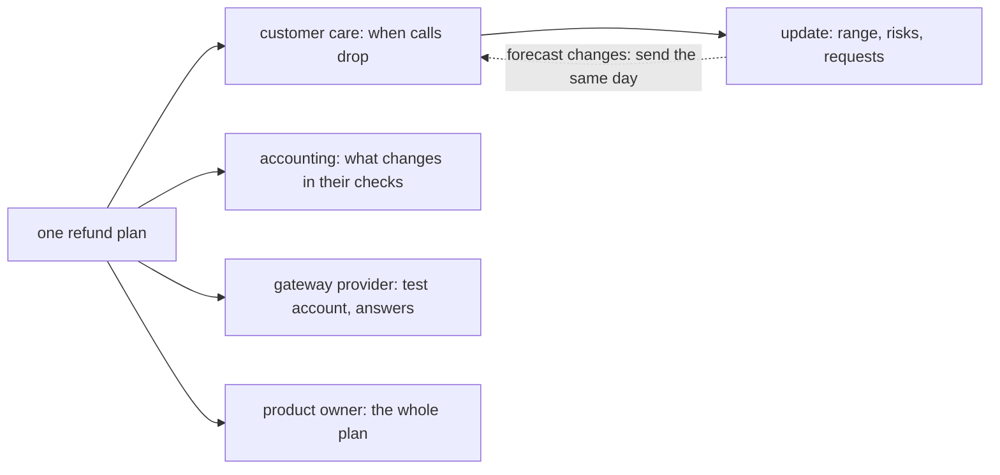

## Bạn cần biết trước

- [[management.l2.risk-responses]] — bạn biết mỗi rủi ro hoàn tiền đều có cách xử lý và một người theo dõi, và R4, các yêu cầu bị từ chối, được chuyển cho chăm sóc khách hàng.
- [[management.l2.forecasting-with-velocity]] — bạn biết phần việc hoàn tiền được dự báo thành một khoảng, 4 đến 5 sprint, tức 8 đến 10 tuần tính từ đầu Sprint 15.
- [[management.l1.meetings-and-communication]] — bạn biết cách viết một bản cập nhật ngắn: đang làm gì, vướng gì, tiếp theo là gì.

## Tình huống

Sprint 15 planning vừa xong, và product owner nhờ bạn báo cho chăm sóc khách hàng về kế hoạch hoàn tiền. Bản nháp đầu của bạn ghi: "Hoàn tiền: 30 điểm, velocity 6–8, nên 4–5 sprint. R1 cao/cao, giảm bằng môi trường test. R4 chuyển cho anh chị." Bạn còn tính chuyển tiếp nguyên cả bảng sprint, dù chăm sóc khách hàng nghe điện thoại cả ngày và chưa từng thấy bảng đó. Kế toán, bên cung cấp cổng thanh toán và bộ phận vận hành cũng đang chờ, mỗi bên chờ một điều khác. Bạn báo cho từng bên về cùng một kế hoạch thế nào?

## Khái niệm cốt lõi

- **bên liên quan** (stakeholder) — bất kỳ ai chịu ảnh hưởng của công việc hoặc có thể ảnh hưởng tới nó, kể cả người ngoài đội như chăm sóc khách hàng, kế toán hay bên cung cấp cổng thanh toán.
- bảng bên liên quan — một danh sách ngắn các bên liên quan của kế hoạch, mỗi bên quan tâm điều gì, đội cần gì từ họ, và họ được báo khi nào, bằng cách nào.
- bản cập nhật — một tin nhắn ngắn gửi một bên liên quan, nêu dự báo dạng khoảng, những rủi ro có thể làm khoảng dịch đi, và điều đội cần từ họ, bằng chữ của họ.

## Cơ chế hoạt động



Hãy bắt đầu từ việc ai là bên liên quan. Có bên ở trong đội, như product owner. Nhiều bên ở ngoài: những người có công việc thay đổi khi kế hoạch thành hiện thực, và những người mà kế hoạch phụ thuộc vào câu trả lời của họ. Trong tình huống trên, chăm sóc khách hàng chịu ảnh hưởng của công việc, còn bên cung cấp cổng thanh toán có thể ảnh hưởng tới nó. Cả hai đều là bên liên quan, dù không ai ngồi trong sprint planning.

Mỗi bên liên quan quan tâm một phần khác nhau của cùng một kế hoạch. Chăm sóc khách hàng muốn biết khi nào khách tự yêu cầu hoàn tiền được, vì đó là lúc cuộc gọi giảm. Kế toán muốn biết cách họ đối chiếu hoàn tiền với sổ sách thay đổi gì. Bên cung cấp cần biết đội sẽ gửi những yêu cầu hoàn tiền nào và bao nhiêu. Product owner cần tất cả. Gửi mọi thứ cho mọi người thì ai cũng phải tự đào tìm phần của mình, và sẽ có người bỏ sót.

Một bản cập nhật gửi một bên liên quan mang ba thứ: dự báo dạng khoảng, những rủi ro có thể làm khoảng dịch đi, và điều đội cần từ họ. Nó được viết bằng chữ người đọc dùng. Bản nháp đầu của bạn không qua được phép thử đó: "velocity", "điểm" và "R1" chẳng có nghĩa gì với chăm sóc khách hàng.

Cuối cùng, các bên liên quan nghe về thay đổi từ chính đội, ngay khi đội biết. Mũi tên nét đứt là quy tắc đó. Một khoảng dịch đi sau tuần đầu làm việc với cổng thanh toán là tin của ngày hôm đó, không phải của lúc khoảng cũ tới. Sơ đồ lấy bản cập nhật cho chăm sóc khách hàng làm ví dụ, còn mỗi bên liên quan nhận bản riêng của mình, cùng ba phần như vậy.

## Trong hệ thống Đơn Hàng

`docs/team/stakeholder-update-example.md` mở đầu bằng một bảng bên liên quan lập ở Sprint 15 planning:

```markdown file=docs/team/stakeholder-update-example.md tag=stage-2 lines=8-14
| Bên liên quan | Quan tâm điều gì | Đội cần gì từ họ | Báo khi nào, bằng cách nào |
|---|---|---|---|
| Chăm sóc khách hàng | Khi nào khách tự yêu cầu hoàn tiền được, để bớt cuộc gọi | Người xử lý yêu cầu bị cổng thanh toán từ chối; những câu khách hay hỏi về hoàn tiền | Email ngắn sau mỗi sprint review, và ngay khi dự báo đổi |
| Kế toán | Đối soát thay đổi gì; mỗi khoản hoàn tiền do ai yêu cầu, lúc nào | Mẫu danh sách hoàn tiền họ cần, trước cuối Sprint 15 | Một buổi 30 phút trong Sprint 15, sau đó email khi có thay đổi |
| Bên cung cấp cổng thanh toán | Đội gọi API hoàn tiền đúng cách và với lượng yêu cầu bao nhiêu | Tài khoản môi trường test trong tuần đầu Sprint 15; câu trả lời về idempotency key và thời hạn hoàn tiền | Email kỹ thuật khi cần |
| Product owner | Toàn bộ kế hoạch: phạm vi, dự báo, rủi ro | Quyết định phạm vi; hỏi các bên ngoài đội những câu còn mở | Sprint planning, sprint review, và daily khi có vướng |
| Bộ phận vận hành | Đơn `shipped` khách từ chối nhận có được hoàn tiền không | Câu trả lời cho câu hỏi đó, dù đợt này chưa làm | Qua product owner, trước Sprint 16 |
```

Năm bên liên quan, bốn cột: ai, quan tâm điều gì, đội cần gì từ họ, và báo khi nào, bằng cách nào. Chăm sóc khách hàng quan tâm khi nào khách tự yêu cầu hoàn tiền được, để bớt cuộc gọi. Đội cần họ cử người xử lý các yêu cầu bị cổng từ chối, và gửi những câu khách hay hỏi. Kế toán quan tâm cách đối soát thay đổi gì, và ai yêu cầu từng khoản hoàn tiền, lúc nào. Đội cần mẫu danh sách họ muốn trước cuối Sprint 15. Bên cung cấp cổng nhận email kỹ thuật, còn bộ phận vận hành được liên hệ qua product owner. Vận hành phải trả lời đơn `shipped` khách từ chối nhận có được hoàn tiền không, một câu hỏi về phạm vi do product owner quyết, trong khi bên cung cấp trả lời các câu hỏi kỹ thuật mà lập trình viên hỏi thẳng được. Chăm sóc khách hàng được báo sau mỗi sprint review, và ngay khi dự báo đổi.

Bản cập nhật đội đã gửi chăm sóc khách hàng:

```markdown file=docs/team/stakeholder-update-example.md tag=stage-2 lines=18-34
> Chào anh chị bên chăm sóc khách hàng,
>
> Khách sẽ tự yêu cầu hoàn tiền cho đơn đã thanh toán ngay trong ứng dụng, dự
> kiến trong khoảng tuần thứ 8 đến tuần thứ 10 kể từ tuần này. Đây là một
> khoảng, chưa phải một ngày; chúng tôi sẽ báo anh chị ngay khi khoảng này đổi.
>
> Điều có thể làm chậm: phần kết nối với cổng thanh toán là việc chúng tôi chưa
> làm bao giờ. Tuần này chúng tôi thử trước với cổng thanh toán, nên tuần sau sẽ
> biết rõ hơn.
>
> Chúng tôi cần anh chị hai việc trước cuối tuần sau:
> 1. Chọn một người nhận các yêu cầu hoàn tiền bị cổng thanh toán từ chối, để
>    gọi lại cho khách như anh chị vẫn làm.
> 2. Gửi chúng tôi năm câu khách hay hỏi nhất về hoàn tiền, để email gửi khách
>    trả lời sẵn những câu đó.
>
> Trong lúc chờ, khách gọi xin hoàn tiền vẫn được xử lý như hiện nay.
```

Đủ cả ba phần. Dự báo là một khoảng, tuần thứ 8 đến tuần thứ 10 kể từ bây giờ, nói rõ là một khoảng chứ chưa phải một ngày, kèm lời hứa báo khi khoảng đổi. Rủi ro là cổng thanh toán, phần đội chưa làm bao giờ, và đội sẽ biết rõ hơn sau lần thử tuần này. Lời nhờ có hai việc, kèm hạn: cử một người lo các yêu cầu bị từ chối, và gửi năm câu khách hay hỏi nhất. Dòng cuối cho họ biết trong lúc chờ thì sao: cuộc gọi xin hoàn tiền vẫn được xử lý như hiện nay.

Mấy dòng cuối của file chỉ ra rằng bản cập nhật không có chữ "sprint", "story point" hay "velocity", vì người nhận không dùng những chữ đó, và nếu dự báo đổi sau tuần làm việc với cổng thanh toán, đội gửi bản cập nhật mới ngay trong ngày.

## Người mới hay nghĩ rằng…

- **"Nói chuyện với bên liên quan là việc của product owner, lập trình viên không cần nghĩ tới."** → Thực ra, trong sổ rủi ro, lập trình viên làm tích hợp phụ trách R2 và hỏi thẳng bên cung cấp cổng thanh toán, còn bản cập nhật cho chăm sóc khách hàng thì ai cũng có thể soạn, như trong tình huống. Bạn sẽ nhận ra khi một câu hỏi kỹ thuật phải chờ cả tuần vì nó phải đi qua một người không trả lời được.
- **"Bên liên quan muốn càng chi tiết càng tốt, nên mình gửi mọi người nguyên bảng sprint."** → Thực ra mỗi bên liên quan cần một phần khác của kế hoạch, bằng chữ của họ, còn bảng sprint giấu phần đó giữa phần của mọi người khác. Bạn sẽ nhận ra khi chăm sóc khách hàng hỏi "vậy bao giờ khách làm được?" sau khi đã nhận mọi story trên bảng.
- **"Tốt hơn là đợi tới khi chắc chắn trễ rồi mới báo ai."** → Thực ra các bên liên quan nghe về thay đổi từ chính đội ngay khi đội biết, để họ còn điều chỉnh kế hoạch của mình. Bạn sẽ nhận ra khi chăm sóc khách hàng biết chuyện trễ từ một khách hàng, đúng vào ngày đã hứa.

## Thử ngay (3 phút)

Mở `docs/team/stakeholder-update-example.md`.

1. Trong bản cập nhật gửi chăm sóc khách hàng, tìm dự báo, rủi ro và lời nhờ.
2. Giả sử tuần đầu với cổng thanh toán không suôn sẻ, vì cổng chạy khác tài liệu, và dự báo dịch sang tuần thứ 10 đến tuần thứ 12. Viết hai câu đầu của bản cập nhật mới gửi chăm sóc khách hàng, bằng chữ của họ.

Kết quả mong đợi: bước 1 là dự báo tuần thứ 8 đến tuần thứ 10 kể từ bây giờ, một khoảng chứ không phải một ngày, rủi ro là phần kết nối với cổng thanh toán mà đội chưa làm bao giờ, và lời nhờ là một người lo các yêu cầu bị từ chối cùng năm câu khách hay hỏi nhất về hoàn tiền, trước cuối tuần sau. Bước 2 là một đoạn kiểu như: "Khách tự yêu cầu hoàn tiền được giờ dự kiến trong khoảng tuần thứ 10 đến tuần thứ 12 kể từ tin nhắn đầu tiên của chúng tôi, muộn hơn hai tuần so với đã báo. Cổng thanh toán chạy khác tài liệu của họ, và chúng tôi cần thời gian đó để điều chỉnh." Không có sprint, điểm hay số hiệu rủi ro.

Bản cập nhật mới đó nên được gửi lúc nào?

<details><summary>Gợi ý đáp án</summary>

Ngay trong ngày đội biết dự báo đã dịch, đúng như file ví dụ nói, không phải ở sprint review tiếp theo và càng không phải ở tuần thứ 8. Chăm sóc khách hàng có thể đang sắp xếp nhân sự theo khoảng cũ, và mỗi ngày chậm trễ là một ngày họ lập kế hoạch trên thông tin sai.

</details>

## Liên hệ

- [[management.l2.forecasting-with-velocity]] — bài cần trước: khoảng mà bản cập nhật này nói lại bằng lời thường.
- [[management.l2.risk-responses]] — bài cần trước: việc chuyển R4 cho chăm sóc khách hàng là một trong các lời nhờ của bản cập nhật.
- [[management.l1.meetings-and-communication]] — bài cần trước: cùng thói quen viết cập nhật ngắn, giờ hướng tới người ngoài đội.
- [[management.l1.how-software-gets-made]] — vòng sáu bước từ thu thập nhu cầu tới vận hành phần mềm bắt đầu và kết thúc ở ngoài đội, với những người bài này gọi là bên liên quan.

## Tóm tắt 5 dòng

1. Bên liên quan là bất kỳ ai chịu ảnh hưởng của công việc hoặc có thể ảnh hưởng tới nó, kể cả người ngoài đội.
2. Các bên liên quan quan tâm những phần khác nhau của một kế hoạch: chăm sóc khách hàng muốn biết khi nào cuộc gọi giảm, kế toán muốn biết cách đối soát đổi gì.
3. Bản cập nhật nêu dự báo dạng khoảng, rủi ro có thể làm nó dịch và điều đội cần, bằng chữ của người đọc.
4. Bản cập nhật gửi chăm sóc khách hàng nói tuần thứ 8 đến tuần thứ 10, gọi tên cổng thanh toán là rủi ro, và nhờ hai việc.
5. Các bên liên quan nghe về thay đổi từ đội ngay khi đội biết, không phải lúc khoảng cũ tới.
