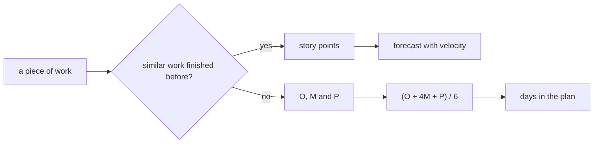

## Before you start

- [[management.l2.forecasting-with-velocity]] — you know the team forecasts its refund work sized in story points as a range of sprints, and that one developer works on the payment gateway instead.

## The situation

At Sprint 15 planning, the refund stories go quickly: the retry job looks like the email job the team already built, so it gets 5 points. Then comes calling the payment gateway's refund API, the outside service that actually returns the money. Nobody on the team has done it. One developer says 3 points, another says 13; neither can name a finished story it resembles. The developer who will do it says: "Six days, if their documentation is right. If it is not, closer to three weeks." How do you write down an estimate that keeps both halves of that answer?

## Core concepts

- **three-point estimation** — estimating one piece of work with three values, an optimistic, a most likely and a pessimistic one, instead of a single number.
- optimistic, most likely, pessimistic (O, M, P) — how long the work takes if the unknowns go well, as they usually go, or badly.
- weighted average — one number made from the three values, where the most likely value counts more than the other two.

## How it works



The first question is whether the team has finished something similar. If it has, story points work: you compare with the finished story, and velocity turns the points into sprints. In the situation above, the retry job took that path.

If nothing similar exists, there is nothing to compare with, and a point number is only a guess dressed up as a comparison. Three-point estimation asks for three values instead; the refund plan uses days of one person's work. Optimistic is the time if the unknowns go well; most likely, the time you would bet on; pessimistic, the time if they go badly: a realistic bad case with a reason you can name.

The gap between optimistic and pessimistic is the useful part. A narrow gap says the team understands the work. A wide gap says it does not, yet. That is information for planning: the plan needs room for it, and the team may want to learn something early to shrink it. A wide gap is not a bad estimate; hiding it behind one number would be.

To put a single number into a plan, one common way is the weighted average (O + 4M + P) / 6. The most likely value counts four times, so the result leans toward it. But when P is far above M and O is close to it, as in the refund plan's two items shown next, the result moves up toward the pessimistic side.

## In the Đơn Hàng system

`docs/team/refund-plan-example.md` splits the refund work in two. Work like what the team has finished (screens, API, email jobs) is sized in story points, seven items adding up to 28, and forecast with velocity. The rest is the part this lesson is about:

```markdown file=docs/team/refund-plan-example.md tag=stage-2 lines=27-36
Đội chưa từng gọi API hoàn tiền của cổng thanh toán, chưa từng đối soát với kế
toán, nên không có việc cũ nào để so điểm. Hai việc này được ước lượng bằng ngày
công của một người, mỗi việc ba giá trị: lạc quan (O), khả dĩ nhất (M), bi quan
(P). Một lập trình viên làm cả hai, từ Sprint 15.

| Việc | O | M | P | (O + 4M + P) / 6 |
|---|---|---|---|---|
| Tích hợp API hoàn tiền của cổng thanh toán | 4 | 6 | 14 | 7 |
| Đối soát hoàn tiền với kế toán | 2 | 4 | 12 | 5 |
| Cộng hai việc | | | | 12 |
```

Two items have no earlier work to compare with: integrating the gateway's refund API, and checking refunds against the accounting records (`đối soát với kế toán`). Each gets O, M and P in days of one person's work, and one developer does both. The gateway integration: (4 + 4 × 6 + 14) / 6 = 42 / 6 = 7 days, one day above its most likely 6. The accounting check: (2 + 16 + 12) / 6 = 5, one day above its 4. Together, 12 days.

The paragraph under the table explains the numbers:

```markdown file=docs/team/refund-plan-example.md tag=stage-2 lines=40-43
Khoảng cách giữa O và P của việc tích hợp là 10 ngày: đội biết rất ít về cổng
thanh toán. Khoảng cách rộng là thông tin cho kế hoạch, không phải một ước lượng
tồi. (O + 4M + P) / 6 nghiêng về giá trị khả dĩ nhất nhưng bị kéo về phía bi
quan khi P xa M.
```

The integration's gap from 4 to 14 is 10 days, because the team knows very little about the gateway. The file says it plainly: a wide gap is information for the plan, not a bad estimate. The formula leans toward the most likely value, but is pulled toward the pessimistic one when P is far from M. The rows right after these in the file add a separate line of extra days on top of the 12, sized from the gap between M and P; that line is the next lesson's subject.

## Beginners often think…

- **"The pessimistic value is just padding people add to protect themselves."** → Actually P describes a real case with a reason: in the refund plan, 14 days for the integration if the gateway does not behave as expected. It is written openly next to M, not slipped into it. You notice this when you ask "what would make it take P?" and get a concrete answer, not a shrug.
- **"Three-point estimation replaces story points for everything."** → Actually the refund plan uses it for two items only, the ones with no finished work to compare with; the other seven stay in story points. You notice this when a team starts asking for three numbers on a screen it has built ten times and the extra values say nothing new.
- **"The most likely value is the one we should give as the deadline."** → Actually M is only the middle case; in both refund items P is much farther from M than O is, so the work can overrun M by much more than it can beat it, and a plan at M has no room for that. You notice this when the integration's 6 days become 9 and nothing in the plan had room for it.

## Try it (3 minutes)

Open `docs/team/refund-plan-example.md` and find the table of three-point estimates.

1. Check the accounting row yourself: compute (2 + 4 × 4 + 12) / 6.
2. Suppose the gateway gives the team a test account in the first week, and the developer lowers the integration's P from 14 to 8. Compute its (O + 4M + P) / 6 again, and its gap from O to P.

Expected result: step 1 gives 30 / 6 = 5, as in the file. Step 2 gives (4 + 24 + 8) / 6 = 36 / 6 = 6, and the gap shrinks from 10 days to 4.

What did the team gain in step 2, apart from a smaller number?

<details><summary>Suggested answer</summary>

It gained knowledge. The pessimistic value dropped because the team learned how the gateway really behaves, not because anyone decided to be more optimistic. A narrower gap means the plan needs less room for the unknown, and the estimate now rests on what the team has seen of the gateway, not on guesses.

</details>

## Connections

- [[management.l2.forecasting-with-velocity]] — the other half of the plan: work sized in points and forecast with velocity.
- [[management.l1.why-estimate]] — why a team estimates at all; this lesson adds a way to estimate what it cannot compare.
- [[management.l1.relative-estimation]] — the opposite case: sizing by comparison with finished stories.
- [[management.l2.schedule-buffer]] — what the plan does with the gap between most likely and pessimistic.

## Five-line summary

1. For work with nothing similar to compare with, estimate three values, optimistic, most likely and pessimistic, instead of one.
2. The gap from optimistic to pessimistic shows how uncertain the work is; a wide gap is information, not a bad estimate.
3. (O + 4M + P) / 6 is one common way to combine them; P far above M, with O near M, pulls it up.
4. The refund plan estimates the gateway integration at 4, 6 and 14 days, giving 7, and the accounting check at 5.
5. In the refund plan, work similar to finished stories stays in story points; three-point estimates cover the work never done.
