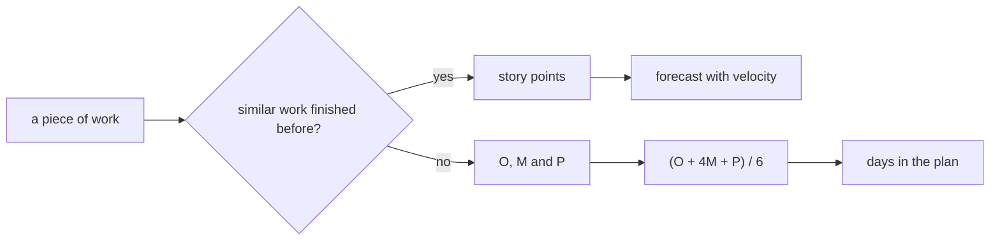

## Bạn cần biết trước

- [[management.l2.forecasting-with-velocity]] — bạn biết đội dự báo phần việc hoàn tiền tính bằng story point thành một khoảng sprint, và một lập trình viên làm phần cổng thanh toán thay vì nhận các việc đó.

## Tình huống

Ở Sprint 15 planning, các story hoàn tiền được ước lượng rất nhanh: job thử lại trông giống job gửi email đội đã làm, nên được 5 điểm. Rồi tới việc gọi API hoàn tiền của cổng thanh toán, dịch vụ bên ngoài thật sự trả tiền lại cho khách. Chưa ai trong đội làm việc này. Một người nói 3 điểm, người khác nói 13, và không ai chỉ ra được story đã xong nào giống nó. Lập trình viên sẽ làm việc đó nói: "Sáu ngày, nếu tài liệu của họ đúng. Nếu không, gần ba tuần." Bạn ghi lại ước lượng thế nào để giữ được cả hai nửa của câu trả lời đó?

## Khái niệm cốt lõi

- **ước lượng ba điểm** (three-point estimation) — ước lượng một việc bằng ba giá trị, lạc quan, khả dĩ nhất và bi quan, thay vì một con số.
- lạc quan, khả dĩ nhất, bi quan (O, M, P) — việc mất bao lâu nếu các điều chưa biết diễn ra tốt, diễn ra như thường lệ, hoặc diễn ra tệ.
- trung bình có trọng số — một con số tạo ra từ ba giá trị, trong đó giá trị khả dĩ nhất được tính nặng hơn hai giá trị kia.

## Cơ chế hoạt động



Câu hỏi đầu tiên là đội đã làm xong việc nào tương tự chưa. Nếu rồi, story point dùng được: bạn so với story đã xong, và velocity đổi điểm thành số sprint. Trong tình huống trên, job thử lại đi theo đường đó.

Nếu không có việc nào tương tự, thì không có gì để so, và một con số điểm chỉ là phỏng đoán khoác áo so sánh. Ước lượng ba điểm hỏi ba giá trị thay vào đó, và kế hoạch hoàn tiền dùng đơn vị ngày công của một người. Lạc quan là thời gian nếu các điều chưa biết diễn ra tốt. Khả dĩ nhất là thời gian bạn sẵn sàng đặt cược. Bi quan là thời gian nếu chúng diễn ra tệ: một trường hợp xấu có thật, với lý do bạn gọi tên được.

Khoảng cách giữa lạc quan và bi quan là phần có ích. Khoảng hẹp nói rằng đội hiểu việc đó. Khoảng rộng nói rằng đội chưa hiểu. Đó là thông tin cho việc lập kế hoạch: kế hoạch cần chỗ cho nó, và đội có thể muốn tìm hiểu điều gì đó sớm để thu hẹp nó. Khoảng rộng không phải ước lượng tồi. Giấu nó sau một con số mới là tồi.

Để đưa một con số vào kế hoạch, người ta hay dùng trung bình có trọng số (O + 4M + P) / 6. Giá trị khả dĩ nhất được tính bốn lần, nên kết quả nghiêng về nó. Nhưng khi P cao hơn M rất nhiều còn O sát M, như hai việc của kế hoạch hoàn tiền ở mục sau, kết quả bị đẩy lên về phía bi quan.

## Trong hệ thống Đơn Hàng

`docs/team/refund-plan-example.md` chia việc hoàn tiền làm hai. Những việc giống việc đội đã làm xong (màn hình, API, job gửi email) được tính bằng story point, bảy việc cộng lại 28 điểm, và dự báo bằng velocity. Phần còn lại là phần bài này bàn tới:

```markdown file=docs/team/refund-plan-example.md tag=stage-2 lines=27-36
Đội chưa từng gọi API hoàn tiền của cổng thanh toán, chưa từng đối soát với kế
toán, nên không có việc cũ nào để so điểm. Hai việc này được ước lượng bằng ngày
công của một người, mỗi việc ba giá trị: lạc quan (O), khả dĩ nhất (M), bi quan
(P). Một lập trình viên làm cả hai, từ Sprint 15.

| Việc | O | M | P | (O + 4M + P) / 6 |
|---|---|---|---|---|
| Tích hợp API hoàn tiền của cổng thanh toán | 4 | 6 | 14 | 7 |
| Đối soát hoàn tiền với kế toán | 2 | 4 | 12 | 5 |
| Cộng hai việc | | | | 12 |
```

Hai việc không có việc cũ nào để so: tích hợp API hoàn tiền của cổng thanh toán, và đối chiếu các khoản hoàn tiền với sổ sách kế toán (`đối soát với kế toán`). Mỗi việc có O, M và P tính bằng ngày công của một người, và một lập trình viên làm cả hai. Việc tích hợp: (4 + 4 × 6 + 14) / 6 = 42 / 6 = 7 ngày, cao hơn giá trị khả dĩ nhất 6 một ngày. Việc đối soát: (2 + 16 + 12) / 6 = 5, cao hơn 4 một ngày. Cộng lại, 12 ngày.

Đoạn dưới bảng giải thích các con số:

```markdown file=docs/team/refund-plan-example.md tag=stage-2 lines=40-43
Khoảng cách giữa O và P của việc tích hợp là 10 ngày: đội biết rất ít về cổng
thanh toán. Khoảng cách rộng là thông tin cho kế hoạch, không phải một ước lượng
tồi. (O + 4M + P) / 6 nghiêng về giá trị khả dĩ nhất nhưng bị kéo về phía bi
quan khi P xa M.
```

Khoảng từ 4 tới 14 của việc tích hợp là 10 ngày, vì đội biết rất ít về cổng thanh toán. File nói thẳng: khoảng rộng là thông tin cho kế hoạch, không phải ước lượng tồi. Công thức nghiêng về giá trị khả dĩ nhất, nhưng bị kéo về phía bi quan khi P xa M. Các dòng ngay sau đó trong file thêm một dòng ngày riêng lên trên 12 ngày, tính từ khoảng cách giữa M và P. Dòng đó là chủ đề của bài sau.

## Người mới hay nghĩ rằng…

- **"Giá trị bi quan chỉ là phần độn thêm để người ta tự bảo vệ."** → Thực ra P mô tả một trường hợp có thật, kèm lý do: trong kế hoạch hoàn tiền, 14 ngày cho việc tích hợp nếu cổng thanh toán không chạy như mong đợi. Nó được ghi công khai cạnh M, không lén nhét vào M. Bạn sẽ nhận ra khi hỏi "điều gì khiến việc này mất tới P?" và nhận được một câu trả lời cụ thể, không phải cái nhún vai.
- **"Ước lượng ba điểm thay cho story point ở mọi việc."** → Thực ra kế hoạch hoàn tiền chỉ dùng nó cho hai việc, những việc không có việc đã xong nào để so, còn bảy việc kia vẫn tính bằng story point. Bạn sẽ nhận ra khi một đội bắt đầu đòi ba con số cho một màn hình đã làm mười lần và các giá trị thêm vào chẳng nói thêm điều gì.
- **"Giá trị khả dĩ nhất là con số mình nên đưa làm hạn chót."** → Thực ra M chỉ là trường hợp ở giữa. Ở cả hai việc hoàn tiền, P cách M xa hơn nhiều so với O, nên việc có thể vượt M nhiều hơn hẳn mức nó có thể xong sớm hơn M, và một kế hoạch đặt ở M không có chỗ cho điều đó. Bạn sẽ nhận ra khi 6 ngày của việc tích hợp thành 9 và trong kế hoạch không có chỗ nào cho nó.

## Thử ngay (3 phút)

Mở `docs/team/refund-plan-example.md` và tìm bảng ước lượng ba điểm.

1. Tự kiểm tra dòng đối soát: tính (2 + 4 × 4 + 12) / 6.
2. Giả sử cổng thanh toán cấp cho đội tài khoản test ngay tuần đầu, và lập trình viên hạ P của việc tích hợp từ 14 xuống 8. Tính lại (O + 4M + P) / 6 của nó, và khoảng cách từ O tới P.

Kết quả mong đợi: bước 1 ra 30 / 6 = 5, đúng như trong file. Bước 2 ra (4 + 24 + 8) / 6 = 36 / 6 = 6, và khoảng cách thu hẹp từ 10 ngày xuống 4.

Ở bước 2, ngoài một con số nhỏ hơn, đội còn được gì?

<details><summary>Gợi ý đáp án</summary>

Đội có thêm hiểu biết. Giá trị bi quan giảm vì đội đã biết cổng thanh toán thật sự chạy ra sao, không phải vì ai đó quyết định lạc quan hơn. Khoảng hẹp hơn nghĩa là kế hoạch cần ít chỗ hơn cho điều chưa biết, và ước lượng giờ dựa trên những gì đội đã thấy ở cổng thanh toán, không dựa trên phỏng đoán.

</details>

## Liên hệ

- [[management.l2.forecasting-with-velocity]] — nửa kia của kế hoạch: việc tính bằng điểm và dự báo bằng velocity.
- [[management.l1.why-estimate]] — vì sao một đội ước lượng, còn bài này thêm cách ước lượng thứ mà đội không có gì để so.
- [[management.l1.relative-estimation]] — trường hợp ngược lại: định cỡ bằng cách so với các story đã xong.
- [[management.l2.schedule-buffer]] — kế hoạch làm gì với khoảng cách giữa khả dĩ nhất và bi quan.

## Tóm tắt 5 dòng

1. Với việc không có gì tương tự để so, hãy ước lượng ba giá trị, lạc quan, khả dĩ nhất và bi quan, thay vì một.
2. Khoảng từ lạc quan tới bi quan cho thấy việc bất định đến đâu, và khoảng rộng là thông tin, không phải ước lượng tồi.
3. (O + 4M + P) / 6 là công thức phổ biến để gộp ba giá trị, và P cao hơn M nhiều, với O sát M, đẩy kết quả lên.
4. Kế hoạch hoàn tiền ước lượng việc tích hợp cổng thanh toán là 4, 6 và 14 ngày, ra 7, và việc đối soát ra 5.
5. Trong kế hoạch hoàn tiền, việc giống story đã xong vẫn tính bằng story point, còn ước lượng ba điểm dành cho việc chưa từng làm.
