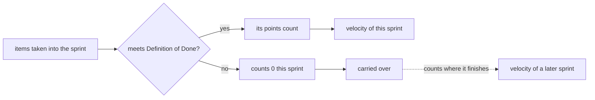

## Before you start

- [[management.l1.estimates-are-not-commitments]] — you know Sprint 14's 2-point item `Ngừng gửi thông báo cho đơn đã hủy` did not finish, was carried over, and that an estimate is a guess, not a promise.

## The situation

Sprint 15 planning starts, and someone asks how much the team got done last sprint. One developer adds up the `Ước lượng` column of Sprint 14 and says 11. Another points out that one item never finished, so the number should be smaller. A third mentions that a friend's team "does 30 points a sprint" and wonders whether the Đơn Hàng team is slow. Three people, three different numbers, and nobody is sure which one is worth writing down. Which number describes what the team actually did in Sprint 14, and what is it good for?

## Core concepts

- **velocity** — the total story points of the items a team finished, meaning they met the Definition of Done, in one sprint.
- planned points — the total of the estimates of everything the team took into the sprint at planning, finished or not.
- carried over — an unfinished item the team takes into a later sprint; its points count in the sprint where it finally meets the Definition of Done.

## How it works



Velocity looks backward. At the end of a sprint, ask of each item the team took in: does it meet the Definition of Done? If it does, its points count. If it does not, it counts zero in this sprint, however much of its code was written. Velocity is the sum of the points that counted. At the next planning, the team uses it as a record of how much it really finished before.

In the situation above, the developer who said 11 added up the planned points: everything the team took in. The one who said smaller was counting finished work, which is what velocity measures. An "almost done" item can still take days; counting it as done describes a sprint that did not happen.

The unfinished item is not lost. In Sprint 14 the team carried it over, and its points count once, in the sprint where it meets the Definition of Done.

Sprints come from Scrum, a way of working whose official description is the Scrum Guide. Velocity is not something Scrum asks for: the 2020 Guide does not mention it, or story points. It says only that the more the Developers, the people doing the work, know about their past performance, their upcoming capacity and their Definition of Done, the more confident they will be in their Sprint forecast, their guess of what fits in the sprint. Velocity is one common way teams keep that record themselves.

The third number in the situation, the friend's 30, cannot be compared with Sprint 14 at all. Story points are sized against a team's own earlier stories, so each team's points are a different unit. What velocity can be compared with is the same team's velocity in its earlier sprints.

## In the Đơn Hàng system

The list of items taken into Sprint 14 is in `docs/team/sprint-example.md`:

```markdown file=docs/team/sprint-example.md tag=stage-1 lines=12-18
| Việc | Người nhận | Ước lượng | Trạng thái cuối sprint |
|---|---|---|---|
| API `POST /api/v1/orders/{id}/cancel` | Dev 1 | 3 | Xong |
| Nút "Hủy đơn" trên màn hình đơn hàng | Dev 2 | 3 | Xong |
| Chặn hủy đơn đã thanh toán | Dev 1 | 2 | Xong |
| Ngừng gửi thông báo cho đơn đã hủy | Dev 3 | 2 | Chưa xong, chuyển sprint sau |
| Sửa lỗi tổng tiền sai ở đơn nhiều dòng | Dev 4 | 1 | Xong |
```

The `Ước lượng` column adds up to 11: 3 + 3 + 2 + 2 + 1. Those are the planned points. Four items end as `Xong` (done): 3 + 3 + 2 + 1 = 9. The item `Ngừng gửi thông báo cho đơn đã hủy` ends as `Chưa xong, chuyển sprint sau`, not finished and moved to the next sprint, so its 2 points count zero here. Sprint 14 planned 11 points; its velocity is 9. The file itself never uses the word velocity; you compute it from the last column.

The sprint review section of the same file (the meeting near the end of the sprint where the team shows what it finished) says why the 2 points stay out:

```markdown file=docs/team/sprint-example.md tag=stage-1 lines=31-33
Đội trình diễn trên môi trường thử nghiệm, không phải trên máy cá nhân. Việc
"Ngừng gửi thông báo" chưa xong nên không được trình diễn — chưa xong thì chưa
tính, dù đã viết gần hết code.
```

The last sentence says it directly: not finished means not counted, even with almost all of the code written. Velocity applies the same rule to points. When the item meets the Definition of Done in a later sprint, its 2 points count there. (The first sentence of the block is about something else: the team demonstrates on a test environment, not on a personal machine.)

## Beginners often think…

- **"Velocity counts every point we worked on during the sprint, finished or not."** → Actually it counts only items that meet the Definition of Done; the rest count zero until the sprint that finishes them. You notice this when a sprint with many "almost done" items shows a velocity well below the points the team planned.
- **"A team with a higher velocity than ours is simply more productive."** → Actually each team sizes stories against its own earlier stories, so its points are its own unit; 30 of theirs and 9 of yours cannot be compared. You notice this when a team pushed to raise its velocity can reach a bigger number simply by giving bigger estimates, while the work stays the same.
- **"Velocity is one of the things the Scrum Guide requires a team to track."** → Actually the 2020 Scrum Guide does not mention velocity or story points; it speaks only of past performance helping a sprint forecast. You notice this when you search the Guide for the word and find nothing.

## Try it (3 minutes)

Open `docs/team/sprint-example.md` and look at the list of items taken into Sprint 14.

1. Add up the `Ước lượng` column.
2. Add up the estimates of the items whose last column is `Xong`.
3. Suppose `Sửa lỗi tổng tiền sai ở đơn nhiều dòng` had also ended unfinished and moved to the next sprint. Compute Sprint 14's velocity again.

Expected result: step 1 gives 11 (planned points), step 2 gives 9 (velocity), step 3 gives 8, with both unfinished items counted in whichever later sprint finishes them.

In Sprint 15, the team finishes `Ngừng gửi thông báo cho đơn đã hủy` along with 8 points of new work. What is Sprint 15's velocity, and does Sprint 14's change?

<details><summary>Suggested answer</summary>

Sprint 15's velocity is 10: the 8 new points plus the 2 points of the carried-over item, which met the Definition of Done in Sprint 15. Sprint 14's velocity stays 9. Each point counts once, in the sprint where its item was finished.

</details>

## Connections

- [[management.l1.estimates-are-not-commitments]] — the unfinished item that was carried over is the same one that makes Sprint 14's velocity 9 instead of 11.
- [[management.l1.relative-estimation]] — why story points are a team's own unit, which is why velocities of two teams cannot be compared.
- [[management.l2.forecasting-with-velocity]] — the next step: using velocity from several sprints to answer "when will it be done".

## Five-line summary

1. Velocity is the total story points of the items that met the Definition of Done in one sprint, not the points planned.
2. An unfinished item counts zero in its sprint and counts in the later sprint that finishes it.
3. Sprint 14 planned 11 points; its velocity is 9, because the 2-point notification item was carried over.
4. The 2020 Scrum Guide does not mention velocity; it only says past performance helps Developers forecast a sprint.
5. Velocity compares a team only with its own past, because each team's story points are its own unit.
