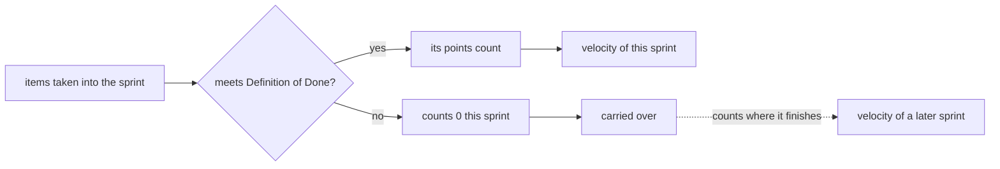

## Bạn cần biết trước

- [[management.l1.estimates-are-not-commitments]] — bạn biết việc 2 điểm `Ngừng gửi thông báo cho đơn đã hủy` của Sprint 14 không xong và được chuyển sang sprint sau, và rằng ước lượng là phỏng đoán, không phải lời hứa.

## Tình huống

Sprint 15 planning bắt đầu, và có người hỏi sprint trước đội làm được bao nhiêu. Một lập trình viên cộng cột `Ước lượng` của Sprint 14 và nói 11. Người khác chỉ ra rằng có một việc chưa xong, nên con số phải nhỏ hơn. Người thứ ba kể đội của một người bạn "làm 30 điểm mỗi sprint" và băn khoăn liệu đội Đơn Hàng có chậm không. Ba người, ba con số, và không ai chắc con số nào đáng ghi lại. Con số nào mô tả đúng điều đội đã làm trong Sprint 14, và nó dùng để làm gì?

## Khái niệm cốt lõi

- **velocity** — tổng story point của những việc một đội đã làm xong, tức là đạt Definition of Done, trong một sprint.
- số điểm đã nhận — tổng ước lượng của mọi việc đội đưa vào sprint lúc planning, xong hay chưa.
- chuyển sprint sau — một việc chưa xong mà đội mang sang một sprint sau, và điểm của nó được tính ở sprint mà nó cuối cùng đạt Definition of Done.

## Cơ chế hoạt động



Velocity nhìn về phía sau. Cuối sprint, hỏi từng việc đội đã nhận: nó có đạt Definition of Done không? Nếu có, điểm của nó được tính. Nếu không, nó tính 0 ở sprint này, dù code đã viết được bao nhiêu. Velocity là tổng số điểm được tính. Ở lần planning tiếp theo, đội dùng nó làm bản ghi về lượng việc mình thật sự đã làm xong.

Trong tình huống trên, người nói 11 đã cộng số điểm đã nhận: mọi thứ đội đưa vào sprint. Người nói phải nhỏ hơn đang đếm việc đã xong, đúng thứ velocity đo. Một việc "gần xong" vẫn có thể mất thêm vài ngày. Tính nó là xong tức là mô tả một sprint không hề diễn ra.

Việc chưa xong không mất đi. Ở Sprint 14, đội chuyển nó sang sprint sau, và điểm của nó được tính một lần, ở sprint mà nó đạt Definition of Done.

Sprint đến từ Scrum, một phương pháp làm việc có bản mô tả chính thức là Scrum Guide. Velocity không phải thứ Scrum yêu cầu: bản 2020 của Guide không nhắc tới nó, cũng không nhắc story point. Guide chỉ nói Developers, tức những người làm việc, càng biết về kết quả đã qua, năng lực sắp tới và Definition of Done của mình thì càng tự tin với Sprint forecast, tức phỏng đoán của họ về những gì vừa với sprint. Velocity là một lối phổ biến để các đội tự giữ bản ghi đó.

Con số thứ ba trong tình huống, con số 30 của đội bạn, hoàn toàn không so được với Sprint 14. Story point được định cỡ theo các story trước đó của chính một đội, nên điểm của mỗi đội là một đơn vị khác nhau. Thứ velocity so được là velocity của chính đội đó ở các sprint trước.

## Trong hệ thống Đơn Hàng

Danh sách việc đưa vào Sprint 14 nằm trong `docs/team/sprint-example.md`:

```markdown file=docs/team/sprint-example.md tag=stage-1 lines=12-18
| Việc | Người nhận | Ước lượng | Trạng thái cuối sprint |
|---|---|---|---|
| API `POST /api/v1/orders/{id}/cancel` | Dev 1 | 3 | Xong |
| Nút "Hủy đơn" trên màn hình đơn hàng | Dev 2 | 3 | Xong |
| Chặn hủy đơn đã thanh toán | Dev 1 | 2 | Xong |
| Ngừng gửi thông báo cho đơn đã hủy | Dev 3 | 2 | Chưa xong, chuyển sprint sau |
| Sửa lỗi tổng tiền sai ở đơn nhiều dòng | Dev 4 | 1 | Xong |
```

Cột `Ước lượng` cộng lại được 11: 3 + 3 + 2 + 2 + 1. Đó là số điểm đã nhận. Bốn việc kết thúc với `Xong`: 3 + 3 + 2 + 1 = 9. Việc `Ngừng gửi thông báo cho đơn đã hủy` kết thúc với `Chưa xong, chuyển sprint sau`, nên 2 điểm của nó tính 0 ở đây. Sprint 14 nhận 11 điểm, còn velocity của nó là 9. Bản thân file không dùng chữ velocity, bạn tự tính ra từ cột cuối.

Phần sprint review của cùng file (buổi họp gần cuối sprint, nơi đội trình diễn những gì đã xong) nói vì sao 2 điểm đó bị để ngoài:

```markdown file=docs/team/sprint-example.md tag=stage-1 lines=31-33
Đội trình diễn trên môi trường thử nghiệm, không phải trên máy cá nhân. Việc
"Ngừng gửi thông báo" chưa xong nên không được trình diễn — chưa xong thì chưa
tính, dù đã viết gần hết code.
```

Câu cuối nói thẳng: chưa xong thì chưa tính, dù đã viết gần hết code. Velocity áp đúng quy tắc đó cho điểm. Khi việc này đạt Definition of Done ở một sprint sau, 2 điểm của nó được tính ở đó. (Câu đầu của khối nói chuyện khác: đội trình diễn trên môi trường thử nghiệm, không phải trên máy cá nhân.)

## Người mới hay nghĩ rằng…

- **"Velocity tính mọi điểm mình đã làm trong sprint, xong hay chưa."** → Thực ra nó chỉ tính những việc đạt Definition of Done, vì phần còn lại tính 0 cho tới sprint làm xong chúng. Bạn sẽ nhận ra khi một sprint có nhiều việc "gần xong" cho velocity thấp hơn hẳn số điểm đội đã nhận.
- **"Đội nào có velocity cao hơn đội mình thì đơn giản là làm năng suất hơn."** → Thực ra mỗi đội định cỡ story theo các story trước đó của chính mình, nên điểm của họ là đơn vị riêng của họ, và 30 điểm của họ với 9 điểm của bạn không so được. Bạn sẽ nhận ra khi một đội bị ép tăng velocity có thể đạt con số lớn hơn chỉ bằng cách ước lượng lớn hơn, trong khi công việc vẫn thế.
- **"Velocity là một trong những thứ Scrum Guide bắt đội phải theo dõi."** → Thực ra Scrum Guide 2020 không nhắc velocity hay story point, vì nó chỉ nói kết quả đã qua giúp dự báo cho sprint. Bạn sẽ nhận ra khi tìm chữ đó trong Guide và không thấy gì.

## Thử ngay (3 phút)

Mở `docs/team/sprint-example.md` và xem danh sách việc đưa vào Sprint 14.

1. Cộng cột `Ước lượng`.
2. Cộng ước lượng của những việc có cột cuối là `Xong`.
3. Giả sử `Sửa lỗi tổng tiền sai ở đơn nhiều dòng` cũng chưa xong và bị chuyển sang sprint sau. Tính lại velocity của Sprint 14.

Kết quả mong đợi: bước 1 ra 11 (số điểm đã nhận), bước 2 ra 9 (velocity), bước 3 ra 8, và cả hai việc chưa xong được tính ở sprint sau nào làm xong chúng.

Ở Sprint 15, đội làm xong `Ngừng gửi thông báo cho đơn đã hủy` cùng 8 điểm việc mới. Velocity của Sprint 15 là bao nhiêu, và velocity của Sprint 14 có đổi không?

<details><summary>Gợi ý đáp án</summary>

Velocity của Sprint 15 là 10: 8 điểm việc mới cộng 2 điểm của việc chuyển sang, vì việc đó đạt Definition of Done trong Sprint 15. Velocity của Sprint 14 vẫn là 9. Mỗi điểm được tính một lần, ở sprint mà việc của nó làm xong.

</details>

## Liên hệ

- [[management.l1.estimates-are-not-commitments]] — việc chưa xong bị chuyển sang sprint sau chính là việc khiến velocity của Sprint 14 là 9 thay vì 11.
- [[management.l1.relative-estimation]] — vì sao story point là đơn vị riêng của một đội, cũng là lý do velocity của hai đội không so được với nhau.
- [[management.l2.forecasting-with-velocity]] — bước tiếp theo: dùng velocity của nhiều sprint để trả lời "bao giờ xong".

## Tóm tắt 5 dòng

1. Velocity là tổng story point của những việc đạt Definition of Done trong một sprint, không phải số điểm đã nhận.
2. Một việc chưa xong tính 0 ở sprint của nó và được tính ở sprint sau làm xong nó.
3. Sprint 14 nhận 11 điểm, còn velocity của nó là 9, vì việc thông báo 2 điểm bị chuyển sang sprint sau.
4. Scrum Guide 2020 không nhắc velocity, Guide chỉ nói kết quả đã qua giúp Developers dự báo cho sprint.
5. Velocity chỉ so một đội với quá khứ của chính nó, vì story point của mỗi đội là đơn vị riêng.
