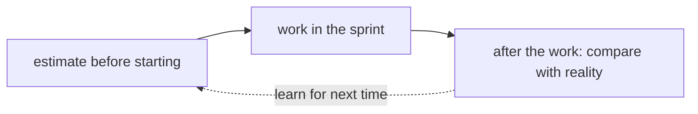

## Before you start

- [[management.l1.relative-estimation]] — you know a story point estimates a story's size relative to the team's other stories, not in hours, and that Sprint 14's `Ước lượng` column uses points.

## The situation

On the last day of a sprint, one item estimated at 2 points is still open. The developer who took it has written most of the code, but the tests are not finished. A teammate says it is "basically done" and suggests showing it at the sprint review anyway, so the sprint looks the way it was planned. Someone else says the real mistake was the 2, and next time the team should be more careful with its numbers. Both of them are treating the 2 as something the team promised. Was it?

## Core concepts

- estimate — the team's best guess at a story's size before the work starts, made with what it knows then.
- commitment — a promise that something will be done, which others can hold you to.
- carry over — not counting an unfinished item as done, and picking it up again later; Sprint 14's file calls this `chuyển sprint sau`.

## How it works



An estimate answers one question: how big does this look before anyone starts? It is made before the work starts, with what the team knows at that moment. A commitment is a different thing: a promise that the work will be done, which someone can hold you to. When a team treats every estimate as a commitment, a number that was only a guess starts to decide whether people have failed.

That is not the commitment a Scrum team does make. In the Scrum Guide, the commitment for a sprint is its sprint goal: the team commits to the goal, not to each item's number. The estimates help choose which items to take in; they are not promises in themselves.

That has a cost. People who are held to their guesses tend to start protecting themselves: they give bigger numbers next time, as the lesson on why teams estimate showed, or they call work "done" when it is not, so the sprint looks as planned. Either way, the numbers stop describing the work, and planning tends to get worse, not better.

Only after the work is actually done can anyone see how the guess compared with reality. The diagram shows that cycle: the estimate comes before starting, the work happens in the sprint, and only then can the two be compared; the dashed arrow is what the team carries into its next estimates. The retrospective, the meeting at the end of the sprint where the team looks at how it worked, is one place to talk about why an item took longer than it looked. An item that did not finish is information for the retrospective, not proof that someone broke a promise.

## In the Đơn Hàng system

In Sprint 14's backlog, in `docs/team/sprint-example.md`, the item `Ngừng gửi thông báo cho đơn đã hủy` was estimated at 2 and ended the sprint as `Chưa xong, chuyển sprint sau`: not finished, moved to the next sprint. The file does not say why it took longer. The sprint review describes what happened next:

```markdown file=docs/team/sprint-example.md tag=stage-0 lines=31-33
Đội trình diễn trên môi trường thử nghiệm, không phải trên máy cá nhân. Việc
"Ngừng gửi thông báo" chưa xong nên không được trình diễn — chưa xong thì chưa
tính, dù đã viết gần hết code.
```

The item was not shown at the review, even though almost all of its code was written: not finished means not counted. This matches the Scrum Guide, which says an item that does not meet the Definition of Done is not presented at the Sprint Review and goes back to the Product Backlog for later. Sprint 14's file records the team's own choice: the item moves to the next sprint. The team did not call it done to make the sprint match the plan, and it did not change the 2 after the fact. (The first line of the block is about something else: the team demonstrates on a test environment, not on a personal machine.)

The retrospective in the same file:

```markdown file=docs/team/sprint-example.md tag=stage-0 lines=37-39
- Làm tốt: viết tiêu chí chấp nhận trước khi code, nhờ vậy không phải làm lại.
- Cần sửa: nhận việc phụ thuộc vào một người duy nhất.
- Hành động cho sprint sau: mỗi việc lớn hơn 3 điểm phải có hai người đọc code.
```

The action, two people reading the code of any item larger than 3 points, sits right after the problem the team wanted to fix: taking on work that depends on a single person. The retrospective does not discuss the unfinished item at all, and its action covers items larger than 3 points, so not this 2-point one. Nothing in it blames the 2, or any other estimate.

## Beginners often think…

- **"An estimate a team gives becomes a deadline they're expected to hit."** → Actually an estimate is a guess about size made before the work starts; the team uses it to plan, not to promise a date. You notice this when a team is held to its numbers and the numbers tend to grow bigger, while the work itself has not changed.
- **"If an item doesn't finish in the sprint it was estimated for, the original estimate must have been wrong."** → Actually a best guess made before starting is sometimes lower than what the work turns out to need, and that is expected, not a mistake: guesses are off in both directions. Not finishing shows the work took longer; it does not show the team guessed badly. You notice this in Sprint 14, where the unfinished item carried over and the retrospective's action was about who reads the code, not about the estimate.

## Try it (3 minutes)

Open `docs/team/sprint-example.md` from the repository.

1. Find the item that did not finish and write down its estimate and its final status.
2. Read the sprint review section and write down what happened to that item there.
3. Read the retrospective and write down whether any line blames an estimate.

Expected result: step 1 — `Ngừng gửi thông báo cho đơn đã hủy`, estimate 2, `Chưa xong, chuyển sprint sau`. Step 2 — it was not shown, because unfinished work is not counted, even with almost all the code written. Step 3 — no; the lines are about writing acceptance criteria first, work depending on one person, and two readers for items over 3 points.

A manager reads Sprint 14 and says: "You estimated 2 and did not finish. Next sprint, give smaller numbers so you look faster." What would that do to the team's estimates?

<details><summary>Suggested answer</summary>

It would make them less useful. If the numbers are chosen to look good instead of to describe the work, they stop helping the team decide how much fits into a sprint. A 2 that is really a 3 means the team takes on more than it can finish, and more items carry over. The better use of the unfinished item is to look at why it took longer at the retrospective, and let that inform the next estimate.

</details>

## Connections

- [[management.l1.why-estimate]] — why a team estimates at all: to plan, not to promise.
- [[management.l1.relative-estimation]] — what the numbers in the `Ước lượng` column measure.
- [[management.l1.scrum-from-junior-seat]] — the sprint review and retrospective where unfinished work is handled.

## Five-line summary

1. An estimate answers how big a story looks before starting; a commitment is a promise others can hold you to.
2. An unfinished item does not make its estimate a mistake; a best guess is sometimes lower than the work turns out.
3. Treating estimates as promises tends to push people to distort later numbers or call unfinished work done.
4. Only after the work can a team compare a guess with what really happened, for example at the retrospective.
5. In Sprint 14 the unfinished 2-point item carried over, was not shown, and was not blamed on its estimate.
