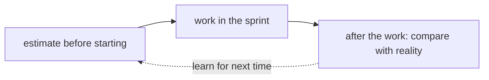

## Bạn cần biết trước

- [[management.l1.relative-estimation]] — bạn biết story point ước lượng kích cỡ của một story so với các story khác của đội, không tính bằng giờ, và rằng cột `Ước lượng` của Sprint 14 dùng điểm.

## Tình huống

Ngày cuối sprint, một việc được ước lượng 2 điểm vẫn còn dở. Lập trình viên nhận việc đó đã viết gần hết code, nhưng test chưa xong. Một đồng đội bảo nó "coi như xong rồi" và đề nghị cứ trình diễn ở buổi sprint review, để sprint trông đúng như kế hoạch. Một người khác nói sai lầm thật sự là con số 2, và lần sau đội phải cẩn thận hơn với các con số. Cả hai đều đang coi con số 2 là thứ đội đã hứa. Có đúng vậy không?

## Khái niệm cốt lõi

- ước lượng — phỏng đoán tốt nhất của đội về kích cỡ của một story trước khi bắt đầu làm, với những gì đội biết lúc đó.
- cam kết — lời hứa rằng một việc sẽ được làm xong, mà người khác có thể bắt bạn giữ.
- chuyển sang sau — không tính một việc chưa xong là xong, và làm tiếp nó sau; file của Sprint 14 gọi là `chuyển sprint sau`.

## Cơ chế hoạt động



Ước lượng trả lời đúng một câu hỏi: việc này trông lớn cỡ nào trước khi ai bắt đầu? Nó được đưa ra trước khi bắt đầu làm, với những gì đội biết lúc đó. Cam kết là chuyện khác: lời hứa rằng việc sẽ xong, mà ai đó có thể bắt bạn giữ. Khi một đội coi mọi ước lượng là cam kết, một con số vốn chỉ là phỏng đoán bắt đầu quyết định ai đã thất bại.

Đó không phải cam kết mà một đội Scrum thực sự đưa ra. Trong Scrum Guide, cam kết của một sprint là sprint goal: đội cam kết với mục tiêu, không cam kết với con số của từng việc. Ước lượng giúp chọn việc nào đưa vào sprint; bản thân chúng không phải lời hứa.

Coi ước lượng là lời hứa có cái giá của nó. Người bị bắt giữ đúng phỏng đoán của mình thường bắt đầu tự bảo vệ: lần sau họ đưa số lớn hơn, như bài về lý do ước lượng đã cho thấy, hoặc họ gọi việc là "xong" khi chưa xong, để sprint trông đúng kế hoạch. Đằng nào thì các con số cũng không còn mô tả công việc, và việc lập kế hoạch thường tệ đi chứ không tốt lên.

Chỉ sau khi công việc thật sự xong thì mới ai thấy được phỏng đoán so với thực tế ra sao. Sơ đồ cho thấy vòng đó: ước lượng có trước khi bắt đầu, công việc diễn ra trong sprint, và chỉ lúc đó mới so được hai thứ; mũi tên nét đứt là điều đội mang vào những lần ước lượng sau. Retrospective, buổi họp cuối sprint nơi đội nhìn lại cách mình làm việc, là một chỗ để bàn vì sao một việc mất lâu hơn vẻ ngoài. Một việc không xong là thông tin cho retrospective, không phải bằng chứng ai đó đã phá lời hứa.

## Trong hệ thống Đơn Hàng

Trong sprint backlog của Sprint 14, ở `docs/team/sprint-example.md`, việc `Ngừng gửi thông báo cho đơn đã hủy` được ước lượng 2 và kết thúc sprint với trạng thái `Chưa xong, chuyển sprint sau`. File không nói vì sao nó mất lâu hơn. Phần sprint review mô tả điều xảy ra tiếp theo:

```markdown file=docs/team/sprint-example.md tag=stage-0 lines=31-33
Đội trình diễn trên môi trường thử nghiệm, không phải trên máy cá nhân. Việc
"Ngừng gửi thông báo" chưa xong nên không được trình diễn — chưa xong thì chưa
tính, dù đã viết gần hết code.
```

Việc đó không được trình diễn ở buổi review, dù gần hết code đã viết xong: chưa xong thì chưa tính. Điều này khớp với Scrum Guide, vốn nói việc chưa đạt Definition of Done thì không được trình diễn ở Sprint Review và quay về Product Backlog để xét sau. File của Sprint 14 ghi lại lựa chọn của chính đội: việc đó được chuyển sang sprint sau. Đội không gọi nó là xong để sprint khớp kế hoạch, và cũng không sửa con số 2 sau khi sự đã rồi. (Dòng đầu của block nói chuyện khác: đội trình diễn trên môi trường thử nghiệm, không phải trên máy cá nhân.)

Phần retrospective trong cùng file:

```markdown file=docs/team/sprint-example.md tag=stage-0 lines=37-39
- Làm tốt: viết tiêu chí chấp nhận trước khi code, nhờ vậy không phải làm lại.
- Cần sửa: nhận việc phụ thuộc vào một người duy nhất.
- Hành động cho sprint sau: mỗi việc lớn hơn 3 điểm phải có hai người đọc code.
```

Hành động, hai người đọc code của mọi việc lớn hơn 3 điểm, đứng ngay sau vấn đề đội muốn sửa: nhận việc phụ thuộc vào một người duy nhất. Retrospective không bàn gì về việc chưa xong, và hành động của nó áp cho việc lớn hơn 3 điểm, nên không áp cho việc 2 điểm này. Không có gì trong đó đổ lỗi cho con số 2, hay cho bất kỳ ước lượng nào.

## Người mới hay nghĩ rằng…

- **"Ước lượng một đội đưa ra sẽ thành hạn chót mà họ phải đạt."** → Thực ra ước lượng là phỏng đoán về kích cỡ đưa ra trước khi bắt đầu làm; đội dùng nó để lập kế hoạch, không để hứa một ngày cụ thể. Bạn sẽ nhận ra khi một đội bị bắt giữ đúng con số và các con số thường lớn dần, trong khi bản thân công việc không đổi.
- **"Nếu một việc không xong trong sprint nó được ước lượng, ước lượng ban đầu hẳn đã sai."** → Thực ra phỏng đoán tốt nhất trước khi bắt đầu đôi khi thấp hơn mức công việc thật sự cần, và điều đó là bình thường, không phải sai lầm: phỏng đoán lệch theo cả hai hướng. Không xong cho thấy công việc mất lâu hơn; nó không cho thấy đội đoán kém. Bạn sẽ nhận ra ở Sprint 14, khi việc chưa xong được chuyển sang sprint sau và hành động của retrospective nói về ai đọc code, không nói về ước lượng.

## Thử ngay (3 phút)

Mở `docs/team/sprint-example.md` trong repository.

1. Tìm việc không xong và ghi lại ước lượng cùng trạng thái cuối của nó.
2. Đọc phần sprint review và ghi lại điều đã xảy ra với việc đó ở đây.
3. Đọc phần retrospective và ghi lại xem có dòng nào đổ lỗi cho một ước lượng không.

Kết quả mong đợi: bước 1 — `Ngừng gửi thông báo cho đơn đã hủy`, ước lượng 2, `Chưa xong, chuyển sprint sau`. Bước 2 — nó không được trình diễn, vì việc chưa xong thì chưa tính, dù gần hết code đã viết. Bước 3 — không; các dòng nói về viết tiêu chí chấp nhận trước, việc phụ thuộc vào một người, và hai người đọc cho việc lớn hơn 3 điểm.

Một quản lý đọc Sprint 14 và nói: "Các bạn ước lượng 2 mà không xong. Sprint sau hãy đưa số nhỏ hơn để trông nhanh hơn." Điều đó sẽ làm gì với các ước lượng của đội?

<details><summary>Gợi ý đáp án</summary>

Nó sẽ khiến ước lượng kém hữu ích đi. Nếu các con số được chọn cho đẹp thay vì để mô tả công việc, chúng không còn giúp đội quyết định bao nhiêu việc vừa với một sprint. Một con số 2 mà thật ra là 3 nghĩa là đội nhận nhiều hơn mức làm xong được, và nhiều việc hơn phải chuyển sang sau. Cách dùng tốt hơn việc chưa xong là xem vì sao nó mất lâu hơn ở retrospective, và để điều đó giúp cho lần ước lượng sau.

</details>

## Liên hệ

- [[management.l1.why-estimate]] — vì sao một đội ước lượng: để lập kế hoạch, không phải để hứa.
- [[management.l1.relative-estimation]] — các con số trong cột `Ước lượng` đo điều gì.
- [[management.l1.scrum-from-junior-seat]] — sprint review và retrospective, nơi việc chưa xong được xử lý.

## Tóm tắt 5 dòng

1. Ước lượng trả lời một story trông lớn cỡ nào trước khi bắt đầu; cam kết là lời hứa người khác có thể bắt bạn giữ.
2. Một việc chưa xong không biến ước lượng của nó thành sai lầm; phỏng đoán tốt nhất đôi khi thấp hơn thực tế.
3. Coi ước lượng là lời hứa thường đẩy người ta làm méo các con số sau hoặc gọi việc chưa xong là xong.
4. Chỉ sau khi làm xong, đội mới so được phỏng đoán với điều thật sự xảy ra, ví dụ ở retrospective.
5. Ở Sprint 14, việc 2 điểm chưa xong được chuyển sang sau, không được trình diễn, và không bị đổ lỗi cho ước lượng.
