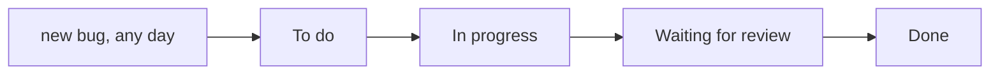

## Bạn cần biết trước

- [[management.l1.scrum-from-junior-seat]] — bạn biết sprint là một khung thời gian cố định có một mục tiêu, và việc không vừa sẽ chuyển sang sprint sau thay vì kéo dài ngày.

## Tình huống

Công ty Đơn Hàng có hai đội phát triển. Đội tính năng lên kế hoạch theo sprint hai tuần, mỗi sprint một mục tiêu. Nhóm hỗ trợ nhận báo lỗi và câu hỏi của khách hàng đến vào bất kỳ ngày nào trong tuần, và có những việc không thể chờ tới khi sprint sau bắt đầu. Nhóm hỗ trợ hoàn toàn không dùng sprint, vậy mà công việc của họ vẫn rõ ràng và ngăn nắp không kém: nó nằm trên một bảng có bốn cột. Việc di chuyển trên bảng đó thế nào khi không có sprint, và vì sao một công ty lại dùng cả hai cách cùng lúc?

## Khái niệm cốt lõi

- **Kanban** — cách theo dõi công việc như một dòng chảy liên tục qua các cột của một bảng, không có sprint độ dài cố định: một việc đi tiếp bất cứ khi nào nó sẵn sàng.
- cột của bảng — một giai đoạn của công việc, như cần làm, đang làm, chờ review hay xong; mỗi việc chỉ nằm ở đúng một cột tại một thời điểm.
- dòng chảy — công việc đi qua các cột từng việc một, thay vì theo một khối được lên kế hoạch lúc bắt đầu một khung thời gian.

## Cơ chế hoạt động



**Kanban** giữ cho công việc chảy qua một bảng. Việc mới vào cột đầu tiên khi được chấp nhận, theo thứ tự ưu tiên. Khi có người rảnh, họ kéo việc trên cùng sang cột kế tiếp, và mỗi việc đi tiếp ngay khi bước hiện tại của nó xong. Không có sprint và không có mục tiêu sprint: không gì phải chờ sprint planning, buổi họp đầu sprint nơi đội chọn việc, và không gì phải chờ hết khối hai tuần mới được tính là xong.

Vì vậy, một bảng Kanban luôn cho thấy hiện tại. Bất kỳ lúc nào bạn cũng đọc được việc gì đang chờ, việc gì đang làm, việc gì chờ review và việc gì đã xong. Bảng sprint trả lời một câu hỏi hẹp hơn: đội đã nhận những gì trong sprint này. Nó hiện các việc đội đã chọn cho sprint này, tức sprint backlog, thuộc về một sprint, nên sprint mới mang tới một bộ việc mới và bảng chỉ cho thấy phần việc của một sprint.

Hai cách này là hai mặc định khác nhau về lúc công việc di chuyển, không phải hai niềm tin đối nghịch. Scrum lên kế hoạch một khối việc quanh một mục tiêu sprint và giữ mục tiêu đó cố định trong suốt sprint; Kanban để mỗi việc tự đi tiếp. Các đội có thể kết hợp chúng, ví dụ giữ vai trò và các buổi họp của Scrum (như daily và retrospective) trong khi dùng một bảng kiểu Kanban. Scrum Guide, bản mô tả chính thức ngắn gọn về Scrum, không nói bảng của đội phải trông thế nào, nên lựa chọn đó thuộc về đội.

## Trong hệ thống Đơn Hàng

Bảng của nhóm hỗ trợ, trong `docs/team/kanban-board-example.md`:

```markdown file=docs/team/kanban-board-example.md tag=stage-1 lines=8-12
| Việc cần làm | Đang làm (giới hạn 2) | Chờ review (giới hạn 2) | Xong |
|---|---|---|---|
| Thêm chỉ mục cho `orders.customer_id` | Sửa lỗi trang sản phẩm bị chậm — Dev 3 | Thêm log cho lần đăng nhập thất bại — Dev 1 | Vá lỗi mật khẩu rỗng vẫn đăng nhập được |
| Viết tài liệu API cho `/api/v1/orders` | Kiểm tra lại cảnh báo email bị gửi hai lần — Dev 2 | | Sửa định dạng số tiền ở trang admin |
| Dọn log cũ hơn 30 ngày | | | Cập nhật container Postgres |
```

Bốn cột: `Việc cần làm`, `Đang làm`, `Chờ review` và `Xong`. Mỗi việc nằm ở một cột, kèm tên lập trình viên khi đã có người làm. `(giới hạn 2)` sau tên hai cột nghĩa là tối đa hai việc được nằm ở đó cùng lúc, điều mà bài sau sẽ nói tới. Cùng file đó giải thích vì sao đội này không có sprint:

```markdown file=docs/team/kanban-board-example.md tag=stage-1 lines=24-28
Nhóm hỗ trợ (Dev 1, Dev 2) nhận việc từ báo lỗi và câu hỏi của khách hàng bất
cứ ngày nào trong tuần; gom chúng vào một khối hai tuần sẽ làm chậm những việc
cần sửa ngay. Đội tính năng (Dev 3, Dev 4) vẫn dùng sprint riêng (xem
`sprint-example.md`) cho các việc lớn, có thể lên kế hoạch trước — hai đội
cùng công ty, khác cách tổ chức việc theo đúng loại việc mỗi đội nhận.
```

File nói nhóm hỗ trợ nhận việc từ báo lỗi và câu hỏi của khách hàng vào bất kỳ ngày nào, và gom chúng vào một khối hai tuần sẽ làm chậm những việc cần sửa ngay. Đội tính năng giữ sprint riêng cho các việc lớn có thể lên kế hoạch trước, và file chỉ tới `sprint-example.md` để xem một sprint diễn ra thế nào. Một công ty, hai cách tổ chức công việc, mỗi cách hợp với loại việc mà đội đó nhận.

## Người mới hay nghĩ rằng…

- **"Kanban chỉ là Scrum mà không đặt tên cho các vai trò."** → Thực ra khác biệt nằm ở lúc công việc di chuyển: Scrum cố định một khung thời gian và một mục tiêu, còn Kanban không cần cái nào, nên mỗi việc đi tiếp ngay khi sẵn sàng. Bạn sẽ nhận ra khi một lỗi khẩn tới bảng của nhóm hỗ trợ vào thứ Tư và lên đầu `Việc cần làm` ngay, để được nhận ngay khi có người làm được, thay vì chờ sprint planning tiếp theo.
- **"Một đội dùng bảng có cột thì tự động là đang làm Kanban."** → Thực ra một đội Scrum có thể dùng cùng các cột cho sprint backlog của mình mà vẫn làm theo khối hai tuần. Các cột chỉ đặt tên cho các giai đoạn; Kanban là việc quản lý cách từng việc chảy qua chúng. Bạn sẽ nhận ra khi một bảng có các cột trông như Kanban lại bị dọn sạch và lấp đầy lại mỗi hai tuần ở sprint planning.

## Thử ngay (3 phút)

Mở `docs/team/kanban-board-example.md` và `docs/team/sprint-example.md` trong repository cạnh nhau.

1. Trên bảng Kanban, liệt kê những gì đang ở `Đang làm` và `Chờ review` lúc này.
2. Trong Sprint 14, tìm việc không xong, và việc đó đã ra sao.
3. Hình dung một khách hàng báo vào thứ Tư rằng đơn hàng hiện sai tổng tiền. Ghi ra khi nào mỗi đội sẽ bắt đầu làm việc đó.

Kết quả mong đợi: 1 — `Đang làm`: trang sản phẩm bị chậm và cảnh báo email gửi hai lần; `Chờ review`: thêm log cho lần đăng nhập thất bại. 2 — `Ngừng gửi thông báo cho đơn đã hủy`, việc đã được chuyển sang sprint sau. 3 — nhóm hỗ trợ ngay khi có người nhận được, khi một việc rời khỏi cột `Đang làm` đang đầy; đội tính năng thường là ở sprint planning tiếp theo.

Cả hai file mô tả cùng một công ty. Vì sao bảng Kanban hợp hơn với công việc của nhóm hỗ trợ, còn sprint thì hợp với đội tính năng?

<details><summary>Gợi ý đáp án</summary>

Việc của nhóm hỗ trợ đến bất chợt và có việc không thể chờ, nên để mỗi việc chảy lên bảng và đi tiếp ngay khi có người nhận giúp những bản sửa khẩn bắt đầu mà không phải chờ sprint sau. Việc của đội tính năng lớn hơn và lên kế hoạch được, nên một khung hai tuần với một mục tiêu giúp đội cam kết một phần dùng được và bảo vệ nó khỏi bị gián đoạn. Khác biệt nằm ở loại việc mỗi đội nhận, không phải phương pháp nào tốt hơn.

</details>

## Liên hệ

- [[management.l1.scrum-from-junior-seat]] — sprint, mục tiêu và các vai trò mà Kanban không cần.
- [[management.l1.wip-limits]] — giới hạn ở cột `Đang làm`, và vì sao nó quan trọng.
- [[management.l1.why-estimate]] — vì sao các đội làm sprint ước lượng kích cỡ công việc.

## Tóm tắt 5 dòng

1. **Kanban** theo dõi công việc như một dòng chảy liên tục qua các cột của bảng, không có sprint cố định và không có mục tiêu sprint.
2. Mỗi việc đi tiếp ngay khi sẵn sàng, nên bảng luôn cho thấy trạng thái hiện tại của các việc trên nó.
3. Bảng sprint cho thấy phần việc của một sprint và thường bắt đầu lại với mỗi sprint mới.
4. Nhóm hỗ trợ của Đơn Hàng dùng Kanban cho việc khó đoán trước, còn đội tính năng giữ sprint cho việc đã lên kế hoạch.
5. Scrum và Kanban là hai mặc định khác nhau về lúc công việc di chuyển, và các đội có thể kết hợp chúng.
