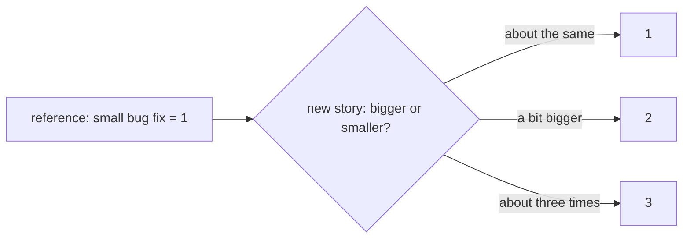

## Before you start

- [[management.l1.why-estimate]] — you know a team estimates to plan a sprint, that estimates are made before the work starts, and that Sprint 14's numbers compare stories with each other rather than counting hours.

## The situation

At planning, the product owner asks how long a new cancel button on the order screen will take. One developer says two days, another says half a day, and a third says it depends who does it and how the order screen code looks today. Nobody can agree on hours. Then someone asks a different question: is it bigger or smaller than the small bug fix the team did last sprint? Everyone agrees at once that it is bigger, about three times bigger. Why is the second question so much easier to answer than the first?

## Core concepts

- **story point** — a unit for estimating a story's size relative to other stories, not in hours or days; a 3-point story is expected to take about three times the effort of a 1-point story.
- relative estimate — an estimate made by comparing a story with ones the team already knows, instead of predicting its duration directly.
- reference story — a story the team knows well and uses as a yardstick, such as a small bug fix sized at 1.

## How it works



A **story point** measures how big a story is compared with the team's other stories. It does not stand for a number of hours. A 3-point story is expected to take roughly three times the effort of a 1-point one, whatever "effort" means to that team: time, complexity, risk and unknowns all mixed together. Two teams can give the same story different points, and neither is wrong, because each compares it with its own earlier work.

Relative estimates are easier to make than absolute ones. Predicting that a story will take eleven hours means imagining every step, every interruption and every surprise. Deciding that it is bigger than one known story and smaller than another only needs a comparison with things the team has already done. People are much more consistent at comparing than at predicting durations, so the numbers agree more often and change less from person to person.

The points are not required by Scrum. The Scrum Guide says the developers who will do the work are responsible for sizing it, and leaves the technique to the team. Story points are one common choice, not a rule.

## In the Đơn Hàng system

Sprint 14's backlog, in `docs/team/sprint-example.md`:

```markdown file=docs/team/sprint-example.md tag=stage-0 lines=12-18
| Việc | Người nhận | Ước lượng | Trạng thái cuối sprint |
|---|---|---|---|
| API `POST /api/v1/orders/{id}/cancel` | Dev 1 | 3 | Xong |
| Nút "Hủy đơn" trên màn hình đơn hàng | Dev 2 | 3 | Xong |
| Chặn hủy đơn đã thanh toán | Dev 1 | 2 | Xong |
| Ngừng gửi thông báo cho đơn đã hủy | Dev 3 | 2 | Chưa xong, chuyển sprint sau |
| Sửa lỗi tổng tiền sai ở đơn nhiều dòng | Dev 4 | 1 | Xong |
```

The `Ước lượng` column holds plain numbers: 3, 3, 2, 2, 1. The wrong-total bug is the smallest, at 1; the cancel endpoint and the cancel button are about three times as big, at 3. Nothing in the table says how many hours any of them took; the numbers are sizes, not hours. The same file's retrospective confirms the unit:

```markdown file=docs/team/sprint-example.md tag=stage-0 lines=39-39
- Hành động cho sprint sau: mỗi việc lớn hơn 3 điểm phải có hai người đọc code.
```

`mỗi việc lớn hơn 3 điểm`, every item larger than 3 points, uses the points as a size threshold: from the next sprint, any item above it must have two people read its code. The team is using its own scale to decide how it works, which only makes sense if everyone on the team reads the numbers the same way.

## Beginners often think…

- **"A story point maps to a fixed number of hours, the same for every team."** → Actually a point only means "this much bigger than our other stories", measured against the team's own earlier work. Another team may call the same story a 5. You notice this when two teams try to compare their point totals and the comparison says nothing, because each team's scale is its own.
- **"Story points are part of the Scrum Guide's own rules for how a Sprint Backlog must be estimated."** → Actually the Scrum Guide leaves sizing to the developers and names no technique; points are something many teams add. You notice this when a team that sizes stories as small, medium and large is told it is "not doing Scrum", and the Guide says nothing either way.

## Try it (3 minutes)

Open `docs/team/sprint-example.md` from the repository.

1. Sort the five Sprint 14 items from smallest to largest, using the `Ước lượng` column.
2. Take a new story: "As a customer, I want to see my order's status on the order screen." Decide whether it is bigger or smaller than the wrong-total fix (1) and than the cancel button (3), and give it a number.
3. Write one sentence on why you did not need to know how many hours the cancel button took.

Expected result: 1 — the wrong-total fix (1); then the two items at 2; then the cancel endpoint and the cancel button (3). 2 — any number from 1 to 3 with a comparison as the reason, for example 2: "bigger than the wrong-total fix, smaller than the cancel button". 3 — because you only compared it with items the team already knew.

Two teammates give the new story a 2 and a 3. How should the team settle it, without talking about hours?

<details><summary>Suggested answer</summary>

Each explains which known item they compared it with and why it looks bigger or smaller. Often one of them knows something the other does not, such as a part of the order screen that has to change. Once the reason is shared, the team picks the number that matches the agreed comparison. The discussion is about the story compared with others, not about predicting hours.

</details>

## Connections

- [[management.l1.why-estimate]] — why a team estimates at all.
- [[management.l1.estimates-are-not-commitments]] — why a story's points are not a promise about when it will be done.
- [[management.l1.user-story-and-ac]] — the stories and acceptance criteria that points are given to.

## Five-line summary

1. A **story point** estimates a story's size relative to the team's other stories, not in hours or days.
2. A 3-point story is expected to take about three times the effort of a 1-point story.
3. Comparing a story with known ones is easier and more consistent than predicting its hours.
4. Points belong to one team's scale; another team may size the same story differently.
5. The Scrum Guide leaves sizing to the developers; story points are one common choice, not a rule.
