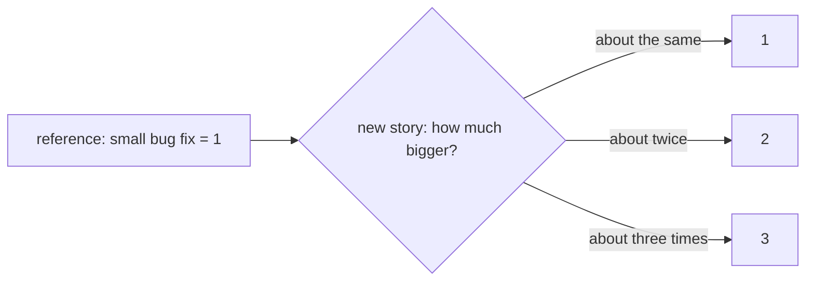

## Bạn cần biết trước

- [[management.l1.why-estimate]] — bạn biết một đội ước lượng để lập kế hoạch sprint, rằng ước lượng được đưa ra trước khi bắt đầu làm, và rằng các con số của Sprint 14 so sánh các story với nhau chứ không đếm giờ.

## Tình huống

Ở buổi planning, product owner hỏi một nút hủy đơn mới trên màn hình đơn hàng sẽ mất bao lâu. Một lập trình viên nói hai ngày, người khác nói nửa ngày, người thứ ba nói còn tùy ai làm và code màn hình đơn hàng hôm nay trông ra sao. Không ai thống nhất được số giờ. Rồi có người hỏi một câu khác: việc này lớn hơn hay nhỏ hơn cái lỗi nhỏ đội đã sửa ở sprint trước? Cả đội đồng ý ngay rằng nó lớn hơn, khoảng gấp ba. Vì sao câu hỏi thứ hai dễ trả lời hơn câu thứ nhất nhiều đến vậy?

## Khái niệm cốt lõi

- **story point** — đơn vị ước lượng kích cỡ của một story so với các story khác, không tính bằng giờ hay ngày; một story 3 điểm được kỳ vọng tốn khoảng gấp ba công sức của một story 1 điểm.
- ước lượng tương đối — ước lượng bằng cách so một story với những story đội đã biết, thay vì đoán thẳng nó mất bao lâu.
- story tham chiếu — một story đội đã biết rõ và dùng làm thước đo, ví dụ một lần sửa lỗi nhỏ được định cỡ 1.

## Cơ chế hoạt động



Một **story point** đo một story lớn cỡ nào so với các story khác của đội. Nó không đại diện cho một số giờ. Một story 3 điểm được kỳ vọng tốn khoảng gấp ba công sức của story 1 điểm, dù "công sức" với đội đó nghĩa là gì. Hai đội có thể cho cùng một story số điểm khác nhau mà không đội nào sai, vì mỗi đội so nó với công việc trước đây của chính mình.

Sơ đồ cho thấy phép so sánh đó diễn ra thế nào. Đội chọn một story tham chiếu đã biết rõ, ở đây là một lần sửa lỗi nhỏ được định cỡ 1, làm bậc nhỏ nhất trên thang của mình. Với một story mới, đội hỏi nó trông lớn hơn story tham chiếu bao nhiêu: xấp xỉ bằng là 1, khoảng gấp đôi là 2, khoảng gấp ba là 3. Một story mới trông nhỏ hơn story tham chiếu thì đơn giản nhận 1, cỡ nhỏ nhất.

Ước lượng tương đối dễ đưa ra hơn ước lượng tuyệt đối. Đoán rằng một story sẽ mất mười một giờ nghĩa là phải hình dung mọi bước, mọi lần bị ngắt quãng và mọi bất ngờ. Quyết định rằng nó lớn hơn một story đã biết và nhỏ hơn một story khác chỉ cần so với những việc đội đã làm. Phép so sánh cũng không phụ thuộc vào ai nhận story, vì cả đội so nó với cùng những việc đã biết. Con người thường nhất quán khi so sánh hơn khi đoán thời lượng, nên các con số thường khớp nhau giữa người này với người khác hơn.

Scrum không bắt buộc dùng điểm. Scrum Guide nói các developer sẽ làm việc đó chịu trách nhiệm định cỡ nó, và để kỹ thuật cho đội tự chọn. Story point là một lựa chọn phổ biến, không phải quy tắc.

## Trong hệ thống Đơn Hàng

Sprint backlog của Sprint 14, trong `docs/team/sprint-example.md`:

```markdown file=docs/team/sprint-example.md tag=stage-0 lines=12-18
| Việc | Người nhận | Ước lượng | Trạng thái cuối sprint |
|---|---|---|---|
| API `POST /api/v1/orders/{id}/cancel` | Dev 1 | 3 | Xong |
| Nút "Hủy đơn" trên màn hình đơn hàng | Dev 2 | 3 | Xong |
| Chặn hủy đơn đã thanh toán | Dev 1 | 2 | Xong |
| Ngừng gửi thông báo cho đơn đã hủy | Dev 3 | 2 | Chưa xong, chuyển sprint sau |
| Sửa lỗi tổng tiền sai ở đơn nhiều dòng | Dev 4 | 1 | Xong |
```

Cột `Ước lượng` chứa những con số trần: 3, 3, 2, 2, 1. Bảng gọi mỗi dòng là một việc (`Việc`), và việc sửa lỗi được định cỡ trong cùng cột với các tính năng mới. Lỗi tổng tiền sai là nhỏ nhất, ở mức 1; endpoint hủy đơn và nút hủy đơn lớn khoảng gấp ba, ở mức 3. Không chỗ nào trong bảng nói việc nào mất bao nhiêu giờ; các con số là kích cỡ, không phải giờ. Phần retrospective của cùng file xác nhận đơn vị:

```markdown file=docs/team/sprint-example.md tag=stage-0 lines=39-39
- Hành động cho sprint sau: mỗi việc lớn hơn 3 điểm phải có hai người đọc code.
```

`mỗi việc lớn hơn 3 điểm` dùng điểm như một ngưỡng kích cỡ: từ sprint sau, việc nào vượt ngưỡng đó phải có hai người đọc code của nó. Đội đang dùng thang của chính mình để quyết định cách làm việc, điều chỉ có nghĩa khi mọi người trong đội hiểu các con số giống nhau.

## Người mới hay nghĩ rằng…

- **"Một story point ứng với một số giờ cố định, giống nhau ở mọi đội."** → Thực ra một điểm chỉ có nghĩa "lớn hơn các story khác của chúng tôi chừng này", đo so với công việc trước đây của chính đội. Đội khác có thể gọi cùng story đó là 5. Bạn sẽ nhận ra khi hai đội thử so tổng điểm của nhau và phép so sánh chẳng nói lên gì, vì thang của mỗi đội là của riêng đội đó.
- **"Story point là một phần trong quy tắc của chính Scrum Guide về cách phải ước lượng Sprint Backlog."** → Thực ra Scrum Guide để việc định cỡ cho developer và không nêu kỹ thuật nào; điểm là thứ nhiều đội tự thêm vào. Bạn sẽ nhận ra khi một đội định cỡ story theo nhỏ, vừa, lớn bị bảo là "không làm Scrum", trong khi Guide không nói gì về chuyện đó.

## Thử ngay (3 phút)

Mở `docs/team/sprint-example.md` trong repository.

1. Xếp năm việc của Sprint 14 từ nhỏ đến lớn, theo cột `Ước lượng`.
2. Lấy một story mới: "Là khách hàng, tôi muốn thấy trạng thái đơn của mình trên màn hình đơn hàng." Quyết định nó lớn hơn hay nhỏ hơn việc sửa lỗi tổng tiền (1) và nút hủy đơn (3), rồi cho nó một con số.
3. Viết một câu giải thích vì sao bạn không cần biết nút hủy đơn đã mất bao nhiêu giờ.

Kết quả mong đợi: bước 1 — việc sửa lỗi tổng tiền (1); rồi hai việc ở mức 2; rồi endpoint hủy đơn và nút hủy đơn (3). Bước 2 — một con số bất kỳ từ 1 đến 3 kèm lý do là một phép so sánh, ví dụ 2: "lớn hơn việc sửa lỗi tổng tiền, nhỏ hơn nút hủy đơn". Bước 3 — vì bạn chỉ so nó với những việc đội đã biết.

Hai đồng đội cho story mới 2 và 3. Đội nên chốt thế nào, mà không bàn về giờ?

<details><summary>Gợi ý đáp án</summary>

Mỗi người giải thích mình đã so nó với việc đã biết nào và vì sao nó trông lớn hơn hay nhỏ hơn. Thường một người biết điều người kia không biết, ví dụ một phần của màn hình đơn hàng phải sửa. Khi lý do đã được chia sẻ, đội chọn con số khớp với phép so sánh cả đội đồng ý. Cuộc bàn luận xoay quanh việc so story với các story khác, không phải đoán giờ.

</details>

## Liên hệ

- [[management.l1.why-estimate]] — vì sao một đội ước lượng.
- [[management.l1.estimates-are-not-commitments]] — vì sao số điểm của một story không phải lời hứa về lúc nó xong.
- [[management.l1.user-story-and-ac]] — các story và tiêu chí chấp nhận mà điểm được gán cho.

## Tóm tắt 5 dòng

1. Một **story point** ước lượng kích cỡ của một story so với các story khác của đội, không tính bằng giờ hay ngày.
2. Một story 3 điểm được kỳ vọng tốn khoảng gấp ba công sức của một story 1 điểm.
3. So một story với những story đã biết thường dễ và nhất quán hơn đoán số giờ của nó.
4. Điểm thuộc về thang của một đội; đội khác có thể định cỡ cùng story đó khác đi.
5. Scrum Guide để việc định cỡ cho developer; story point là một lựa chọn phổ biến, không phải quy tắc.
