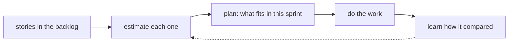

## Before you start

- [[management.l1.wip-limits]] — you know a Kanban team limits how much is in progress instead of planning a batch of work in advance.
- [[management.l1.user-story-and-ac]] — you know a story states who wants what and why, and that its acceptance criteria make it checkable before anyone starts coding.

## The situation

Your first sprint planning with a Đơn Hàng team that works in sprints. The product owner reads out five items, and after each one the team says a small number: 3, 3, 2, 2, 1. Nobody has started any of the work, and nobody seems sure how long any of it will take. A junior next to you whispers that these numbers must be deadlines, and asks what happens to whoever guessed wrong. If nobody can know the real size yet, why does the team bother to guess at all?

## Core concepts

- estimate — a best guess at how big a piece of work is, made before the work starts, with the information available at that moment.
- planning — deciding how much work reasonably fits into a sprint, or roughly how long a larger piece of work will take.
- sprint planning — the meeting at the start of a sprint where the team chooses the work that fits.

## How it works

A team estimates so that it can plan. At sprint planning, the question is how many of the waiting stories fit into the next sprint. That question cannot be answered without some idea of how big each story is compared with the others. The numbers in Sprint 14 compare stories with each other; they are not hours or days, and the next lesson shows how they are chosen. The same holds for larger work: to say whether a feature is a matter of weeks or of months, the team needs a rough size for its parts.

An estimate is made before the work starts, so it can only use what the team knows then. The code has not been read closely, the unexpected problem has not appeared yet, and the person who knows the old module may be on holiday. Estimates will therefore sometimes be wrong, in both directions: some work turns out smaller than it looked, and some larger. That is expected, not a sign that the team did something wrong.

What an estimate is not is a promise to someone outside the team. It is the team's own planning tool. A story with no estimate can still be worked on; what the team cannot do without some idea of each story's size is decide how many stories to take into a sprint. After the work is done, the team can look back and see how its guesses compared with reality, which is how the next estimates get better; that is the dashed arrow in the diagram.

## In the Đơn Hàng system

The Sprint 14 backlog, in `docs/team/sprint-example.md`, has a column `Ước lượng`, estimate, with a number for each item: 3 for the cancel endpoint and for the cancel button, 2 for blocking cancellation of a paid order and for stopping notifications for a cancelled order, and 1 for the wrong-total bug. Numbers like these are what let a team decide, at planning, how many items fit into the sprint.

The same file shows the other half. One item, stopping notifications for a cancelled order, was estimated at 2 and did not finish; it moved to the next sprint. At the sprint review, the meeting at the end of the sprint, the team simply did not count it as done, and the file does not say why it took longer. An estimate helps plan a sprint; it does not decide what happens in it.

The Kanban board in `docs/team/kanban-board-example.md` has no estimate column. That team does not plan a batch of work in advance; it limits what is in progress instead, so it has less need to size each item before it starts.

## Beginners often think…

- **"The point of estimating is to give management an exact deadline to hold the team to."** → Actually the team estimates for its own planning: to see how much fits into a sprint, or roughly how long larger work will take. A number made before the work starts cannot be exact. You notice this when estimates are turned into deadlines and people start giving larger numbers to protect themselves, so the numbers stop being useful for planning.
- **"A good team's estimates are always right; being wrong means the estimate was done badly."** → Actually every estimate uses only what is known before the work starts, so good teams are wrong too, in both directions. What a good team does is learn from the difference. You notice this when one item estimated at 2 does not finish in its sprint, as in Sprint 14, while the other four do.

## Try it (3 minutes)

Open `docs/team/sprint-example.md` from the repository.

1. Add up the numbers in the `Ước lượng` column.
2. Find the item that did not finish, and its estimate.
3. Write one sentence on what the team could learn from that item at its retrospective, without saying anyone guessed badly.

Expected result: 1 — 11. 2 — `Ngừng gửi thông báo cho đơn đã hủy`, estimated at 2. 3 — for example: "this item took longer than we sized it; let's look at why before we size similar work next time."

The unfinished item was estimated at 2 and still did not fit. Does that mean the 2 was a mistake, and should the team stop estimating?

Suggested answer

No. The 2 was the team's best guess with what it knew at planning; the item took longer than that, which work sometimes does, and the file does not say why. An estimate like this still does its job: it helps a team judge how many items fit into a sprint. Stopping would leave the team with no way to decide how much fits into a sprint. The better response is to find out at the retrospective why it took longer and use that at the next planning.

## Connections

- [[management.l1.relative-estimation]] — how the numbers in the `Ước lượng` column are chosen: relative size, not hours.
- [[management.l1.estimates-are-not-commitments]] — why an estimate must not be treated as a promise.
- [[management.l1.scrum-from-junior-seat]] — the sprint and its planning that estimates feed into.

## Five-line summary

1. A team estimates so it can plan: how much fits into a sprint, or roughly how long larger work will take.
2. An estimate is made before the work starts, with only what is known then.
3. Estimates are sometimes wrong in both directions, and that is expected, not a failure.
4. Work can start without an estimate, but a sprint cannot be planned without knowing roughly how big each story is.
5. Sprint 14's `Ước lượng` numbers are for planning; the unfinished item did not make its estimate a broken promise.
