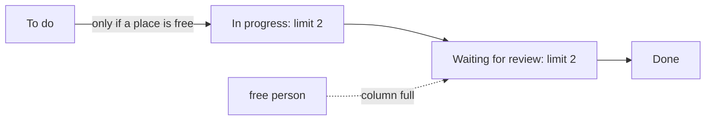

## Before you start

- [[management.l1.kanban-vs-scrum]] — you know Kanban moves each item through board columns as soon as it is ready, and that the team's board marks two columns `(giới hạn 2)`, which this lesson explains.

## The situation

Dev 4 has just finished a task and, eager to keep busy, reaches for the next item in `Việc cần làm`. The `Đang làm` column already holds two items, and the team lead stops Dev 4 before the card moves. Dev 4 is free, the work is waiting, and nobody else is touching that item. From Dev 4's seat, refusing to start looks like wasting a working day. Why would a team deliberately stop a free person from starting new work, and what should Dev 4 do instead?

## Core concepts

- **WIP limit** — a cap on how many items can sit in one column at once; WIP stands for work in progress. Once the column is full, nobody starts new work there, and no item moves into it from the column before, until something moves out.
- full column — a column that has reached its limit; the board shows at a glance that the stage is saturated.
- finishing over starting — the habit a WIP limit builds: when you are free and the column is full, help move an existing item forward instead of opening another.

## How it works



On the Đơn Hàng team's board, each **WIP limit** belongs to one column: it is the number in brackets after the column name. It says how many items may be in that column at the same time. While the column has room, anyone who is free pulls the next item in. When it is full, the rule is plain: nobody starts another item there until one leaves.

The limit changes what a free person does. Instead of opening something new, they look at what is already in progress or waiting and help move it forward: review a pull request that is waiting, test a fix, or sit with the person on a stuck item and work on it together. In the diagram, that is the dashed arrow: a free person who finds `In progress` full goes to `Waiting for review` to help there. Work gets finished before more is started, so fewer things sit half-done.

Without a limit, too much work in progress is invisible. Every person can have three things open, each moving slowly, and the board still looks busy and healthy. With a limit, the same problem shows on the board itself: a column that stays full, with items that do not leave it, shows where work is stuck, and you can point at it. The limit does not make the team do less; it makes the team finish what it started, and it makes a jam visible when it happens.

## In the Đơn Hàng system

The team's Kanban board, in `docs/team/kanban-board-example.md`, limits two columns:

```markdown file=docs/team/kanban-board-example.md tag=stage-1 lines=8-12
| Việc cần làm | Đang làm (giới hạn 2) | Chờ review (giới hạn 2) | Xong |
|---|---|---|---|
| Thêm chỉ mục cho `orders.customer_id` | Sửa lỗi trang sản phẩm bị chậm — Dev 3 | Thêm log cho lần đăng nhập thất bại — Dev 1 | Vá lỗi mật khẩu rỗng vẫn đăng nhập được |
| Viết tài liệu API cho `/api/v1/orders` | Kiểm tra lại cảnh báo email bị gửi hai lần — Dev 2 | | Sửa định dạng số tiền ở trang admin |
| Dọn log cũ hơn 30 ngày | | | Cập nhật container Postgres |
```

`Đang làm` and `Chờ review` each carry `(giới hạn 2)`. `Đang làm` already has two items, so it is full. The file tells what happened next:

```markdown file=docs/team/kanban-board-example.md tag=stage-1 lines=16-20
Dev 4 vừa xong một việc và định lấy việc thứ ba trong "Việc cần làm", nhưng
"Đang làm" đã có hai việc của Dev 2 và Dev 3. Trưởng nhóm chặn lại: giới hạn
nghĩa là dừng, đi giúp một việc đang có sẵn — ví dụ đọc review đang chờ ở cột
kế bên — thay vì mở việc mới. Một cột đầy là tín hiệu tắc nghẽn, không phải
chỗ trống cho người rảnh.
```

Dev 4 has finished a task and wants to take a third item from `Việc cần làm` into `Đang làm`, but the team lead stops them: the limit means stop and help an item that is already there, for example by reading the review waiting in the next column, instead of opening something new. The last sentence states the rule: a full column is a signal of a blockage, not an empty seat for whoever is free.

## Beginners often think…

- **"A WIP limit just slows the team down by capping how much work they can do."** → Actually it caps how much is started at once, not how much gets done. When a free person helps finish an item already in progress, that item reaches `Xong` sooner, and the next one can start. You notice this when a team with many items open at once sees each of them take longer to reach `Xong`, because everyone's time is split across all of them.
- **"WIP limits are a suggestion, not something the board actually enforces by structure."** → Actually the limit is a rule, not a hint: the team treats a full column as closed, as the team lead does with Dev 4, and the number on the column shows everyone at once when the rule is broken. You notice this when a column labelled `limit 2` quietly holds four items and nobody treats that as a problem any more.

## Try it (3 minutes)

Open `docs/team/kanban-board-example.md` from the repository.

1. Count the items in `Đang làm` and in `Chờ review`, and compare each with its limit.
2. Suppose the item in `Chờ review` passes its review and moves to `Xong`. Write down which column now has room, and how many places.
3. Suppose instead the slow product page fix is finished and its pull request is opened. Write down where that item moves, and whether that is allowed.

Expected result: 1 — `Đang làm` has 2 of 2, full; `Chờ review` has 1 of 2. 2 — `Chờ review` now has 0 of 2, so two places; `Đang làm` is still full. 3 — it moves to `Chờ review`, which has one free place, so it is allowed, and `Đang làm` drops to 1 of 2.

After step 3, one place is free in `Đang làm`. What should Dev 4 do now, and why was waiting the right call a moment ago?

<details><summary>Suggested answer</summary>

Dev 4 can now pull the top item from `Việc cần làm` into `Đang làm`, because the column has room. Waiting was the right call because, while the column was full, starting a third item would only have added to the unfinished work. A place frees up only when an existing item moves on, as the product page fix did in step 3, and helping items move on is what Dev 4 was sent to do.

</details>

## Connections

- [[management.l1.kanban-vs-scrum]] — the board and the flow that the limit applies to.
- [[management.l1.code-review-basics]] — the reviews a free developer can help with when a column is full.
- [[management.l1.why-estimate]] — how sprint teams decide how much work fits, instead of limiting a column.

## Five-line summary

1. A **WIP limit** caps how many items can sit in one column at once; a full column accepts nothing new.
2. When a column is full, a free person helps finish something already there instead of starting more.
3. The limit makes too much work in progress visible: a column that stays full shows where work is stuck.
4. The team's board limits `Đang làm` and `Chờ review` to two items each.
5. A WIP limit is a rule the team keeps, and the number on the column shows at once when it is broken.
