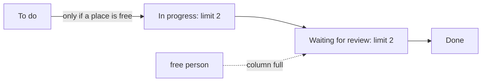

## Bạn cần biết trước

- [[management.l1.kanban-vs-scrum]] — bạn biết Kanban đưa mỗi việc đi qua các cột của bảng ngay khi nó sẵn sàng, và bảng của đội đánh dấu hai cột `(giới hạn 2)`, điều mà bài này giải thích.

## Tình huống

Dev 4 vừa làm xong một việc và, muốn luôn có việc để làm, với tay lấy việc tiếp theo trong `Việc cần làm`. Cột `Đang làm` đã có hai việc, và trưởng nhóm chặn Dev 4 lại trước khi thẻ kịp di chuyển. Dev 4 đang rảnh, việc đang chờ, và không ai khác động vào việc đó. Từ chỗ ngồi của Dev 4, việc từ chối bắt đầu trông như lãng phí một ngày làm việc. Vì sao một đội lại cố ý chặn một người đang rảnh bắt đầu việc mới, và Dev 4 nên làm gì thay vào đó?

## Khái niệm cốt lõi

- **WIP limit** — giới hạn số việc được nằm trong một cột cùng lúc; WIP là viết tắt của work in progress, việc đang làm. Khi cột đã đầy, không ai bắt đầu việc mới ở đó, và không việc nào từ cột trước được chuyển vào, cho tới khi có việc rời đi.
- cột đầy — một cột đã chạm giới hạn; bảng cho thấy ngay giai đoạn đó đã quá tải.
- làm xong hơn là bắt đầu — thói quen mà WIP limit tạo ra: khi bạn rảnh mà cột đã đầy, hãy giúp một việc đang có đi tiếp thay vì mở thêm việc khác.

## Cơ chế hoạt động



Trên bảng của đội Đơn Hàng, mỗi **WIP limit** thuộc về một cột: đó là con số trong ngoặc sau tên cột. Nó cho biết có bao nhiêu việc được nằm trong cột đó cùng lúc. Khi cột còn chỗ, ai rảnh sẽ kéo việc tiếp theo vào. Khi cột đã đầy, quy tắc rất đơn giản: không ai bắt đầu thêm việc ở đó cho tới khi có một việc rời đi.

Giới hạn thay đổi việc mà một người rảnh sẽ làm. Thay vì mở việc mới, họ nhìn vào những gì đang làm hoặc đang chờ và giúp chúng đi tiếp: review một pull request đang chờ, test một bản sửa, hoặc ngồi cùng người đang kẹt ở một việc và cùng làm. Trong sơ đồ, đó là mũi tên nét đứt: một người rảnh thấy `In progress` đã đầy sẽ sang `Waiting for review` để giúp ở đó. Việc được làm xong trước khi bắt đầu thêm, nên ít thứ nằm dở dang hơn.

Không có giới hạn, tình trạng quá nhiều việc đang làm là vô hình. Mỗi người có thể mở ba việc, việc nào cũng nhích chậm, mà bảng vẫn trông bận rộn và khỏe mạnh. Có giới hạn, cùng vấn đề đó hiện ngay trên bảng: một cột cứ đầy mãi, với những việc không rời đi, cho thấy công việc đang kẹt ở đâu, và bạn chỉ tay vào đó được. Giới hạn không khiến đội làm ít đi; nó khiến đội làm xong những gì đã bắt đầu, và làm lộ ra chỗ tắc khi nó xảy ra.

## Trong hệ thống Đơn Hàng

Bảng Kanban của đội, trong `docs/team/kanban-board-example.md`, giới hạn hai cột:

```markdown file=docs/team/kanban-board-example.md tag=stage-1 lines=8-12
| Việc cần làm | Đang làm (giới hạn 2) | Chờ review (giới hạn 2) | Xong |
|---|---|---|---|
| Thêm chỉ mục cho `orders.customer_id` | Sửa lỗi trang sản phẩm bị chậm — Dev 3 | Thêm log cho lần đăng nhập thất bại — Dev 1 | Vá lỗi mật khẩu rỗng vẫn đăng nhập được |
| Viết tài liệu API cho `/api/v1/orders` | Kiểm tra lại cảnh báo email bị gửi hai lần — Dev 2 | | Sửa định dạng số tiền ở trang admin |
| Dọn log cũ hơn 30 ngày | | | Cập nhật container Postgres |
```

`Đang làm` và `Chờ review` đều có `(giới hạn 2)`. `Đang làm` đã có hai việc, nên nó đã đầy. File kể điều xảy ra tiếp theo:

```markdown file=docs/team/kanban-board-example.md tag=stage-1 lines=16-20
Dev 4 vừa xong một việc và định lấy việc thứ ba trong "Việc cần làm", nhưng
"Đang làm" đã có hai việc của Dev 2 và Dev 3. Trưởng nhóm chặn lại: giới hạn
nghĩa là dừng, đi giúp một việc đang có sẵn — ví dụ đọc review đang chờ ở cột
kế bên — thay vì mở việc mới. Một cột đầy là tín hiệu tắc nghẽn, không phải
chỗ trống cho người rảnh.
```

Dev 4 vừa xong một việc và muốn lấy thêm một việc thứ ba từ `Việc cần làm` sang `Đang làm`, nhưng trưởng nhóm chặn lại: giới hạn nghĩa là dừng lại và đi giúp một việc đang có, ví dụ đọc review đang chờ ở cột kế bên, thay vì mở việc mới. Câu cuối nêu quy tắc: một cột đầy là tín hiệu tắc nghẽn, không phải chỗ trống cho người đang rảnh.

## Người mới hay nghĩ rằng…

- **"WIP limit chỉ làm đội chậm lại bằng cách giới hạn lượng việc đội làm được."** → Thực ra nó giới hạn lượng việc được bắt đầu cùng lúc, không giới hạn lượng việc được làm xong. Khi một người rảnh giúp hoàn thành một việc đang làm, việc đó tới `Xong` sớm hơn, và việc tiếp theo có thể bắt đầu. Bạn sẽ nhận ra khi một đội mở nhiều việc cùng lúc thấy từng việc mất lâu hơn mới tới được `Xong`, vì thời gian của mọi người bị chia cho tất cả.
- **"WIP limit chỉ là một lời gợi ý, không phải thứ mà bảng thực sự áp đặt bằng cấu trúc."** → Thực ra giới hạn là một quy tắc, không phải lời gợi ý: đội coi một cột đầy là đã đóng, như trưởng nhóm làm với Dev 4, và con số trên cột cho mọi người thấy ngay khi quy tắc bị phá. Bạn sẽ nhận ra khi một cột ghi `limit 2` lặng lẽ chứa bốn việc mà không ai còn coi đó là vấn đề.

## Thử ngay (3 phút)

Mở `docs/team/kanban-board-example.md` trong repository.

1. Đếm số việc trong `Đang làm` và trong `Chờ review`, rồi so mỗi cột với giới hạn của nó.
2. Giả sử việc trong `Chờ review` qua được review và chuyển sang `Xong`. Ghi ra cột nào giờ còn chỗ, và bao nhiêu chỗ.
3. Giả sử thay vào đó, bản sửa trang sản phẩm bị chậm đã xong và pull request của nó được mở. Ghi ra việc đó chuyển đi đâu, và điều đó có được phép không.

Kết quả mong đợi: 1 — `Đang làm` có 2 trên 2, đã đầy; `Chờ review` có 1 trên 2. 2 — `Chờ review` giờ có 0 trên 2, nên còn hai chỗ; `Đang làm` vẫn đầy. 3 — nó chuyển sang `Chờ review`, cột còn một chỗ trống, nên được phép, và `Đang làm` giảm còn 1 trên 2.

Sau bước 3, `Đang làm` có một chỗ trống. Giờ Dev 4 nên làm gì, và vì sao lúc nãy chờ lại là quyết định đúng?

<details><summary>Gợi ý đáp án</summary>

Giờ Dev 4 có thể kéo việc trên cùng từ `Việc cần làm` sang `Đang làm`, vì cột đã có chỗ. Chờ là quyết định đúng vì, khi cột còn đầy, bắt đầu việc thứ ba chỉ làm tăng thêm việc dở dang. Một chỗ trống chỉ xuất hiện khi một việc đang có đi tiếp, như bản sửa trang sản phẩm ở bước 3, và giúp các việc đi tiếp chính là điều Dev 4 được cử đi làm.

</details>

## Liên hệ

- [[management.l1.kanban-vs-scrum]] — bảng và dòng chảy mà giới hạn áp dụng lên.
- [[management.l1.code-review-basics]] — các review mà một lập trình viên rảnh có thể giúp khi một cột đã đầy.
- [[management.l1.why-estimate]] — cách các đội làm sprint quyết định bao nhiêu việc là vừa, thay vì giới hạn một cột.

## Tóm tắt 5 dòng

1. Một **WIP limit** giới hạn số việc được nằm trong một cột cùng lúc; cột đã đầy thì không nhận việc mới.
2. Khi một cột đầy, người rảnh giúp hoàn thành việc đang có thay vì bắt đầu thêm.
3. Giới hạn làm lộ ra tình trạng quá nhiều việc đang làm: một cột cứ đầy mãi cho thấy công việc đang kẹt ở đâu.
4. Bảng của đội giới hạn `Đang làm` và `Chờ review` ở hai việc mỗi cột.
5. WIP limit là một quy tắc đội giữ, và con số trên cột cho thấy ngay khi nó bị phá.
