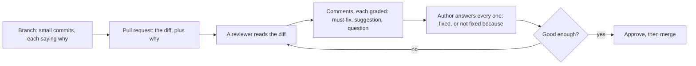

## Before you start

- [[foundation.l2.good-commits]] — a commit holds one logical change and its message says why; a pull request is that discipline one size up.
- [[foundation.l1.reading-code]] — you followed one path through an unfamiliar codebase instead of reading it in order; reviewing is the same method pointed at a change.

## The situation

Your change to the order-cancelling code sits on a branch, in small commits with messages saying why. Before you ask anyone to read it, you open `docs/team/review-comments-examples.md`, a note the repository keeps at `stage-0`, the version this lesson reads. It collects the comments this team left on an earlier pull request, a teammate's change merged before you joined that added order cancelling on the code you now touch: four it calls good, then a table of four it calls bad with the reason beside each. Two of the bad ones you have written yourself in a hurry. The note then turns round and addresses the author instead of the reviewer. What is this whole exchange for?

## Core concepts

- **pull request** — a request to merge one branch into another, carrying the diff — every line the merge would change — and a place to write beside it.
- **code review** — another person reading that diff before it merges, to find defects, to move knowledge both ways, and to keep the codebase reading as if one team wrote it.
- a must-fix comment — one the team does not merge until the author settles it, because something is wrong.
- a suggestion — a comment the author may take, or decline with a reason, because something could be better; the merge does not wait on it.
- a question — a comment that asks before it asserts, because the reviewer may have misread; by itself it says nothing is wrong, though the author still owes it an answer.
- an approval — the reviewer saying the change may merge now; the judgement is good enough, not perfect.

## How it works



In the situation above your branch is finished and the merge has not happened; the pull request stands between them. It is a request, not an act: it names the source and target branches and gives the team somewhere to write beside every changed line. The author writes a description with it, what the change does and why, because a reviewer who cannot see the why guesses at it. Git gives you the branch and the merge; the page holding the diff, the comments and the approval comes from the service hosting the repository.

A reviewer then reads that diff, and three things come out of it. Defects, the one juniors expect. Knowledge, moving both ways: the reviewer learns the change, the author learns the standard. And a codebase that reads as one team's work.

What the reviewer writes is graded, and the grade says what it costs. A must-fix holds the merge until the team settles it; a suggestion and a question do not hold it, though the author answers both. The note adds a fourth label, praise: it names what the author got right and holds nothing either. A comment about the person rather than the change is one of the four the note lists as bad. The grades are plain text: a hosting service can require an approval before a merge, but cannot tell a must-fix from a suggestion; the team does that.

Then the arrow goes back. The author answers each comment (fixed here, not fixed there, because) and adds new commits to the same branch; on the hosting service the pull request tracks that branch, not a fixed list of commits, so they join it. The reviewer reads again; the loop ends at approval: a change good enough to merge, not one beyond improving.

## In the Đơn Hàng system

The note is written for the team, not for a reader of the code. Its first half is four comments from that earlier pull request.

```markdown file=docs/team/review-comments-examples.md tag=stage-0 lines=7-18
> **Bắt buộc sửa.** Ở `OrderService.Cancel`, đơn `shipped` cũng bị chuyển sang
> `cancelled`. Tiêu chí chấp nhận số 3 nói chỉ đơn `new` mới hủy được. Bạn thêm
> một điều kiện, hay mình hiểu sai tiêu chí?

> **Gợi ý, không bắt buộc.** Tên `flag` ở dòng 42 không cho biết nó là gì.
> `customerOwnsOrder` sẽ đọc thẳng ra nghĩa, và bỏ được comment ngay bên trên.

> **Câu hỏi.** Vì sao chỗ này bắt `Exception` chứ không bắt riêng
> `InvalidOperationException`? Nếu có lý do mình chưa thấy thì ghi lại một dòng
> giúp mình nhé.

> **Khen.** Test cho trường hợp hủy hai lần rất hay, mình không nghĩ ra.
```

Each opens with its grade: must fix, a suggestion that is not compulsory, a question, praise. Each then names a place (`OrderService.Cancel`, the name `flag` on line 42, the line catching `Exception` where the reviewer expected `InvalidOperationException`) and gives a reason. The first holds the code against the cancel-order story's criterion 3, which the comment reads as allowing cancellation only from `new`, and ends by asking whether the author added a condition or misread it. Not one of the four judges the author as a person.

The second half is a table of four comments the note calls bad, each with its reason. "Code này sai" (this code is wrong) says neither where nor how. "Bạn nên học lại về transaction" (go back and learn about transactions) is about the person, not the code. "Đổi hết sang LINQ đi" (rewrite it all in another style, whichever style that is) is a preference with no reason and no grade. And "OK." on an eight-hundred-line change is approval without reading, which the note calls worse than not approving.

Then the note turns round and addresses the author.

```markdown file=docs/team/review-comments-examples.md tag=stage-0 lines=31-34
- Trả lời từng nhận xét, kể cả nhận xét bạn không đồng ý.
- Phân biệt rõ "đã sửa" và "không sửa, vì...".
- PR nhỏ nhận được nhận xét tốt hơn PR lớn, luôn luôn.
- Nhiều nhận xét không có nghĩa là bạn làm tệ. Nó có nghĩa là có người đọc kỹ.
```

Answer every comment, including the ones you disagree with. Keep "fixed" apart from "not fixed, because…", so the reviewer sees which is which. The note states one rule without exception: a small pull request, PR in its shorthand, gets better comments than a large one. And many comments do not mean you did badly; they mean somebody read closely.

Read the good half as the standards this team holds you to: the story's acceptance criteria, names that carry meaning, catching the error you meant, a test for cancelling twice.

Part of that standard is on paper. The story's acceptance criteria come first, then this team's Definition of Done, agreed before any of this, demanding a test for each criterion and a reading and approval by at least one other person. This note itself is the third: it fixes how a comment is phrased. What no file states is the judgement behind them: whether this name is clear enough here, which exception this code should catch. That shows up only in comments on real changes, which is why a junior who reviews meets it sooner than one who only waits to be reviewed.

## Beginners often think…

- **"Many comments on my pull request mean I did badly."** → Actually the count tracks how closely somebody read, not how bad the change is, and the team's note says so. You notice this when the change that merged with two comments is the one nobody had time to open.
- **"As a junior I have nothing to say in reviewing a senior's code."** → Actually the cheapest comment in the note is a question, and a question needs no seniority: asking why a line catches what it catches either teaches you something or finds something. You notice this when your question makes the author add the line of explanation the next reader needed.
- **"Approving means saying the code is perfect."** → Actually approval says the change may merge now; holding it for everything you would have written differently holds the merge over comments you could have marked as suggestions. You notice this when a pull request waits three days over one name while the branch collects conflicts.

## Try it (3 minutes)

1. Open `docs/team/review-comments-examples.md` (any copy will do: the lesson quotes every line you need) and cover the right-hand column of the table of bad comments. For each of the four, write the one clause that would make it usable, and say which grade it should have carried — except "OK.", an approval: say what would have to be in it before it counts as reading.
2. Rewrite "Code này sai." like the good ones: a grade, a place, a reason, and a question if you are not certain.

Expected result: your rewrite names a file or a line, says what the code does that it should not, and gives as its reason a rule the team holds, not a taste of yours.

<details><summary>Suggested answer</summary>

What each one needs: a place and what the code does there, as a must fix; the same remark turned onto the code (which transaction, what goes wrong) as a suggestion; a reason for the style change, or a question instead; and, for "OK.", one comment on something in the diff, or no approval yet. A rewrite of the first: "Must fix. `OrderService.Cancel` moves a `shipped` order to `cancelled`. I read criterion 3 as allowing cancellation only from `new` — have I misread it?"

</details>

## Connections

- [[foundation.l2.good-commits]] — the same discipline one size up: the commits it teaches are what a reviewer reads, and a branch of them is what a pull request proposes.
- [[foundation.l1.reading-code]] — prerequisite for reviewing anything: a review is that reading method applied to a diff instead of a whole repository.
- [[design.l1.solid-srp]] — where a must-fix comment cites a rule instead of a taste: this lesson asks for a reason, that one supplies them.

## Five-line summary

1. A pull request proposes a merge and holds it open long enough for another person to read the diff and say something.
2. Review exists to find defects, to move knowledge in both directions, and to keep the codebase consistent.
3. As the author: keep it small, say why in the description, answer every comment, and separate "fixed" from "not fixed, because".
4. As the reviewer: about the code and not the person, a question before an assertion, must-fix marked apart from suggestion, approve at good enough.
5. Many comments mean somebody read closely; reviewing other people's changes meets a team's unwritten standards sooner than only being reviewed.
