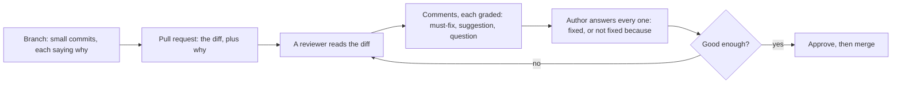

## Bạn cần biết trước

- [[foundation.l2.good-commits]] — mỗi commit chứa một thay đổi logic và message của nó nói vì sao. Pull request là cùng kỷ luật đó ở cỡ lớn hơn một bậc.
- [[foundation.l1.reading-code]] — bạn đã đi theo một đường xuyên qua codebase lạ thay vì đọc từ đầu tới cuối. Review là cùng phương pháp đó, chĩa vào một thay đổi.

## Tình huống

Thay đổi của bạn cho phần code hủy đơn đang nằm trên một branch, chia thành các commit nhỏ, message nào cũng nói vì sao. Trước khi nhờ ai đọc, bạn mở `docs/team/review-comments-examples.md`, một ghi chép mà repository giữ ở `stage-0`, phiên bản bài này đọc. Nó gom các nhận xét đội đã để lại trên pull request trước đó, cái đã thêm chức năng hủy đơn. Trong đó có bốn nhận xét được gọi là tốt, rồi một bảng bốn nhận xét được gọi là tệ, mỗi cái kèm lý do. Hai trong số nhận xét tệ đó bạn từng tự viết khi vội. Sau đó ghi chép quay sang nói với người viết code chứ không còn nói với người review. Cả cuộc trao đổi này để làm gì?

## Khái niệm cốt lõi

- **pull request** (yêu cầu gộp một branch vào branch khác, kèm diff và thảo luận) — lời đề nghị merge một branch vào branch khác, mang theo diff, tức mọi dòng mà lần merge đó sẽ thay đổi, và một chỗ để viết ngay bên cạnh.
- **code review** (người khác đọc và góp ý thay đổi code trước khi gộp) — một người khác đọc diff đó trước khi nó được merge, để tìm lỗi, để kiến thức đi theo cả hai chiều, và để codebase đọc lên như do một đội viết.
- nhận xét bắt buộc sửa — đội không merge cho tới khi người viết code giải quyết xong, vì có điều gì đó sai.
- gợi ý — nhận xét mà người viết có thể làm theo, hoặc từ chối kèm lý do, vì có điều gì đó có thể tốt hơn. Lần merge không phải chờ nó.
- câu hỏi — nhận xét hỏi trước khi khẳng định, vì người review có thể đã đọc nhầm. Tự nó không nói là có gì sai, dù người viết vẫn phải trả lời.
- approve — người review nói thay đổi có thể merge ngay bây giờ. Tiêu chí là đủ tốt, không phải hoàn hảo.

## Cơ chế hoạt động



Trong tình huống trên, branch của bạn đã xong nhưng chưa được merge. Pull request đứng giữa hai trạng thái đó. Nó là một lời đề nghị, chưa phải một hành động: nó ghi rõ branch nguồn và branch đích. Phần mô tả của người viết nói thay đổi làm gì và vì sao, vì người review không thấy được lý do thì sẽ phải đoán. Git cho bạn branch và merge ngay trên máy mình. Đội còn giữ một bản repository dùng chung trên một dịch vụ lưu trữ, và pull request là một trang ở đó, nơi mọi người đọc diff, viết nhận xét cạnh bất kỳ dòng nào bị đổi, rồi approve.

Tiếp theo, một người review đọc diff đó, và các đội đưa ra ba lý do cho bước này. Thứ nhất là tìm lỗi, lý do mà junior hay nghĩ tới. Thứ hai là kiến thức đi theo cả hai chiều: người review hiểu thay đổi, người viết học được tiêu chuẩn. Thứ ba là một codebase đọc lên như sản phẩm của một đội.

Những gì người review viết ra đều có phân loại, và loại đó cho biết nó tốn gì. Nhận xét bắt buộc sửa giữ lần merge lại cho tới khi đội giải quyết xong. Gợi ý và câu hỏi không giữ, dù người viết vẫn trả lời cả hai. Ghi chép thêm một nhãn thứ tư là khen: nó chỉ ra điều người viết làm đúng và cũng không giữ gì cả. Các nhãn này chỉ là chữ thường. Dịch vụ lưu trữ có thể bắt buộc phải có approve trước khi merge, và người review có thể đánh dấu cả lượt review là còn cần sửa. Nhưng với từng nhận xét riêng lẻ, nhãn không có ý nghĩa gì với dịch vụ. Chính đội mới cho nó ý nghĩa.

Sau đó người viết trả lời từng nhận xét (chỗ này đã sửa, chỗ kia không sửa, vì…) và thêm commit mới vào cùng branch. Trên dịch vụ lưu trữ, pull request bám theo branch đó chứ không bám một danh sách commit cố định, nên các commit mới tự nhập vào. Người review đọc lại. Vòng lặp kết thúc ở approve: một thay đổi đủ tốt để merge, không phải một thay đổi không còn gì để cải thiện.

## Trong hệ thống Đơn Hàng

Nửa đầu của ghi chép là bốn nhận xét từ pull request trước đó.

```markdown file=docs/team/review-comments-examples.md tag=stage-0 lines=7-18
> **Bắt buộc sửa.** Ở `OrderService.Cancel`, đơn `shipped` cũng bị chuyển sang
> `cancelled`. Tiêu chí chấp nhận số 3 nói chỉ đơn `new` mới hủy được. Bạn thêm
> một điều kiện, hay mình hiểu sai tiêu chí?

> **Gợi ý, không bắt buộc.** Tên `flag` ở dòng 42 không cho biết nó là gì.
> `customerOwnsOrder` sẽ đọc thẳng ra nghĩa, và bỏ được comment ngay bên trên.

> **Câu hỏi.** Vì sao chỗ này bắt `Exception` chứ không bắt riêng
> `InvalidOperationException`? Nếu có lý do mình chưa thấy thì ghi lại một dòng
> giúp mình nhé.

> **Khen.** Test cho trường hợp hủy hai lần rất hay, mình không nghĩ ra.
```

Mỗi nhận xét mở đầu bằng nhãn của nó: bắt buộc sửa, gợi ý không bắt buộc, câu hỏi, khen. Sau đó mỗi cái chỉ ra một chỗ cụ thể (`OrderService.Cancel`, `flag` ở dòng 42, dòng bắt `Exception`) và đưa ra lý do. Nhận xét đầu tiên đối chiếu code với tiêu chí số 3 của user story hủy đơn, được hiểu là chỉ cho hủy từ trạng thái `new` (`new`, `shipped` và `cancelled` là các trạng thái của đơn). Tiêu chí đó thật ra nói về chuyện ẩn nút Hủy, nên cách hiểu của người review có thể sai. Vì thế nhận xét kết thúc bằng câu hỏi: người viết sẽ thêm một điều kiện, hay người review đã hiểu nhầm? Không nhận xét nào trong bốn cái phán xét người viết như một con người.

Nửa sau là một bảng bốn nhận xét mà ghi chép gọi là tệ, mỗi cái kèm lý do. "Code này sai" không nói sai ở đâu, cũng không nói sai thế nào. "Bạn nên học lại về transaction" nhắm vào con người, không nhắm vào code. "Đổi hết sang LINQ đi" (chuyển toàn bộ sang một lối viết khác cho cùng đoạn code, lối mà nó gọi tên) là một sở thích, không lý do, không nhãn. Còn "OK." trên một thay đổi tám trăm dòng là approve mà không đọc, điều ghi chép gọi là tệ hơn cả không approve.

Rồi ghi chép quay sang nói với người viết code.

```markdown file=docs/team/review-comments-examples.md tag=stage-0 lines=31-34
- Trả lời từng nhận xét, kể cả nhận xét bạn không đồng ý.
- Phân biệt rõ "đã sửa" và "không sửa, vì...".
- PR nhỏ nhận được nhận xét tốt hơn PR lớn, luôn luôn.
- Nhiều nhận xét không có nghĩa là bạn làm tệ. Nó có nghĩa là có người đọc kỹ.
```

Trả lời từng nhận xét, kể cả những cái bạn không đồng ý. Tách bạch "đã sửa" với "không sửa, vì…". Ghi chép nêu một quy tắc không có ngoại lệ: pull request nhỏ, viết tắt là PR, nhận được nhận xét tốt hơn pull request lớn. Và nhiều nhận xét không có nghĩa là bạn làm tệ, chỉ có nghĩa là có người đọc kỹ.

Một phần tiêu chuẩn mà người viết học được qua review đã nằm trên giấy. Acceptance criteria của user story đứng đầu. Tiếp theo là Definition of Done của đội, yêu cầu mỗi tiêu chí có một test, và có ít nhất một người khác đọc và approve. Chính ghi chép này là phần thứ ba: nó quy định nhận xét phải được diễn đạt thế nào. Thứ không file nào ghi lại là phán đoán đứng sau chúng: tên này ở đây đã đủ rõ chưa, đoạn code này nên bắt exception nào. Điều đó chỉ lộ ra qua nhận xét trên những thay đổi thật. Một junior đi review thường đọc nhiều thay đổi hơn số mình viết, và thấy cả nhận xét của những người review khác trên từng thay đổi, nên gặp nó sớm hơn người chỉ ngồi chờ được review.

## Người mới hay nghĩ rằng…

- **"Pull request của mình nhận nhiều nhận xét nghĩa là mình làm tệ."** → Thực ra số nhận xét phản ánh mức độ có người đọc kỹ, không phản ánh thay đổi tệ tới đâu, và ghi chép của đội nói đúng điều đó. Bạn sẽ nhận ra khi thay đổi được merge với hai nhận xét lại chính là thay đổi không ai có thời gian mở ra đọc.
- **"Là junior, mình chẳng có gì để nói khi review code của senior."** → Thực ra loại nhẹ nhất trong ghi chép là câu hỏi, và câu hỏi không cần thâm niên: hỏi vì sao một dòng lại bắt đúng thứ nó bắt thì hoặc bạn học được điều gì đó, hoặc bạn phát hiện ra điều gì đó. Bạn sẽ nhận ra khi câu hỏi của bạn khiến người viết thêm đúng dòng giải thích mà người đọc sau cần.
- **"Approve nghĩa là nói code đã hoàn hảo."** → Thực ra approve nói thay đổi có thể merge ngay bây giờ. Giữ nó lại vì mọi chỗ bạn sẽ viết khác đi là giữ lần merge vì những nhận xét lẽ ra có thể đánh dấu là gợi ý. Bạn sẽ nhận ra khi một pull request chờ ba ngày vì một cái tên, trong lúc các pull request khác merge vào branch đích và cái này cứ tích thêm conflict.

## Thử ngay (3 phút)

1. Lấy bốn nhận xét tệ đã liệt kê ở mục "Trong hệ thống Đơn Hàng", đừng đọc lại lý do đi kèm từng cái. Với mỗi nhận xét, viết thêm một vế câu để nó dùng được, và nói nó lẽ ra phải mang nhãn nào. Riêng "OK." là một lần approve: hãy nói nó cần có gì thì mới tính là đã đọc.
2. Viết lại "Code này sai.", giả sử nó được để lại trên `OrderService.Cancel`, theo kiểu những nhận xét tốt: một nhãn, một chỗ cụ thể, một lý do, và một câu hỏi nếu bạn chưa chắc.

Kết quả mong đợi: ba nhận xét đầu giờ đã chỉ ra một chỗ hoặc một lý do và mang một nhãn, "OK." nói rõ nó cần gì mới tính là đã đọc, và bản viết lại của bạn nêu một file hoặc một dòng, nói code làm điều gì mà nó không nên làm, và lấy lý do là một quy tắc của đội, không phải sở thích của bạn.

<details><summary>Gợi ý đáp án</summary>

Mỗi nhận xét cần thêm như sau. Cái đầu cần một chỗ cụ thể và code làm gì ở đó, với nhãn bắt buộc sửa. Cái thứ hai cần hướng cùng ý đó vào code (giao dịch nào, chỗ đó có thể làm tốt hơn thế nào), với nhãn gợi ý. Cái thứ ba cần một lý do cho thay đổi cách viết, hoặc đổi thành một câu hỏi. Còn "OK." cần một nhận xét về một điểm nào đó trong diff, nếu không thì chưa approve. Bản viết lại của nhận xét đầu: "Bắt buộc sửa. `OrderService.Cancel` chuyển đơn `shipped` sang `cancelled`. Mình hiểu tiêu chí số 3 là chỉ cho hủy từ `new`, mình có hiểu nhầm không?"

</details>

## Liên hệ

- [[foundation.l2.good-commits]] — cùng kỷ luật đó ở cỡ nhỏ hơn một bậc: các commit bài đó dạy là thứ người review đọc, và một branch gồm các commit đó là thứ pull request đề nghị merge.
- [[foundation.l1.reading-code]] — review là phương pháp đọc đó áp vào một diff.
- [[design.l1.solid-srp]] — nơi một nhận xét bắt buộc sửa dẫn ra quy tắc thay vì sở thích: bài này đòi lý do, bài đó cung cấp lý do.

## Tóm tắt 5 dòng

1. Pull request đề nghị một lần merge và giữ nó mở đủ lâu để người khác đọc diff và góp ý.
2. Các đội review để tìm lỗi, để kiến thức đi theo cả hai chiều, và để codebase nhất quán.
3. Khi là người viết: giữ thay đổi nhỏ, nói vì sao trong phần mô tả, trả lời mọi nhận xét, và tách "đã sửa" khỏi "không sửa, vì".
4. Khi là người review: nói về code chứ không về người, hỏi trước khi khẳng định, tách bắt buộc sửa khỏi gợi ý, approve khi đã đủ tốt.
5. Nhiều nhận xét nghĩa là có người đọc kỹ, và review thay đổi của người khác giúp bạn gặp những tiêu chuẩn không thành văn của đội sớm hơn chỉ chờ được review.
