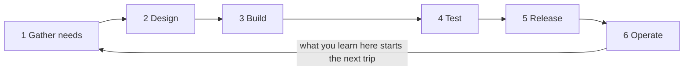

## Before you start

- No prerequisites — start here.

## The situation

Your first task on Đơn Hàng arrives as one line: a customer must be able to cancel an order that has not been delivered yet. You open the example repository at `stage-0`, the label on its starting state, and find no application to change — among other things a database holding twelve orders and a folder of the team's own notes. Somebody decided this was worth building. Somebody decided which orders may be cancelled at all. Somebody will answer the phone when it goes wrong next month. Where did that one line come from, and what happens to your code after you think you are finished?

## Core concepts

- the six steps — gathering needs, designing, building, testing, releasing and operating: the steps the team's own note uses for any piece of work, whether or not a method names them.
- a trip — one journey through all six steps, from a need arriving to the built thing running for real users.
- trip size — how much of the system travels through the six steps at once: one small feature, or everything the system will ever do.
- a single-trip method — each step done once, for the whole system, before the next step starts; teams often call this shape a waterfall.
- an iterative method — the same six steps repeated on one small slice at a time, so the system grows by finished pieces rather than by finished steps.
- the cost of being wrong — the work you throw away when a decision turns out wrong, which grows with how much got built on top of it first.

## How it works



In the situation above, the one line you were handed is the output of step 1: somebody collected a need and wrote it down without saying how to build it. Step 2 turns that need into decisions your code must obey: which orders may be cancelled, and what happens to the rest. Step 3 is where you come in. Step 4 checks the built thing against conditions the team agreed on. Step 5 puts it in front of users. Step 6 is every week after that, when the thing runs and the next need is found.

The arrow back from 6 to 1 is the part of the diagram worth keeping. Six steps in a row would be a project that ends; the arrow makes them a loop that runs as long as anyone uses the system. The team's note on this feature puts it as a rule: the six steps happen even when nobody names them. What the methods disagree about is how much of the system goes around the loop at one time.

Send everything around once — all needs gathered, then all designed, then all built, which can take a year — and a decision made in step 2 waits until step 5 to meet a real user: that is the single-trip method. Send one small feature around and it reaches step 5 in a week or two: that is an iterative method.

The decision that turns out wrong then costs a fortnight of building rather than a year of it. That is the argument for small trips: not less thinking and not fewer written decisions, but a shorter distance between a decision and the evidence that it was wrong.

## In the Đơn Hàng system

The repository records one real trip around the loop, in Vietnamese: `docs/team/lifecycle-example.md` follows a cancel-order feature through six headings, one per step. `Thu thập nhu cầu` says where the need started — the customer-care department reporting about ten phone calls a day asking to cancel an order not yet delivered — and that the product owner, the person who did step 1 here, rewrote it as one sentence that does not say how to build it. `Thiết kế` records the decision that shrinks the work most: only an order in status `new` can be cancelled, while an order already `paid` goes to the refunds people. The file says that decision is written down precisely because it narrows the scope so much.

`Xây dựng` is two people on separate branches, each merging the main branch into their own every day — work inside step 3, done by the same people who write the code. Then comes `Kiểm thử`, step 4, the heading a junior usually pictures as the end of the work.

```markdown file=docs/team/lifecycle-example.md tag=stage-0 lines=22-23
Tiêu chí chấp nhận được viết trước khi code. Tester chạy lại đúng các tiêu chí
đó, cộng thêm một trường hợp không ai nghĩ tới: hủy đơn hai lần liên tiếp.
```

Read the order of events in the first sentence: `Tiêu chí chấp nhận`, the checkable conditions, exist *trước khi code*, before the code. Step 4 therefore re-runs an agreement made earlier rather than inventing one now, so the tester — the person the file gives step 4 to — is not deciding what correct means. The tester adds one case nobody had thought of — cancelling the same order twice in a row — so the step also finds what the agreement missed. On many teams you run those agreed conditions against your own code before handing it over, which makes step 4 shared rather than somebody else's.

`Phát hành` then puts the feature in front of users at the start of a week. `Vận hành` reports what the team learned afterwards: after a week the calls drop to two a day, and a cancelled order is still sending a notification that says it is on its way. That wrong behaviour, the file says, goes back to step 1 as a new need.

```markdown file=docs/team/lifecycle-example.md tag=stage-0 lines=36-39
Sáu bước trên luôn xảy ra, kể cả khi không ai gọi tên chúng. Khác biệt giữa các
phương pháp làm việc chỉ là **kích thước một vòng**: làm cả sáu bước cho một
tính năng nhỏ trong hai tuần, hay làm cả sáu bước cho cả hệ thống trong một năm.
Vòng nhỏ không tạo ra ít tài liệu hơn; nó làm cho việc sai sớm rẻ hơn.
```

Methods differ in *kích thước một vòng*, the size of one trip: two weeks for one small feature, or a year for the whole system. The last sentence is the one to carry out of this lesson — a small trip does not produce fewer documents; it makes being wrong early cheaper.

## Beginners often think…

- **"Agile means no planning and no written decisions."** → Actually the repository's own example sends one small feature, a cancel button, once around the loop, and still writes down the need, the scope decision and the conditions for passing. Teams call working in small trips agile; a small trip shortens the wait for feedback rather than removing the thinking. You notice this when a team that stopped writing decisions down spends each planning conversation re-deciding what it settled a month ago.
- **"Testing is a phase that starts when development finishes."** → Actually the conditions a tester checks are agreed before the code is written, so testing is an agreement being re-run, and the same trip also produces cases nobody agreed on in advance. You notice this when a problem found after release turns out to be a behaviour nobody ever decided on, rather than code that broke.
- **"My task starts when the task arrives and ends when my code works."** → Actually the line you were handed is the output of two earlier steps and the input to three later ones, each with a person you can go and ask. You notice this when someone asks what your feature does to orders that are already paid, and the answer was settled in step 2 by somebody else.

## Try it (3 minutes)

1. Take the cancel-order feature above. For each of the six steps, write down in one short phrase the single thing that step handed to the next one.
2. Now mark which of your six answers you would produce yourself as a junior, and which arrive from somebody else.

Expected result: one of the six is entirely yours, one is shared with the tester, and the other four have an owner you could go and ask by name.

<details><summary>Suggested answer</summary>

Step 1 hands over a need in one sentence: customers want to cancel an undelivered order. Step 2 hands over a scope decision: `new` can be cancelled, `paid` goes to refunds. Step 3 hands over the built feature. Step 4 hands over a verdict against the agreed conditions, plus the case nobody thought of. Step 5 hands over a feature customers can use. Step 6 hands back a measurement and a new defect, which becomes the next step 1.

Step 3 is yours. Step 4 is shared on many teams: you run the agreed conditions against your own code, and a tester re-runs them plus the cases nobody agreed on. The other four are where your task came from and where it goes: whoever wrote the one-sentence need in step 1, whoever recorded the scope decision in step 2, whoever releases in step 5, and whoever watches the running system in step 6.

</details>

## Connections

- [[management.l1.scrum-from-junior-seat]] — one named way of fixing the size of a trip around this loop, and the meetings each step turns into.
- [[management.l1.user-story-and-ac]] — steps 1, 2 and 4 at the size of a single task: how a need becomes one sentence and a list of checkable conditions.
- [[devops.l1.what-is-deploy]] — step 5 opened up: what releasing actually does to the code you finished.

## Five-line summary

1. Your team's note names six steps every feature goes through: gathering needs, designing, building, testing, releasing and operating, whatever the method is called.
2. Those six steps are a loop, not a line: what you learn while the system runs becomes the next need to gather.
3. Methods differ mainly in how much of the system goes around that loop at once, from one small feature to everything.
4. Small trips make being wrong cheap because a decision meets real users in weeks; they do not mean less planning or fewer written decisions.
5. You build in step 3 and often share step 4 with a tester; each of the other four has an owner you can ask.
