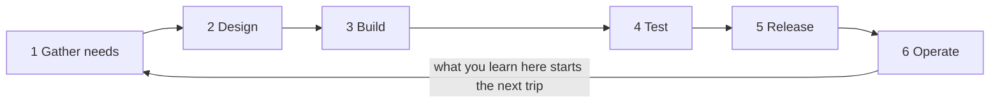

## Bạn cần biết trước

- Không cần bài nào trước — bắt đầu từ đây.

## Tình huống

Việc đầu tiên của bạn ở Đơn Hàng đến dưới dạng một dòng: khách hàng phải hủy được một đơn chưa giao. Bạn mở repository ví dụ ở `stage-0`, nhãn đánh dấu trạng thái khởi đầu của nó, và không thấy ứng dụng nào để sửa. Trong đó có một database chứa mười hai đơn hàng và một thư mục ghi chú của chính đội. Đã có người quyết định tính năng này đáng làm, và quyết định cả đơn nào được phép hủy. Sẽ có người nghe điện thoại khi nó hỏng vào tháng sau. Dòng yêu cầu đó từ đâu ra, và code của bạn sẽ đi đâu sau khi bạn nghĩ mình đã xong?

## Khái niệm cốt lõi

- sáu bước — thu thập nhu cầu, thiết kế, xây dựng, kiểm thử, phát hành và vận hành: các bước mà ghi chú của đội dùng cho mọi phần việc, dù cách làm việc (phương pháp) có gọi tên chúng hay không.
- một vòng — một lượt đi qua cả sáu bước, từ lúc có nhu cầu đến lúc thứ được làm ra chạy thật cho người dùng.
- kích thước vòng — bao nhiêu phần của hệ thống cùng đi qua sáu bước một lúc: một tính năng nhỏ, hay mọi thứ hệ thống sẽ làm.
- phương pháp một vòng — mỗi bước làm một lần cho cả hệ thống, xong mới sang bước sau. Các đội thường gọi dạng này là waterfall.
- phương pháp lặp — lặp lại đúng sáu bước đó trên từng lát nhỏ, nên hệ thống lớn dần theo từng phần đã xong chứ không theo từng bước đã xong. Các đội thường gọi cách làm này là agile.
- cái giá của sai — phần việc phải bỏ đi khi một quyết định hóa ra sai, và nó càng lớn khi càng nhiều thứ đã được xây lên trên quyết định đó.

## Cơ chế hoạt động



Dòng yêu cầu bạn nhận là đầu ra của bước 1: một nhu cầu được viết ra mà không nói phải xây nó thế nào. Bước 2 biến nhu cầu đó thành các quyết định mà code của bạn phải tuân theo: đơn nào được hủy, và các đơn còn lại thì sao. Bước 3 là chỗ bạn vào cuộc. Bước 4 kiểm tra thứ đã làm ra theo các điều kiện cả đội đã thống nhất. Bước 5 đưa nó đến tay người dùng. Bước 6 là mọi tuần sau đó, khi nó chạy và nhu cầu tiếp theo lộ ra.

Mũi tên từ 6 quay về 1 là phần đáng nhớ nhất của sơ đồ. Sáu bước xếp thành hàng sẽ là một dự án có điểm kết thúc. Mũi tên biến chúng thành một vòng lặp chạy mãi chừng nào còn người dùng hệ thống. Ghi chú của đội về tính năng này nói thành một quy tắc: sáu bước luôn xảy ra, kể cả khi không ai gọi tên chúng. Điều các phương pháp bất đồng là bao nhiêu phần của hệ thống đi qua vòng lặp cùng một lúc.

Cho mọi thứ đi qua vòng một lần — thu thập hết nhu cầu, rồi thiết kế hết, rồi xây hết, có thể mất cả năm — thì một quyết định đưa ra ở bước 2 phải đợi tới bước 5 mới gặp người dùng thật: đó là phương pháp một vòng. Cho một tính năng nhỏ đi qua vòng thì nó tới bước 5 trong một hai tuần: đó là phương pháp lặp. Nếu một quyết định hóa ra sai, phương pháp lặp mất hai tuần xây dựng thay vì cả năm. Đó là lý lẽ cho vòng nhỏ: không phải nghĩ ít hơn, cũng không phải ghi ít quyết định hơn, mà là rút ngắn khoảng cách giữa một quyết định và bằng chứng cho thấy nó sai.

## Trong hệ thống Đơn Hàng

Ghi chú của đội ghi lại cách họ đã đưa chính tính năng này đi qua vòng lặp, bằng tiếng Việt. Hãy hình dung bạn là người xây nó. `docs/team/lifecycle-example.md` có sáu tiêu đề, mỗi bước một tiêu đề. `Thu thập nhu cầu` (bước 1) kể rằng nhu cầu bắt đầu từ bộ phận chăm sóc khách hàng báo khoảng mười cuộc gọi mỗi ngày xin hủy đơn chưa giao. Người làm bước 1, file gọi là product owner, viết lại nó thành một câu không nói phải xây thế nào. `Thiết kế` (bước 2) ghi quyết định của đội: chỉ đơn ở trạng thái `new` mới hủy được, còn đơn `paid` chuyển sang hoàn tiền. Quyết định này được ghi ra vì nó thu hẹp phạm vi — tập đơn hàng tính năng phải xử lý — đi rất nhiều.

`Xây dựng` (bước 3) là hai người làm trên hai branch riêng, mỗi ngày đều merge branch chính vào branch của mình. Sau đó tới `Kiểm thử`, bước 4, tiêu đề dễ bị hình dung là điểm kết thúc công việc.

```markdown file=docs/team/lifecycle-example.md tag=stage-0 lines=22-23
Tiêu chí chấp nhận được viết trước khi code. Tester chạy lại đúng các tiêu chí
đó, cộng thêm một trường hợp không ai nghĩ tới: hủy đơn hai lần liên tiếp.
```

Hãy để ý thứ tự trong câu đầu: `Tiêu chí chấp nhận`, các điều kiện kiểm tra được, có từ *trước khi code*. File không nói ai viết chúng, chỉ nói chúng có trước khi ai đó viết code. Vì vậy bước 4 chạy lại một thỏa thuận đã có, nên tester — người được file giao bước 4 — không phải là người quyết định thế nào là đúng. Tester thêm một trường hợp chưa ai nghĩ tới — hủy cùng một đơn hai lần liên tiếp — nên bước này còn tìm ra chỗ thỏa thuận bỏ sót. Ở nhiều đội, bạn cũng tự kiểm tra từng điều kiện đã thống nhất trên code đang chạy của mình, ví dụ hủy một đơn `new` và thử hủy một đơn `paid`, nên bước 4 là việc chung.

`Phát hành` (bước 5) đưa tính năng đến người dùng vào đầu một tuần. `Vận hành` (bước 6) kể những gì đội học được sau đó: sau một tuần, số cuộc gọi giảm còn hai mỗi ngày, và một đơn đã hủy vẫn gửi thông báo nói rằng đơn đang trên đường giao. File nói hành vi sai đó quay về bước 1 thành một nhu cầu mới.

```markdown file=docs/team/lifecycle-example.md tag=stage-0 lines=36-39
Sáu bước trên luôn xảy ra, kể cả khi không ai gọi tên chúng. Khác biệt giữa các
phương pháp làm việc chỉ là **kích thước một vòng**: làm cả sáu bước cho một
tính năng nhỏ trong hai tuần, hay làm cả sáu bước cho cả hệ thống trong một năm.
Vòng nhỏ không tạo ra ít tài liệu hơn; nó làm cho việc sai sớm rẻ hơn.
```

*Kích thước một vòng* chính là kích thước vòng ở trên. Câu cuối là câu nên mang theo: vòng nhỏ không sinh ra ít tài liệu hơn, nó làm cho sai sớm trở nên rẻ hơn.

## Người mới hay nghĩ rằng…

- **"Agile nghĩa là không lập kế hoạch và không ghi lại quyết định nào."** → Thực ra vòng một tính năng trong repository, một nút hủy đơn, vẫn ghi ra nhu cầu, quyết định phạm vi và các điều kiện để đạt, vì vòng nhỏ rút ngắn thời gian chờ phản hồi chứ không bỏ bớt phần suy nghĩ. Bạn sẽ nhận ra khi một đội đã thôi ghi quyết định, rồi buổi lập kế hoạch nào cũng quyết định lại điều đã chốt từ tháng trước.
- **"Kiểm thử là một giai đoạn bắt đầu khi lập trình xong."** → Thực ra các điều kiện tester kiểm tra đã được thống nhất trước khi viết code, nên kiểm thử là chạy lại một thỏa thuận, và cùng vòng đó còn sinh ra những trường hợp chưa ai thống nhất từ trước. Bạn sẽ nhận ra khi một lỗi phát hiện sau khi phát hành hóa ra là hành vi chưa ai từng quyết định, vì không ai thống nhất điều kiện trước khi viết code.
- **"Việc của mình bắt đầu khi task tới và kết thúc khi code chạy được."** → Thực ra dòng yêu cầu bạn nhận là đầu ra của hai bước trước và là đầu vào của ba bước sau, mỗi bước do người khác hoặc cả đội chốt. Bạn sẽ nhận ra khi có người hỏi tính năng của bạn làm gì với những đơn đã thanh toán, và câu trả lời đã được cả đội chốt ở bước 2, trước khi bạn bắt đầu.

## Thử ngay (3 phút)

1. Lấy tính năng hủy đơn ở trên. Với mỗi bước trong sáu bước, viết một cụm ngắn nêu đúng một thứ mà bước đó chuyển cho bước sau.
2. Giờ đánh dấu câu trả lời nào trong sáu câu bạn, một junior, tự làm ra, và câu nào đến từ người khác.

Kết quả mong đợi: một trong sáu hoàn toàn là của bạn, một là việc chung với tester, và bốn cái còn lại đến từ người khác hoặc từ cả đội.

<details><summary>Gợi ý đáp án</summary>

Bước 1 chuyển đi một nhu cầu gói trong một câu: khách hàng muốn hủy đơn chưa giao. Bước 2 chuyển đi một quyết định phạm vi: đơn `new` hủy được, đơn `paid` chuyển sang hoàn tiền. Bước 3 chuyển đi tính năng đã xây. Bước 4 chuyển đi kết luận đạt hay không theo các điều kiện đã thống nhất, cộng với trường hợp chưa ai nghĩ tới. Bước 5 chuyển đi một tính năng khách hàng dùng được. Bước 6 trả về một con số đo được và một lỗi mới, đơn đã hủy vẫn báo đang trên đường giao, thứ trở thành bước 1 tiếp theo.

Bước 3 là của bạn. Bước 4 là việc chung ở nhiều đội: bạn kiểm tra các điều kiện đã thống nhất trên code đang chạy, còn tester chạy lại chúng cùng những trường hợp chưa ai thống nhất. Bốn bước còn lại đến từ người khác hoặc từ cả đội: bước 1 từ product owner, bước 2 từ một quyết định của đội trước khi có code của bạn, bước 5 và 6 từ những người trong đội phụ trách phát hành và theo dõi hệ thống.

</details>

## Liên hệ

- [[management.l1.scrum-from-junior-seat]] — một phương pháp có tên, cố định kích thước vòng đi quanh vòng lặp này, và các buổi họp mà mỗi bước trở thành.
- [[management.l1.user-story-and-ac]] — bước 1, 2 và 4 ở kích thước một task: một nhu cầu trở thành một câu và một danh sách điều kiện kiểm tra được ra sao.
- [[devops.l1.what-is-deploy]] — mở bước 5 ra xem: phát hành thực sự làm gì với code bạn đã viết xong.

## Tóm tắt 5 dòng

1. Ghi chú của đội nêu sáu bước mọi tính năng đều đi qua: thu thập nhu cầu, thiết kế, xây dựng, kiểm thử, phát hành và vận hành, dù phương pháp mang tên gì.
2. Sáu bước đó là một vòng lặp, không phải một đường thẳng: điều học được khi hệ thống chạy trở thành nhu cầu tiếp theo cần thu thập.
3. Các phương pháp khác nhau chủ yếu ở chỗ bao nhiêu phần của hệ thống đi qua vòng lặp cùng lúc, từ một tính năng nhỏ đến mọi thứ.
4. Vòng nhỏ làm cho sai trở nên rẻ vì một quyết định gặp người dùng thật trong vài tuần, chứ không có nghĩa là ít lập kế hoạch hay ít ghi quyết định hơn.
5. Bạn xây ở bước 3 và thường làm chung bước 4 với tester, bốn bước còn lại đến từ người khác hoặc cả đội.
