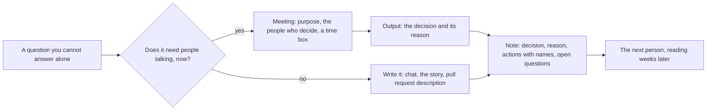

## Before you start

- [[management.l1.scrum-from-junior-seat]] — the meetings a sprint already contains, and why the sentence naming what blocks you is the one worth saying out loud.

## The situation

A week into the sprint you pick up the work that stops an order already paid for from being cancelled — orders in Đơn Hàng carry one named state each, `paid` and `shipped` among them. You were not in the meeting that decided this one. One teammate remembers the outside service that took the money, another something about refunds; neither is sure. Then somebody points you at `docs/team/meeting-notes-example.md`, kept by the example repository at `stage-0`, the version of Đơn Hàng this course starts from: one page that settles what the meeting spent twenty minutes on. The meeting is gone; the page is not. What has to be on a page for it to outlive its meeting?

## Core concepts

- the purpose — the one question a meeting exists to answer, fixed before anyone is invited; without it, nothing tells the meeting what finishing means, only the time box tells it when to stop.
- the output — what the meeting leaves behind: a decision, or actions with a name and a deadline against each.
- the note — the page that carries the decision, its reason, the actions and what is still open.
- the reason — why the decision went this way and not the other; the part a later reader cannot reconstruct, and the part that stops the team deciding it twice.
- a status update — three lines saying where the work stands, what blocks it and what comes next, so nobody calls a meeting to find out.
- a disagreement — an argument about the work, carrying a reason, made while the question is open and dropped once it is decided.

## How it works



In the situation above, the question is whether a `paid` order can be cancelled from the application. Nobody answers it alone: the product owner, the two developers and the tester each hold a piece — the meeting branch of the diagram.

Most questions are not like that, which is what the other branch says. A question with one obvious owner costs less in writing — in chat, on the story, or in the pull request description — because the person you asked answers when they next look at their messages, and the answer stays where the next person looks. A meeting costs everyone in the room at once — four people for twenty minutes is over an hour of the team — and is worth paying when talking is what unlocks the answer.

Whichever branch you take, both end at the same note box: the write branch goes straight there, the meeting branch through its output. A meeting has left nothing behind until its output is written down somewhere the next person looks. A decision nobody wrote down is one the team can end up making again, differently, later. The note holds four things: what was decided, why, who does what next, and what is still open. The reason is the part most often left out and the part a later reader cannot reconstruct: without it, a new reader has to reopen the argument to get it back.

The last arrow is the one that pays: the next person is you, and what reaches you is the file, not the conversation. The write branch also runs before anyone asks: that is what a status update is.

## In the Đơn Hàng system

The note is written for the team, in Vietnamese, on one page; everything described next sits above the lines quoted below. Three lines stand under the title, before the first section heading. `Mục đích` states the purpose as a question: may a `paid` order be cancelled or not. `Người dự` lists the four people there. `Thời lượng` says twenty minutes.

Under `Quyết định` come two sentences: a `paid` order cannot be cancelled from the application, and the customer has to ask for a refund. Under `Lý do` comes why: a refund has to be matched against what the payment gateway recorded, the outside service that took the money; the team has not built that part; and cancelling without refunding would produce an order both cancelled and paid, a state nobody handles. That last clause is what makes the reason usable later: it names the state the team refused to create.

`Lý do` also shows where an argument belongs. It records a reason, not a preference, which is the form a disagreement takes while the question is open: about the work, with something behind it. Once `Quyết định` is written the team treats the argument as closed, including for whoever lost it. Reopening it needs something new, not the old argument.

Under `Việc phải làm` the decision turns into work, where `API hủy` names the part of the application a screen would call to cancel an order.

```markdown file=docs/team/meeting-notes-example.md tag=stage-0 lines=19-23
| Việc | Ai | Khi nào |
|---|---|---|
| Thêm điều kiện trạng thái vào API hủy | Dev 1 | Trong sprint này |
| Ẩn nút "Hủy đơn" với đơn `paid` | Dev 2 | Trong sprint này |
| Viết story cho luồng hoàn tiền | PO | Trước sprint sau |
```

Each row carries a `Việc`, an `Ai` and a `Khi nào` — a piece of work, a person, a deadline. Two go to developers inside this sprint, the refund story to the product owner before the next sprint. No row says the team will look into it. The heading after the table, `Câu chưa trả lời`, holds what the meeting did not settle — what a `shipped` order the customer refuses counts as — and who will go and ask. Writing the open question down costs a line; a question nobody wrote down has to be asked again, often in another meeting.

Then the file shows the other half.

```markdown file=docs/team/meeting-notes-example.md tag=stage-0 lines=33-38
> Đang làm: API hủy đơn, xong phần kiểm tra trạng thái.
> Vướng: chưa rõ đơn `shipped` bị từ chối nhận thì xử lý thế nào — đã hỏi PO.
> Tiếp theo: viết test cho trường hợp hủy hai lần, xong trong hôm nay.

Ba dòng này thay được một cuộc họp. Nêu vấn đề sớm kèm phương án, đừng nêu muộn
kèm lời xin lỗi.
```

These three lines are a status update, and each does one job: what is being worked on, what blocks it and who has been asked, what comes next and by when. The file says they can stand in for a meeting, and the middle line makes that true, because it is the one somebody else usually has to clear. The two lines after them give the rule for problems: raise them early with an option, not late with an apology. Early, the refused `shipped` order is a question, and the answer can still change what the team builds this sprint; at the end, it is work that did not ship.

## Beginners often think…

- **"Juniors should stay quiet in meetings until asked."** → Actually a new person asking what was just decided and what they do next costs almost nothing: the answer has to exist anyway, and others in the room are often unsure too. You notice this when a meeting ends and four people leave with three different understandings.
- **"If I mention a problem, I will be blamed for it."** → Actually a problem raised while there is still time is a question the team answers; raised at the end, it is a promise the team broke, which is the one that gets discussed. You notice this when a blocked line is answered the same morning and the blocker nobody wrote down stops the work for days.
- **"We talked it through, so the meeting was useful."** → Actually a meeting with no decision and no note leaves nothing for anyone who was not in the room. You notice this when the same question comes back weeks later and nobody can say what was concluded or why.

## Try it (3 minutes)

1. Take the open question at the end of the note: does a `shipped` order the customer refuses count as cancelled? Write the message that sends it to one person instead of to a meeting. Name what you want decided — which state the refused order gets — not the area it is about, and say what you do if no answer comes today.
2. Write your own three lines in the shape of the file's status update — doing, blocked, next — for whatever you are working on now. Cross out any line nobody else could act on.

Expected result: your message names a decision rather than a topic, fits in five lines and ends with what you will do if no answer comes today; of the three lines, the blocked one survives the crossing out, often as the only one.

<details><summary>Suggested answer</summary>

A message that works: "For the refused `shipped` order, does it become `cancelled` or a new state? Reusing `cancelled` loses the difference; a new state has to be handled everywhere orders are listed. If I hear nothing today I will leave the case out and open a follow-up."

The first line survives when it hands something over, the third when somebody waits on the date, and the middle one nearly always.

</details>

## Connections

- [[foundation.l2.asking-good-questions]] — this lesson says put it in writing; that one says what to put in it so the answer comes back the first time.
- [[management.l1.scrum-from-junior-seat]] — where most of your meetings already are: the sprint already fixes the purpose of its own meetings for you.
- [[management.l1.code-review-basics]] — the same rule pointed at a change: a pull request description is the meeting note written in advance.

## Five-line summary

1. A meeting needs a purpose, an output and somebody writing it down; without those three it is a conversation that leaves nothing behind.
2. Write the decision, its reason, the actions with names, and what is still open; the reason is what a later reader cannot reconstruct.
3. What is written outlives the meeting and reaches the next person instead of you being asked again; write it for them.
4. A status update is three lines — doing, blocked, next — and the blocked line is the one that earns it.
5. Raise a problem early with an option; disagree about the work with a reason, and once the decision is written, act on it.
