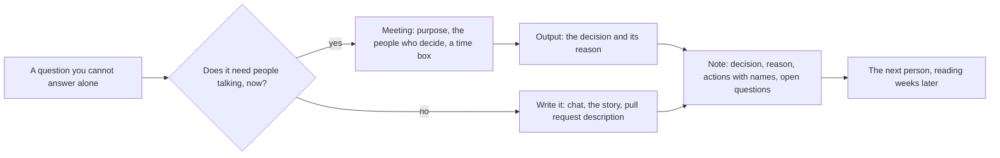

## Bạn cần biết trước

- [[management.l1.scrum-from-junior-seat]] — các buổi họp vốn đã có sẵn trong một sprint, và vì sao câu nêu điều đang cản bạn là câu đáng nói to lên.

## Tình huống

Sprint đã đi được một tuần, bạn nhận phần việc làm cho đơn `paid` không thể bị hủy. Mỗi đơn trong Đơn Hàng mang một trạng thái có tên, trong đó có `paid` và `shipped`. Bạn không có mặt ở buổi họp đã quyết định chuyện này. Một đồng đội nhớ là có liên quan tới cổng thanh toán, tức dịch vụ bên ngoài mà khoản thanh toán đi qua. Người khác nhớ mang máng chuyện hoàn tiền. Không ai chắc. Rồi có người chỉ bạn tới `docs/team/meeting-notes-example.md`, nằm trong Đơn Hàng ở `stage-0`, phiên bản mà khóa học này bắt đầu: một trang chốt lại điều buổi họp đã bàn mất hai mươi phút. Buổi họp đã qua, trang giấy thì vẫn còn. Một trang cần có gì để sống lâu hơn buổi họp sinh ra nó?

## Khái niệm cốt lõi

- mục đích — câu hỏi duy nhất mà buổi họp tồn tại để trả lời, được chốt trước khi mời ai. Thiếu nó, không có gì cho buổi họp biết thế nào là xong, chỉ có time box báo lúc nào phải dừng.
- đầu ra — thứ buổi họp để lại: một quyết định, hoặc các việc cần làm, mỗi việc gắn một tên người và một hạn chót.
- biên bản — trang ghi quyết định, lý do, các việc cần làm và những gì còn bỏ ngỏ.
- lý do — vì sao quyết định đi theo hướng này mà không theo hướng kia. Đây là phần người đọc sau này không tự dựng lại được, và cũng là phần giữ cho đội khỏi quyết định cùng một chuyện hai lần.
- cập nhật tình hình — ba dòng nói việc đang ở đâu, cái gì đang cản và bước tiếp theo là gì, để không ai phải gọi họp chỉ để hỏi.
- bất đồng — một lập luận về công việc, có lý do đi kèm, đưa ra khi câu hỏi còn mở và gác lại khi đã có quyết định.

## Cơ chế hoạt động



Trong tình huống trên, câu hỏi là đơn `paid` có được hủy từ ứng dụng hay không. Không ai trả lời một mình được: product owner, hai developer và tester mỗi người nắm một mảnh. Đó là nhánh họp trong sơ đồ.

Phần lớn câu hỏi không như thế, và nhánh còn lại nói đúng điều đó. Câu hỏi có một người chịu trách nhiệm rõ ràng thì hỏi bằng văn bản sẽ rẻ hơn: trong chat, trên story, hoặc trong phần mô tả pull request. Người được hỏi trả lời khi họ mở tin nhắn lần tới, và câu trả lời nằm đúng chỗ người sau sẽ tìm. Một buổi họp tốn thời gian của mọi người trong phòng cùng lúc: bốn người trong hai mươi phút là hơn một giờ của cả đội. Chỉ đáng bỏ ra khi chính cuộc nói chuyện mới mở được câu trả lời.

Đi nhánh nào thì cả hai cũng về cùng một ô biên bản. Nhánh viết đi thẳng tới đó, vì tin nhắn hay story đã viết chính là biên bản. Nhánh họp đi qua đầu ra của buổi họp. Một buổi họp chưa để lại gì cho tới khi đầu ra của nó được ghi xuống ở chỗ người sau sẽ tìm. Một quyết định không ai ghi lại là quyết định mà đội có thể phải đưa ra lần nữa, theo hướng khác, về sau. Biên bản chứa bốn thứ: quyết định gì, vì sao, ai làm gì tiếp theo, và điều gì còn bỏ ngỏ. Lý do là phần người đọc sau không tự dựng lại được: thiếu nó, người mới phải mở lại cuộc tranh luận mới lấy lại được.

Người sau đó chính là bạn, và thứ tới tay bạn là file, không phải cuộc nói chuyện. Nhánh viết còn chạy cả trước khi có ai hỏi: một cập nhật tình hình trả lời trước điều đồng đội lẽ ra sẽ phải hỏi bạn, là việc đang ở đâu, cái gì đang cản.

## Trong hệ thống Đơn Hàng

Biên bản viết cho đội, bằng tiếng Việt, trên một trang. Mọi thứ mô tả tiếp theo nằm phía trên các dòng được trích bên dưới. Ba dòng đứng ngay dưới tiêu đề, trước tiêu đề mục đầu tiên. `Mục đích` nêu điều buổi họp phải quyết: đơn `paid` có được hủy hay không. `Người dự` liệt kê bốn người có mặt. `Thời lượng` ghi hai mươi phút.

Dưới `Quyết định` là hai câu: đơn `paid` không hủy được từ ứng dụng, và khách phải yêu cầu hoàn tiền. Dưới `Lý do` là vì sao: khoản hoàn tiền phải được đối chiếu với những gì cổng thanh toán đã ghi nhận, đội chưa làm phần đó, và hủy mà không hoàn tiền sẽ để lại một đơn đã hủy trong khi tiền đã bị trừ, một trạng thái không ai xử lý được. Vế cuối đó làm cho lý do dùng được về sau: nó gọi tên trạng thái mà đội đã từ chối tạo ra.

`Lý do` ghi một lý do, không ghi một sở thích. Đó cũng là dạng mà bất đồng nên có khi câu hỏi còn mở: nói về công việc, có căn cứ phía sau. Khi quyết định đã được ghi xuống thì làm theo. Muốn mở lại thì cần điều gì mới, không phải lập luận cũ.

Dưới `Việc phải làm`, quyết định biến thành công việc. `API hủy` là tên biên bản dùng cho phần hủy đơn mà đội vẫn còn phải sửa.

```markdown file=docs/team/meeting-notes-example.md tag=stage-0 lines=19-23
| Việc | Ai | Khi nào |
|---|---|---|
| Thêm điều kiện trạng thái vào API hủy | Dev 1 | Trong sprint này |
| Ẩn nút "Hủy đơn" với đơn `paid` | Dev 2 | Trong sprint này |
| Viết story cho luồng hoàn tiền | PO | Trước sprint sau |
```

Mỗi dòng có một `Việc`, một `Ai` và một `Khi nào`: một phần việc, một người, một hạn chót. Hai việc giao cho developer, làm trong sprint này, còn story hoàn tiền giao cho product owner, xong trước sprint sau. Không dòng nào ghi kiểu "đội sẽ xem xét": dòng nào cũng là việc có người làm xong được. Tiêu đề ngay sau bảng, `Câu chưa trả lời`, giữ điều buổi họp chưa chốt: một đơn `shipped` bị khách từ chối nhận thì tính là gì, và ai sẽ đi hỏi. Ghi câu hỏi bỏ ngỏ xuống chỉ tốn một dòng. Câu hỏi không ai ghi thì phải hỏi lại, thường là trong một buổi họp khác.

Sau đó file cho thấy nửa còn lại.

```markdown file=docs/team/meeting-notes-example.md tag=stage-0 lines=33-38
> Đang làm: API hủy đơn, xong phần kiểm tra trạng thái.
> Vướng: chưa rõ đơn `shipped` bị từ chối nhận thì xử lý thế nào — đã hỏi PO.
> Tiếp theo: viết test cho trường hợp hủy hai lần, xong trong hôm nay.

Ba dòng này thay được một cuộc họp. Nêu vấn đề sớm kèm phương án, đừng nêu muộn
kèm lời xin lỗi.
```

Ba dòng này là một cập nhật tình hình, và mỗi dòng làm một việc: đang làm gì, cái gì đang cản và đã hỏi ai, bước tiếp theo là gì và xong khi nào. File nói ba dòng này thay được một cuộc họp, và dòng giữa làm cho điều đó đúng, vì đó là dòng thường cần người khác gỡ. Hai dòng sau đó đưa ra quy tắc cho vấn đề: nêu sớm kèm phương án, đừng nêu muộn kèm lời xin lỗi. Nếu nêu sớm, đơn `shipped` bị từ chối nhận chỉ là một câu hỏi, và câu trả lời vẫn còn kịp thay đổi thứ đội làm trong sprint này. Nếu đợi tới cuối, đó là phần việc không kịp xong trong sprint.

## Người mới hay nghĩ rằng…

- **"Junior nên im lặng trong buổi họp cho tới khi được hỏi."** → Thực ra một người mới hỏi lại vừa quyết định gì và mình làm gì tiếp gần như không tốn gì, vì câu trả lời đằng nào cũng phải có, và người khác trong phòng thường cũng chưa chắc. Bạn sẽ nhận ra khi buổi họp kết thúc và bốn người ra về với ba cách hiểu khác nhau.
- **"Nếu mình nói ra một vấn đề, mình sẽ bị đổ lỗi."** → Thực ra vấn đề được nêu khi còn thời gian là một câu hỏi mà đội trả lời. Nêu vào lúc cuối, nó thành một lời hứa đội đã thất hứa, và đó mới là thứ bị đem ra bàn. Bạn sẽ nhận ra khi một dòng "vướng" được trả lời ngay trong buổi sáng, còn điều đang cản mà không ai ghi lại thì làm việc đứng im nhiều ngày.
- **"Đã bàn kỹ với nhau rồi, nên buổi họp có ích."** → Thực ra một buổi họp không có quyết định và không có biên bản thì chẳng để lại gì cho người không có mặt trong phòng. Bạn sẽ nhận ra khi cùng câu hỏi đó quay lại vài tuần sau và không ai nói được đã kết luận gì hay vì sao.

## Thử ngay (3 phút)

1. Lấy câu hỏi bỏ ngỏ ở cuối biên bản: đơn `shipped` bị khách từ chối nhận có tính là đã hủy không? Viết tin nhắn, tối đa năm dòng, gửi câu hỏi đó cho một người thay vì đem ra họp. Nêu điều bạn cần được quyết, tức đơn bị từ chối nhận mang trạng thái nào, chứ không chỉ nêu chủ đề. Nói luôn bạn sẽ làm gì nếu hôm nay không có câu trả lời.
2. Viết ba dòng của chính bạn theo khuôn cập nhật tình hình trong file (đang làm, vướng, tiếp theo) cho việc bạn đang làm lúc này. Gạch bỏ dòng nào không ai khác dựa vào đó mà làm gì được.

Kết quả mong đợi: tin nhắn nêu một quyết định chứ không nêu một chủ đề, gói trong năm dòng và kết thúc bằng điều bạn sẽ làm nếu hôm nay không có câu trả lời. Trong ba dòng, dòng "vướng" còn lại sau khi gạch, thường là dòng duy nhất còn lại.

<details><summary>Gợi ý đáp án</summary>

Một tin nhắn dùng được: "Đơn `shipped` bị từ chối nhận thì chuyển sang `cancelled` hay một trạng thái mới? Nếu dùng lại `cancelled` thì mất sự phân biệt giữa khách tự hủy và khách từ chối nhận hàng. Nếu hôm nay chưa có trả lời, mình sẽ bỏ trường hợp này ra và viết một story riêng cho nó."

Dòng đầu còn lại khi nó bàn giao một thứ gì đó, dòng thứ ba khi có người đang chờ cái hạn trong đó, còn dòng giữa thì gần như luôn còn lại.

</details>

## Liên hệ

- [[foundation.l2.asking-good-questions]] — bài này bảo hãy viết ra, bài kia nói nên viết gì để câu trả lời quay về ngay từ lần đầu.
- [[management.l1.scrum-from-junior-seat]] — các buổi họp vốn có trong một sprint, còn bài này nói về những câu hỏi rơi vào khoảng giữa các buổi đó.
- [[management.l1.code-review-basics]] — cùng quy tắc đó áp vào một thay đổi: phần mô tả pull request là biên bản họp viết trước.

## Tóm tắt 5 dòng

1. Một buổi họp cần mục đích, đầu ra và người ghi lại. Thiếu những thứ đó, nó chỉ là cuộc nói chuyện không để lại gì.
2. Ghi quyết định, lý do, các việc kèm tên người, và điều còn bỏ ngỏ. Lý do là thứ người đọc sau không tự dựng lại được.
3. Thứ được viết ra sống lâu hơn buổi họp và tới tay người sau, thay vì bạn bị hỏi lại. Hãy viết cho họ.
4. Cập nhật tình hình là ba dòng (đang làm, vướng, tiếp theo), và dòng "vướng" thường là dòng làm nên giá trị của nó.
5. Nêu vấn đề sớm kèm phương án, bất đồng về công việc thì kèm lý do, và khi quyết định đã được ghi xuống thì làm theo.
