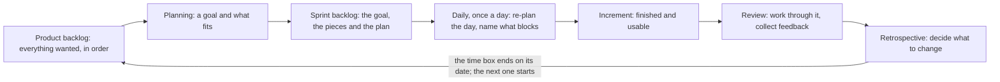

## Before you start

- [[management.l1.how-software-gets-made]] — the six steps every feature goes through, and how methods differ mainly in how much goes around that loop at once.

## The situation

It is your second week on Đơn Hàng. The example repository, at the point this lesson starts from (`stage-0`), has no application yet, but it carries the team's own note on the two weeks before you arrived, `docs/team/sprint-example.md`. Reading it you count five pieces of work, several meetings written down, and a length nobody changed: one piece was almost finished and still went to the next two weeks. Tomorrow morning you stand in a meeting of your own with a list of what you did yesterday. What are those two weeks and those meetings actually for?

## Core concepts

The six items below are the parts of Scrum, the way of working this team follows.

- **sprint** — a stretch of time fixed before the work starts, two weeks in this team's note, in which the team commits to one goal and finishes something usable.
- the increment — what a sprint produces: one or more pieces of work, each finished to the standard the team agreed in advance and usable as it stands.
- the three roles — the product owner decides what is wanted and in what order; the developers decide how, and how much fits; the scrum master owns the way of working and clears what blocks the team.
- the two backlogs — the product backlog is everything wanted, kept in order; the sprint backlog is the goal, the slice this sprint took to serve it, and the team's plan for both.
- the four meetings inside a sprint — planning (why, what and how), the daily (re-plan today), the review (work through the increment, collect feedback), the retrospective (decide what to change in how the team works).
- a time box — a duration decided before the work starts and not changed afterwards, so when the work does not fit, what moves is the work, as this team's note shows.

## How it works



The six items above are the parts of Scrum this lesson covers; the reference description, a document called the Scrum Guide, names these and a few more, and calls the roles accountabilities.

The two weeks you stand in is the sprint; everything else in the diagram happens inside it. It opens at planning: the product owner brings the ordered product backlog, the team picks a goal it can commit to and takes in the pieces serving it. Your part is to say whether the slice against your name fits the days you have. The result is the sprint backlog, which the developers own and rearrange as they learn; you move your own row without waiting to be asked.

At the same time every working day after that, the daily: the team reads what is left against the goal and re-plans the day, until the time box closes. This is the developers talking to each other, fifteen minutes of it, so the sentence worth saying is the one that changes somebody's plan — what blocks you — not an account of your hours.

When the days run out, what they produced is measured: the increment is what is finished by the date, judged against the standard agreed beforehand, the conditions the finished work must satisfy. Nearly-there work is not part of it. At the review the team and the people who asked for it work through the increment together, not a presentation, and what they say reorders the product backlog for the next planning.

The retrospective is the one meeting about the team rather than the product: what to keep, what hurt, what to change; bring one thing that cost you time. Then the box closes on its date and the next sprint opens on the reordered backlog.

## In the Đơn Hàng system

The team's note is in Vietnamese. The two lines under its title fix what the diagram holds fixed: `Độ dài: hai tuần`, two weeks, and a team of one product owner, one scrum master, four developers and one tester. Under `Mục tiêu sprint` comes the goal, one sentence a customer could read: they cancel an unpaid order themselves instead of phoning. Then the sprint backlog.

```markdown file=docs/team/sprint-example.md tag=stage-0 lines=12-18
| Việc | Người nhận | Ước lượng | Trạng thái cuối sprint |
|---|---|---|---|
| API `POST /api/v1/orders/{id}/cancel` | Dev 1 | 3 | Xong |
| Nút "Hủy đơn" trên màn hình đơn hàng | Dev 2 | 3 | Xong |
| Chặn hủy đơn đã thanh toán | Dev 1 | 2 | Xong |
| Ngừng gửi thông báo cho đơn đã hủy | Dev 3 | 2 | Chưa xong, chuyển sprint sau |
| Sửa lỗi tổng tiền sai ở đơn nhiều dòng | Dev 4 | 1 | Xong |
```

Five pieces of work, each with a person against it, a number in the `Ước lượng` column, and a status at the end; the first row is the server side of the cancel request, the part of the system a `POST` reaches. Four say `Xong`, finished. The fifth says `Chưa xong, chuyển sprint sau`: moved to the next sprint. The two weeks did not stretch to swallow it; the work moved instead.

Next comes the daily, as three sentences of a junior.

```markdown file=docs/team/sprint-example.md tag=stage-0 lines=22-27
> Hôm qua tôi làm xong phần kiểm tra trạng thái đơn.
> Hôm nay tôi viết test cho trường hợp hủy hai lần.
> Tôi đang vướng: không biết đơn `shipped` có được hủy không, cần PO trả lời.

Câu thứ ba là câu quan trọng nhất. Daily không phải để báo cáo cho quản lý; nó
để cả đội sắp xếp lại một ngày.
```

The note marks the third as the most important and gives the reason: the daily is not a report to a manager but the whole team re-planning a day. Not knowing whether a `shipped` order may be cancelled — PO is the product owner — costs a day if you sit on it, a minute if you say it out loud. The review section draws the same line: the team demonstrates on a shared test environment, a machine kept for trying things out, not one person's own, and the unfinished piece is not demonstrated at all — unfinished does not count however much code is written.

The note closes with the retrospective: what worked, writing the conditions a piece of work must satisfy down before coding it; what hurt, work only one person could do; and one change for the next sprint, two people reading the code of anything above three in that column.

Held against the Scrum Guide summarised in Core concepts, this team shows two differences: it has a tester as a separate person, where the reference names no specialist roles at all — everyone doing the work is a developer — and it sizes each piece of work with a number, which the reference permits without naming a unit. It kept what the diagram holds still — the fixed length, one goal, the daily, the rule about what counts as finished — so its adaptation leaves the parts listed in Core concepts in place.

The ones worth arguing about leave one of those parts out — a sprint given three more days so everything can be called done, a retrospective dropped for taking too long — which the reference says covers up problems and limits the benefits. A team that wants work to flow with no fixed length gives up the sprint on purpose; by the reference's own words the result is not Scrum, a choice rather than a fault.

## Beginners often think…

- **"The daily is where I prove I worked yesterday."** → Actually the daily is the team re-planning one day, which is why the note calls the blocked sentence the important one. You notice this when everyone reports in turn, nobody asks a question, and the same thing still blocks somebody on Friday.
- **"The scrum master is my manager."** → Actually the scrum master owns the way of working, not the work and not the people: they clear what blocks the team and defend the time box. You notice this when you bring something in the way and get help around it, not an instruction.
- **"If the work does not fit, we add a few days."** → Actually the length is the one thing held still; this team moved a piece of work out instead. You notice this when a team that keeps extending has no date fixed in advance to measure against, so nobody can say whether it is slow or the numbers in its `Ước lượng` column are wrong.

## Try it (3 minutes)

1. Write the junior's three sentences for what you are working on right now — yesterday, today, and what blocks you — each under fifteen words. With no task of your own, write them for Dev 3's piece in the table.
2. Cross out any sentence that would not change what a teammate does today. Read what is left.

Expected result: the first two lines survive only when somebody else depends on them; the blocked line almost always survives.

<details><summary>Suggested answer</summary>

Sentence one survives only when it hands something over: "the cancel piece is on my branch and needs someone to read it." Sentence two survives only when it warns of a collision: "I am in the same file as Dev 2 today." The third nearly always survives: only a teammate can answer it, and this meeting closes it in a minute. If all three get crossed out, say so.

</details>

## Connections

- [[management.l1.how-software-gets-made]] — the loop this lesson sizes: a sprint is one trip around those six steps with the end date fixed.
- [[management.l1.user-story-and-ac]] — what one line of that table must say before the team can take it in and call it finished.
- [[management.l1.meetings-and-communication]] — what any meeting needs before it is worth the hour it costs.

## Five-line summary

1. A sprint is a fixed time box in which the team commits to one goal and finishes a usable increment.
2. When the work does not fit the box, the work moves to the next sprint; the dates do not move.
3. Three roles decide different things: the product owner what and in what order, the developers how much fits, the scrum master how the team works.
4. The daily is the developers re-planning their day, not a report to a manager; the sentence naming what blocks you matters most.
5. Teams adapt Scrum; keeping the fixed length and the finished-means-usable rule keeps its parts in place, stretching the dates or dropping the retrospective does not.
