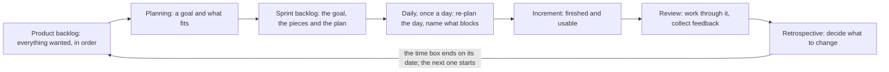

## Bạn cần biết trước

- [[management.l1.how-software-gets-made]] — sáu bước mà tính năng nào cũng đi qua, và các phương pháp khác nhau chủ yếu ở chỗ mỗi lần đi hết vòng đó thì mang theo bao nhiêu việc.

## Tình huống

Đây là tuần thứ hai của bạn ở Đơn Hàng. Repository ví dụ, ở điểm bài này bắt đầu (`stage-0`), chưa có ứng dụng nào, nhưng đã có ghi chép của chính đội về hai tuần trước khi bạn đến: `docs/team/sprint-example.md`. Đọc nó, bạn đếm được năm việc, vài buổi họp được ghi lại, và một độ dài không ai đổi: có một việc gần xong mà vẫn phải chuyển sang hai tuần sau. Sáng mai bạn sẽ đứng trong một buổi họp như thế, cầm danh sách những gì mình làm hôm qua. Hai tuần đó và các buổi họp đó thật ra để làm gì?

## Khái niệm cốt lõi

Sáu mục dưới đây là các phần của Scrum, cách làm việc mà đội này theo.

- **sprint** (khoảng thời gian cố định, thường 1–4 tuần, trong đó team hoàn thành một phần tăng trưởng sản phẩm) — một khoảng thời gian được chốt trước khi bắt đầu làm, trong ghi chép của đội này là hai tuần, trong đó đội cam kết một mục tiêu và làm xong một thứ dùng được.
- increment — thứ mà một sprint tạo ra: một hoặc nhiều việc, mỗi việc xong theo tiêu chuẩn đội đã thống nhất từ trước và dùng được ngay như nó đang có.
- ba vai trò — product owner quyết định cần gì và theo thứ tự nào; các developer quyết định làm thế nào và bao nhiêu việc thì vừa; scrum master chịu trách nhiệm về cách làm việc và gỡ những gì đang cản đội.
- hai backlog — product backlog là mọi thứ được mong muốn, luôn giữ theo thứ tự; sprint backlog là mục tiêu, phần việc mà sprint này nhận để phục vụ mục tiêu đó, và kế hoạch của đội cho cả hai.
- bốn buổi họp trong một sprint — planning (vì sao, làm gì và làm thế nào), daily (lên lại kế hoạch cho hôm nay), review (cùng xem xét increment, thu góp ý), retrospective (quyết định thay đổi gì trong cách đội làm việc).
- time box — một khoảng thời gian được quyết định trước khi làm và không đổi sau đó, nên khi việc không vừa thì thứ phải dời đi là việc, như ghi chép của đội này cho thấy.

## Cơ chế hoạt động



Bản mô tả chuẩn, một tài liệu tên là Scrum Guide (bài này theo bản 2020), gọi tên sáu phần này cùng vài phần khác, và gọi các vai trò là accountabilities (trách nhiệm).

Hai tuần bạn đang ở trong chính là sprint, và mọi buổi họp trong sơ đồ đều diễn ra bên trong nó. Sprint mở đầu bằng planning: product owner mang tới product backlog đã sắp thứ tự, đội chọn một mục tiêu có thể cam kết và nhận vào những việc phục vụ mục tiêu đó. Phần của bạn là nói xem phần việc ghi tên mình có vừa với số ngày bạn có không. Kết quả là sprint backlog, thuộc về các developer và được họ sắp xếp lại khi biết thêm. Bạn tự cập nhật việc của mình, không chờ ai hỏi.

Sau đó, cùng một giờ mỗi ngày làm việc là daily: đội đối chiếu phần còn lại với mục tiêu và lên lại kế hoạch cho ngày. Đây là các developer nói chuyện với nhau, trong mười lăm phút, nên câu đáng nói là câu làm thay đổi kế hoạch của người khác, tức điều đang cản bạn, chứ không phải bản kê giờ làm.

Khi hết ngày, thứ chúng tạo ra được đem ra đo: increment là những gì xong trước hạn, xét theo tiêu chuẩn đã thống nhất từ trước, tức các điều kiện mà việc đã xong phải thỏa. Việc gần xong không thuộc về nó. Ở buổi review, đội và những người yêu cầu tính năng cùng nhau xem xét increment, một buổi làm thật trên sản phẩm chứ không chỉ là trình bày, và điều họ học được có thể sắp lại product backlog cho lần planning sau.

Retrospective là buổi họp duy nhất nói về đội chứ không về sản phẩm: giữ gì, cái gì gây khó, đổi gì. Hãy mang tới một thứ đã làm bạn mất thời gian. Sau đó khung thời gian đóng lại đúng hạn và sprint tiếp theo mở ra với backlog đã sắp lại.

## Trong hệ thống Đơn Hàng

Ghi chép của đội viết bằng tiếng Việt. Hai dòng dưới tiêu đề chốt độ dài sprint và thành phần đội: `Độ dài: hai tuần`, và một đội gồm một product owner, một scrum master, bốn developer và một tester. Dưới `Mục tiêu sprint` là mục tiêu, một câu mà khách hàng cũng đọc được: khách tự hủy đơn chưa thanh toán thay vì phải gọi điện. Tiếp theo là sprint backlog.

```markdown file=docs/team/sprint-example.md tag=stage-0 lines=12-18
| Việc | Người nhận | Ước lượng | Trạng thái cuối sprint |
|---|---|---|---|
| API `POST /api/v1/orders/{id}/cancel` | Dev 1 | 3 | Xong |
| Nút "Hủy đơn" trên màn hình đơn hàng | Dev 2 | 3 | Xong |
| Chặn hủy đơn đã thanh toán | Dev 1 | 2 | Xong |
| Ngừng gửi thông báo cho đơn đã hủy | Dev 3 | 2 | Chưa xong, chuyển sprint sau |
| Sửa lỗi tổng tiền sai ở đơn nhiều dòng | Dev 4 | 1 | Xong |
```

Năm việc, mỗi việc có một người nhận, một con số ở cột `Ước lượng` là phỏng đoán của đội về độ lớn của việc, và một trạng thái lúc cuối sprint. Dòng đầu là phía server của request hủy đơn, phần hệ thống mà một `POST` đi tới. Bốn dòng ghi `Xong`. Dòng thứ năm ghi `Chưa xong, chuyển sprint sau`. Hai tuần không bị kéo dài để ôm nốt việc đó. Thay vào đó, việc được dời đi, qua product backlog sang sprint sau.

Tiếp theo là daily, dưới dạng ba câu của một junior.

```markdown file=docs/team/sprint-example.md tag=stage-0 lines=22-27
> Hôm qua tôi làm xong phần kiểm tra trạng thái đơn.
> Hôm nay tôi viết test cho trường hợp hủy hai lần.
> Tôi đang vướng: không biết đơn `shipped` có được hủy không, cần PO trả lời.

Câu thứ ba là câu quan trọng nhất. Daily không phải để báo cáo cho quản lý; nó
để cả đội sắp xếp lại một ngày.
```

Ghi chép đánh dấu câu thứ ba là quan trọng nhất và nêu lý do: daily không phải báo cáo cho quản lý, mà là cả đội lên lại kế hoạch cho một ngày. Không biết đơn `shipped` có được hủy hay không (PO là product owner) sẽ tốn một ngày nếu bạn giữ trong đầu, và chỉ tốn một phút nếu bạn nói ra. Phần review cũng chặt chẽ không kém về chuyện cái gì được tính: đội demo trên một môi trường test dùng chung, một máy dành riêng để thử nghiệm chứ không phải máy của một người, và việc chưa xong hoàn toàn không được demo. Chưa xong thì không được tính, dù đã viết bao nhiêu code.

Ghi chép kết thúc bằng retrospective. Điều làm tốt: viết ra các điều kiện một việc phải thỏa trước khi code nó. Điều gây khó: có việc chỉ một người làm được. Và một thay đổi cho sprint sau: hai người cùng đọc code của mọi việc có con số trên ba ở cột đó.

So với Scrum Guide, đội này có hai điểm khác. Đội có một tester là người riêng, trong khi bản chuẩn không đặt ra vai trò chuyên môn nào, ai làm việc cũng đều là developer. Đội cũng ước lượng mỗi việc bằng một con số, điều bản chuẩn cho phép nhưng không quy định đơn vị. Đội giữ những phần không đổi qua mọi sprint: độ dài cố định, một mục tiêu, daily, quy tắc thế nào là xong. Ghi chép cũng có cả review và retrospective, nên cách đội điều chỉnh vẫn giữ nguyên các phần đã nêu ở Khái niệm cốt lõi.

Những điều chỉnh đáng tranh luận là những cái bỏ đi một trong các phần đó: một sprint được thêm ba ngày để mọi việc đều được gọi là xong, một buổi retrospective bị bỏ vì tốn thời gian. Bản chuẩn nói những điều đó che giấu vấn đề và hạn chế lợi ích của Scrum.

## Người mới hay nghĩ rằng…

- **"Daily là lúc mình chứng minh hôm qua mình có làm việc."** → Thực ra daily là cả đội lên lại kế hoạch cho một ngày, vì vậy ghi chép mới gọi câu nói về điều đang cản là câu quan trọng. Bạn sẽ nhận ra khi mọi người lần lượt báo cáo, không ai đặt câu hỏi, và tới thứ Sáu vẫn cùng một thứ đang cản một ai đó.
- **"Scrum master là quản lý của mình."** → Thực ra scrum master chịu trách nhiệm về cách làm việc, không phải về công việc hay về con người: họ gỡ những gì đang cản đội và giữ time box. Bạn sẽ nhận ra khi mang tới một thứ đang vướng và được giúp vượt qua nó, chứ không nhận một mệnh lệnh.
- **"Nếu việc không vừa thì thêm vài ngày."** → Thực ra độ dài là thứ duy nhất được giữ cố định. Đội này dời một việc ra ngoài thay vì kéo dài. Bạn sẽ nhận ra khi một đội cứ liên tục kéo dài không có mốc ngày chốt trước để đối chiếu, nên không ai nói được là đội chậm hay các con số trong cột `Ước lượng` bị sai.

## Thử ngay (3 phút)

1. Viết ba câu kiểu junior cho việc bạn đang làm lúc này: hôm qua, hôm nay, và điều đang cản bạn, mỗi câu dưới mười lăm từ. Nếu chưa có việc riêng, hãy viết cho việc của Dev 3 trong bảng.
2. Gạch bỏ câu nào không làm thay đổi điều một đồng đội sẽ làm hôm nay. Đọc lại phần còn lại.

Kết quả mong đợi: hai dòng đầu chỉ còn lại khi có người khác phụ thuộc vào chúng, còn dòng về điều đang cản gần như luôn còn lại.

<details><summary>Gợi ý đáp án</summary>

Câu thứ nhất chỉ còn lại khi nó bàn giao một thứ gì đó: "phần hủy đơn đã nằm trên branch của mình, cần một người đọc." Câu thứ hai chỉ còn lại khi nó cảnh báo một va chạm: "hôm nay mình sửa cùng file với Dev 2." Câu thứ ba gần như luôn còn lại: chỉ đồng đội mới trả lời được nó, và buổi họp này giải quyết nó trong một phút. Nếu cả ba câu đều bị gạch, hãy nói đúng như vậy.

</details>

## Liên hệ

- [[management.l1.how-software-gets-made]] — vòng lặp mà bài này đo kích cỡ: một sprint là một lần đi hết sáu bước đó với ngày kết thúc được chốt trước.
- [[management.l1.user-story-and-ac]] — một dòng trong bảng đó phải nói gì thì đội mới nhận vào và gọi là xong được.
- [[management.l1.meetings-and-communication]] — một buổi họp bất kỳ cần gì để xứng với một giờ nó tốn.

## Tóm tắt 5 dòng

1. Sprint là một time box cố định, trong đó đội cam kết một mục tiêu và làm xong một increment dùng được.
2. Khi việc không vừa khung thời gian, việc chưa xong quay về product backlog, còn ngày thì không dời.
3. Ba vai trò quyết định những điều khác nhau: product owner quyết định làm gì và theo thứ tự nào, các developer quyết định bao nhiêu thì vừa, scrum master quyết định cách đội làm việc.
4. Daily là các developer lên lại kế hoạch cho ngày của mình, không phải báo cáo cho quản lý, và câu nêu điều đang cản bạn là quan trọng nhất.
5. Các đội điều chỉnh Scrum: đổi những gì bản chuẩn để ngỏ, như chức danh, vẫn giữ nguyên các phần của nó, còn kéo dài ngày hay bỏ retrospective thì không.
