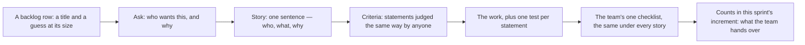

## Before you start

- [[management.l1.scrum-from-junior-seat]] — the sprint backlog whose rows this lesson opens up, and the daily where a junior says what blocks them.

## The situation

You take a row from the sprint backlog you read last lesson. The row reads `Nút "Hủy đơn" trên màn hình đơn hàng`, a button on the order screen, with a 3 beside it: the team's guess at how big the work is. A title and a number; you could put a button on a screen by lunch. Then you open `docs/team/story-example.md`, another note the repository keeps at `stage-0` — the label marking the version of the repository this lesson reads — and it spends a whole page on that same piece of work: one sentence, then five numbered statements, then a checklist that mentions neither buttons nor orders. What does that page carry that the title leaves out?

## Core concepts

Three parts of that page answer three different questions.

- **user story** — one sentence naming who wants something, what they want and why, standing in for a conversation instead of replacing it with a specification.
- **acceptance criteria** — the statements attached to one story that say, in checkable form, when that story is satisfied.
- **Definition of Done** — the team's single checklist of what must be true of any finished piece of work, whatever its story says.
- a checkable statement — one written so that two people reading it reach the same verdict without asking a third.
- an automatic test — a small program that puts the system into a state and reports whether a statement held.

## How it works



In the situation above the backlog row is a title and a guess at its size — enough to find the work again, too little to build it — so the first arrow leaves it for a conversation: who wants this, and why. The story is that conversation written down — one sentence, in the words of the person who wants it. It stays short on purpose, because a sentence invites the questions a long document closes off.

Those questions have answers, and the answers become the criteria. Each one is a statement about behaviour you can stand in front of and judge: given this state, this happens. This team attaches each of them to a single story and agrees them before the work starts, because their job is to tell you what to build, not to grade you afterwards. A story with none of them is still only a title: two people sizing it size different work, and two asked whether it is finished can answer differently.

Then you build, with one test for each statement. When they all pass the story is satisfied — and still not done. Done is the second checklist, the Definition of Done, which the team writes once and applies to every story. The criteria answer whether you built the right thing; the checklist answers whether it may be handed over at all. Work that has not passed the checklist does not count in the sprint's increment, the usable piece of product the sprint hands over; this team's checklist also asks for one test per criterion of the story.

## In the Đơn Hàng system

The file opens with the story, one sentence carrying all three parts: as a customer, I want to cancel my own unpaid order, so that I do not have to phone the hotline when I change my mind. Because it records why the customer wants this and not only what they asked for, the note treats the story as a promise of a conversation: if a button proves expensive, the why stays open to discussion. Below it stand five criteria.

```markdown file=docs/team/story-example.md tag=stage-0 lines=10-19
1. Khi đơn ở trạng thái `new` và thuộc về tôi, màn hình chi tiết đơn hiện nút
   "Hủy đơn".
2. Khi tôi bấm "Hủy đơn" và xác nhận, trạng thái đơn chuyển thành `cancelled`
   và màn hình hiện thông báo "Đã hủy đơn".
3. Khi đơn ở trạng thái `paid`, `shipped` hoặc `cancelled`, nút "Hủy đơn" không
   hiện.
4. Khi tôi gọi API hủy một đơn không thuộc về tôi, hệ thống trả về 403 và không
   thay đổi gì.
5. Khi tôi hủy cùng một đơn hai lần, lần thứ hai trả về 409 và trạng thái đơn
   vẫn là `cancelled`.
```

Each opens with `Khi`, when: a condition — a state of the order, or something you do — then what the system does about it. The first puts the button on the screen only for an order in state `new` that belongs to you; the third hides it for `paid`, `shipped` and `cancelled`.

That third line settles only the screen half of what blocked the junior at the daily in last lesson's sprint note: for a `shipped` order the button does not appear. Whether the request itself may cancel such an order is the part still to ask about, which is why criteria 4 and 5 leave the screen. Cancelling an order that is not yours — not from the screen but by sending the request the screen would send, which is what the file's `API` means — returns 403, a refusal, and changes nothing. Cancelling it twice returns 409 the second time, the code for a request that does not fit the order's current state, and the state stays `cancelled`. A button alone would go no further than the first half of criterion 1, and one shown on every order would break the third.

Below the criteria the file keeps a second list, mentioning no orders.

```markdown file=docs/team/story-example.md tag=stage-0 lines=23-27
- [ ] Code đã được ít nhất một người khác đọc và duyệt.
- [ ] Có test tự động cho mọi tiêu chí chấp nhận ở trên.
- [ ] Chạy được trên môi trường thử nghiệm, không chỉ trên máy người viết.
- [ ] Không thêm cảnh báo mới khi build.
- [ ] Tài liệu API đã cập nhật.
```

Five lines that read the same under any row of that backlog: another person has read and approved the code, every criterion above has an automatic test, the work runs on the shared test environment and not only the author's machine, the build gained no new warnings, and the document describing those requests is up to date. The third line is the one the sentence "it works on my machine" fails. When this team looked back at the end of the sprint, it named writing the criteria before coding as what went well, because it did not have to do the work twice.

The name Definition of Done is the Scrum Guide's — the short document that defines Scrum — which describes the state the increment must be in to meet the quality the product requires, and gives it to the team, or to the organisation where the organisation sets one, rather than to a single story. A checklist applied to every story has nothing to gain from naming one, which is why the one above says nothing about cancelling. Neither of the other two names appears there, and the Guide prescribes no shape for a backlog row, saying only that adding detail to one over time brings in a description, an order and a size: the story sentence and the criteria you just read are this team's own.

## Beginners often think…

- **"A story is done when my code works."** → Actually done is the team's checklist, not your story's criteria; code passing all five criteria can leave every line of that checklist unticked. You notice this when work you reported finished at the daily comes back next sprint with nothing wrong inside it.
- **"Acceptance criteria are written by testers after development."** → Actually, on this team they are agreed before the work starts, which makes them something to build towards rather than a verdict handed to you. You notice this when a bug report first tells you what was wanted and you rewrite last week's screen.
- **"If the criteria are missing I should build something sensible and fix it later."** → Actually, when the product owner, who decides what is wanted, already holds the answer, asking at the daily is one sentence; guessing may cost you the work twice. You notice this when your first question at the end of the sprint is what it should have done instead.

## Try it (3 minutes)

1. Take the row of that sprint backlog that did not finish, `Ngừng gửi thông báo cho đơn đã hủy`: stop sending notifications for a cancelled order. Write it as one story sentence — who, what, why.
2. Write three criteria in the shape of the five above: a condition, then what the system does about it. Mark which of the five checklist lines your criteria cover.

Expected result: your three criteria are all about notifications and orders, and cover none of the five checklist lines, which are demanded anyway.

<details><summary>Suggested answer</summary>

A story: as a customer, I want no notifications about an order I cancelled, so that I am not told about something that is not happening. Three criteria: when an order moves to `cancelled`, no further notification for it is sent; when a notification for it is already waiting to go out, it is not sent; cancelling the same order twice changes nothing about notifications either time. None of the checklist lines appears among them: the team asks those of any work. The second criterion is the one you cannot settle alone: whether a waiting notification can be pulled back is a question for the product owner, and the daily is where you ask it.

</details>

## Connections

- [[management.l1.scrum-from-junior-seat]] — where the backlog row came from; this lesson is what one row must carry before it can be called finished.
- [[foundation.l2.writing-bug-reports]] — the same discipline pointed the other way: a criterion says what should happen, a bug report says what did.
- [[design.l1.unit-test-first-look]] — where a criterion stops being prose; the second checklist line above asks for one automatic test per criterion.

## Five-line summary

1. Work is described by a story, made checkable by its acceptance criteria, and called finished only by the team's Definition of Done.
2. A user story states who wants something, what they want and why, in one sentence, and stands for a conversation rather than a specification.
3. Acceptance criteria are checkable statements this team agrees before coding; without them, two people sizing or judging the story mean different things.
4. The Definition of Done is one checklist for every story; passing your own criteria while skipping it is not finished work.
5. When a story is unclear, ask for the criteria before coding; the daily is where the product owner can answer.
