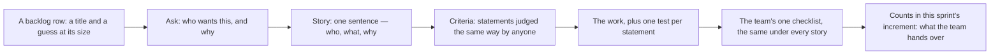

## Bạn cần biết trước

- [[management.l1.scrum-from-junior-seat]] — sprint backlog, nơi chứa các dòng mà bài này mở ra xem bên trong, và buổi daily, nơi một junior nói điều đang cản mình.

## Tình huống

Bạn nhận một dòng trong sprint backlog, danh sách những việc đội nhận vào sprint này. Dòng đó ghi `Nút "Hủy đơn" trên màn hình đơn hàng`, một nút bấm trên màn hình đơn hàng, và bên cạnh là số 3: phỏng đoán của đội về độ lớn của việc. Đặt một nút lên màn hình thì trước giờ ăn trưa là xong. Rồi bạn mở `docs/team/story-example.md`, một ghi chép khác mà repository giữ ở `stage-0` (nhãn đánh dấu phiên bản repository mà bài này đọc), và thấy nó dành cả một trang cho đúng việc đó: một câu, rồi năm câu đánh số, rồi một danh sách kiểm tra không hề nhắc tới nút bấm hay đơn hàng. Trang đó mang theo điều gì mà tiêu đề bỏ sót?

## Khái niệm cốt lõi

Ba phần của trang đó trả lời ba câu hỏi khác nhau.

- **user story** (mô tả ngắn một nhu cầu từ góc người dùng: là ai, muốn gì, để làm gì) — một câu nêu ai muốn một thứ, họ muốn gì và vì sao. Nó đại diện cho một cuộc trao đổi, chứ không thay cuộc trao đổi đó bằng một bản đặc tả.
- **acceptance criteria** (điều kiện kiểm tra được để một story tính là xong) — các câu gắn với một story, nói ở dạng kiểm tra được khi nào story đó được thỏa.
- **Definition of Done** (danh sách chung của team về thế nào là "xong" cho mọi việc) — danh sách kiểm tra duy nhất của đội về những gì phải đúng với mọi việc đã xong, dù story của nó nói gì.
- câu kiểm tra được — câu viết sao cho hai người đọc nó đưa ra cùng một kết luận mà không cần hỏi người thứ ba.
- test tự động — một chương trình nhỏ đưa hệ thống vào một trạng thái rồi báo xem một câu có đúng hay không.

## Cơ chế hoạt động



Trong tình huống trên, dòng backlog chỉ là một tiêu đề và một phỏng đoán về độ lớn. Đủ để tìm lại việc, nhưng quá ít để làm ra nó. Vì vậy mũi tên đầu tiên rời nó để đi tới một cuộc trao đổi: ai muốn điều này, và vì sao. Story chính là cuộc trao đổi đó được ghi lại, một câu, bằng lời của người muốn nó. Nó cố ý ngắn: ghi chép của đội gọi story là lời hẹn cho một cuộc trao đổi, không phải một bản đặc tả, nên những câu hỏi nó để ngỏ là để được hỏi.

Những câu hỏi đó có câu trả lời, và câu trả lời trở thành các tiêu chí. Mỗi tiêu chí là một câu về hành vi mà bạn có thể đứng trước và phán xét: ở trạng thái này thì điều này xảy ra. Đội này gắn mỗi tiêu chí với đúng một story và viết chúng trước khi bắt đầu làm, vì chúng có nhiệm vụ nói cho bạn biết phải làm gì, chứ không phải chấm điểm bạn sau đó. Một story không có tiêu chí nào vẫn chỉ là một tiêu đề: hai người ước lượng nó sẽ ước lượng hai việc khác nhau, và hai người được hỏi nó xong chưa có thể trả lời khác nhau.

Rồi bạn làm, với một test cho mỗi câu. Khi tất cả đều qua, story được thỏa, nhưng vẫn chưa xong. Xong là danh sách kiểm tra thứ hai, Definition of Done, mà đội giữ thành một danh sách và áp cho mọi story. Các tiêu chí trả lời câu hỏi bạn có làm đúng thứ cần làm không. Danh sách kiểm tra trả lời câu hỏi thứ đó có được bàn giao hay không. Việc chưa qua danh sách kiểm tra thì không được tính vào increment của sprint, tức phần sản phẩm dùng được mà sprint bàn giao.

## Trong hệ thống Đơn Hàng

File mở đầu bằng story, một câu mang đủ cả ba phần: là khách hàng, tôi muốn tự hủy đơn chưa thanh toán của mình, để không phải gọi hotline khi đổi ý. Vì câu này ghi lại lý do khách muốn điều đó chứ không chỉ điều họ yêu cầu, bản thân cái nút vẫn có thể bàn lại nếu nó hóa ra tốn kém. Bên dưới là năm tiêu chí.

```markdown file=docs/team/story-example.md tag=stage-0 lines=10-19
1. Khi đơn ở trạng thái `new` và thuộc về tôi, màn hình chi tiết đơn hiện nút
   "Hủy đơn".
2. Khi tôi bấm "Hủy đơn" và xác nhận, trạng thái đơn chuyển thành `cancelled`
   và màn hình hiện thông báo "Đã hủy đơn".
3. Khi đơn ở trạng thái `paid`, `shipped` hoặc `cancelled`, nút "Hủy đơn" không
   hiện.
4. Khi tôi gọi API hủy một đơn không thuộc về tôi, hệ thống trả về 403 và không
   thay đổi gì.
5. Khi tôi hủy cùng một đơn hai lần, lần thứ hai trả về 409 và trạng thái đơn
   vẫn là `cancelled`.
```

Mỗi câu mở đầu bằng `Khi`: một điều kiện (một trạng thái của đơn, hoặc một thao tác của bạn), rồi hệ thống làm gì với nó. Câu đầu chỉ đặt nút lên màn hình cho đơn ở trạng thái `new` và thuộc về bạn. Câu thứ ba ẩn nút với `paid`, `shipped` và `cancelled`.

Trong ghi chép sprint ở bài trước, junior bị vướng ở buổi daily vì không biết đơn `shipped` có được hủy hay không. Dòng thứ ba chỉ giải quyết nửa phía màn hình, vì nút không hiện. Còn bản thân request có được hủy đơn như thế hay không thì vẫn phải hỏi, vì không tiêu chí nào trả lời. Tiêu chí 4 và 5 rời màn hình để nói về hai trường hợp khác. Hủy một đơn không phải của bạn, không qua màn hình mà bằng cách gửi đúng request mà màn hình sẽ gửi (đó là nghĩa của chữ `API` trong file), thì trả về 403, một lời từ chối, và không đổi gì. Hủy hai lần thì lần thứ hai trả về 409, mã cho một request không khớp với trạng thái hiện tại của đơn, và trạng thái vẫn là `cancelled`. Chỉ một cái nút thì mới thỏa phần của tiêu chí 1 nói rằng nút hiện ra, chưa thỏa phần nói về trạng thái nào và đơn của ai. Một nút hiện trên mọi đơn sẽ vi phạm tiêu chí thứ ba.

Dưới các tiêu chí, file giữ một danh sách thứ hai, không nhắc tới đơn hàng nào.

```markdown file=docs/team/story-example.md tag=stage-0 lines=23-27
- [ ] Code đã được ít nhất một người khác đọc và duyệt.
- [ ] Có test tự động cho mọi tiêu chí chấp nhận ở trên.
- [ ] Chạy được trên môi trường thử nghiệm, không chỉ trên máy người viết.
- [ ] Không thêm cảnh báo mới khi build.
- [ ] Tài liệu API đã cập nhật.
```

Năm dòng này đọc giống hệt nhau dưới bất kỳ dòng nào của backlog đó: một người khác đã đọc và duyệt code, mọi tiêu chí ở trên đều có test tự động, việc chạy được trên môi trường thử nghiệm dùng chung chứ không chỉ trên máy người viết, build không thêm cảnh báo mới, và tài liệu mô tả các request đó đã được cập nhật. Khi đội này nhìn lại vào cuối sprint, họ gọi tên việc viết tiêu chí trước khi code là điều làm tốt, vì nhờ vậy không phải làm lại việc lần thứ hai.

Cái tên Definition of Done đến từ Scrum Guide, tài liệu ngắn định nghĩa Scrum. Ở đó, nó là trạng thái mà increment phải đạt để đáp ứng chất lượng sản phẩm đòi hỏi. Nó thuộc về đội, hoặc về tổ chức nếu tổ chức đặt ra một cái, chứ không thuộc về một story riêng lẻ. Đó là lý do danh sách kiểm tra ở trên không nói gì về chuyện hủy đơn. Guide không dùng hai cái tên còn lại, và cũng không quy định hình dạng cho một dòng backlog: nó chỉ nói rằng khi tinh chỉnh một dòng thì thêm các chi tiết như mô tả, thứ tự và độ lớn. Câu story và các tiêu chí là của riêng đội này.

## Người mới hay nghĩ rằng…

- **"Một story là xong khi code của mình chạy."** → Thực ra xong là danh sách kiểm tra của đội, không phải các tiêu chí của story. Code qua đủ năm tiêu chí vẫn có thể để trống mọi dòng của danh sách đó. Bạn sẽ nhận ra khi một việc bạn đã báo xong ở daily quay lại vào sprint sau, vì một dòng trong danh sách, như review hay test, chưa bao giờ được làm.
- **"Acceptance criteria do tester viết sau khi phát triển xong."** → Thực ra, ở đội này chúng được viết trước khi bắt đầu làm, nên chúng là đích để bạn làm hướng tới chứ không phải một phán quyết đưa cho bạn. Bạn sẽ nhận ra khi một bug report mới là nơi đầu tiên cho bạn biết người ta muốn gì, và bạn phải viết lại màn hình của tuần trước.
- **"Nếu thiếu tiêu chí thì mình cứ làm một thứ hợp lý rồi sửa sau."** → Thực ra, product owner quyết định cần gì và có thể đã có sẵn câu trả lời: nêu câu hỏi ở daily chỉ tốn một câu, và product owner sẽ trả lời, còn đoán thì có thể khiến bạn làm lại cả việc. Bạn sẽ nhận ra khi câu hỏi đầu tiên của bạn vào cuối sprint là lẽ ra nó phải làm gì.

## Thử ngay (3 phút)

1. Lấy dòng chưa xong trong sprint backlog đó, `Ngừng gửi thông báo cho đơn đã hủy`: ngừng gửi thông báo cho một đơn đã hủy. Viết nó thành một câu story: ai, muốn gì, vì sao.
2. Viết ba tiêu chí theo dạng của năm tiêu chí ở trên: một điều kiện, rồi hệ thống làm gì với nó. Đánh dấu xem tiêu chí của bạn phủ dòng nào trong năm dòng của danh sách kiểm tra.

Kết quả mong đợi: cả ba tiêu chí đều nói về thông báo và đơn hàng, và không phủ dòng nào trong năm dòng của danh sách kiểm tra, những dòng vẫn bị đòi hỏi dù thế nào.

<details><summary>Gợi ý đáp án</summary>

Một story: là khách hàng, tôi muốn không nhận thông báo nào về đơn mình đã hủy, để không bị báo về một thứ không còn diễn ra. Ba tiêu chí: khi đơn chuyển sang `cancelled`, không gửi thêm thông báo nào cho đơn đó nữa. Khi một thông báo cho đơn đó đang chờ gửi, nó không được gửi. Hủy cùng một đơn hai lần không làm thay đổi gì về thông báo ở cả hai lần. Không dòng nào của danh sách kiểm tra nằm trong số đó: đội đòi hỏi chúng với mọi việc. Tiêu chí thứ hai là cái bạn không tự quyết được: thông báo đang chờ có rút lại được không là câu hỏi dành cho product owner, hãy nêu nó ở daily.

</details>

## Liên hệ

- [[management.l1.scrum-from-junior-seat]] — nơi dòng backlog xuất phát. Bài này nói một dòng phải mang theo những gì trước khi được gọi là xong.
- [[foundation.l2.writing-bug-reports]] — cùng một kỷ luật nhưng nhìn theo chiều ngược lại: một tiêu chí nói điều gì phải xảy ra, một bug report nói điều gì đã xảy ra.
- [[design.l1.unit-test-first-look]] — nơi một tiêu chí thôi là văn xuôi và trở thành một test tự động.

## Tóm tắt 5 dòng

1. Việc được mô tả bằng một story, được làm cho kiểm tra được bằng acceptance criteria của nó, và chỉ được gọi là xong theo Definition of Done của đội.
2. User story nêu ai muốn gì và vì sao trong một câu, và đại diện cho một cuộc trao đổi chứ không phải một bản đặc tả.
3. Acceptance criteria là các câu kiểm tra được mà đội này viết trước khi code. Thiếu chúng, hai người ước lượng hay đánh giá story sẽ hiểu hai thứ khác nhau.
4. Definition of Done là một danh sách kiểm tra cho mọi story. Qua các tiêu chí của riêng bạn mà bỏ qua nó thì chưa phải việc đã xong.
5. Khi story chưa rõ, hãy hỏi tiêu chí trước khi code: nêu ở daily, và product owner là người trả lời.
