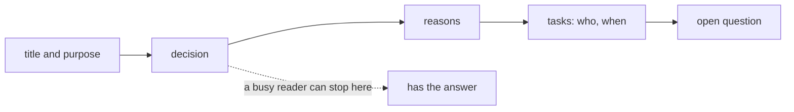

## Before you start

- [[management.l2.writing-for-a-reader]] — you know to name one reader and their job before writing, and to move or cut what does not serve it.
- [[management.l1.meetings-and-communication]] — you know meeting notes record the decision, its reason, the tasks with names, and what is still open.

## The situation

You took notes at the twenty-minute meeting about cancelling paid orders, and you send them to a developer who missed it and must change the app this sprint. Your draft follows the meeting in time: who spoke first, what each person worried about, the options people raised. The decision appears in the fourth paragraph. An hour later the developer replies: "Read the start. So nothing was decided yet?" Everything they needed was in your notes. Why did they miss it, and in what order should the notes have gone?

## Core concepts

- answer first — a work document opens with its conclusion, decision or request; the background and reasons follow for whoever needs them.
- skimming reader — a reader who reads the first lines and the headings, then stops or jumps to the part they need.
- statement heading — a heading that says something, such as "Paid orders cannot be cancelled in the app", instead of only naming a topic, such as "Discussion".
- shape of the content — steps the reader follows go in a numbered list, and things compared on the same points go in a table.

## How it works



Many readers of a work document are busy. They read the first lines, and maybe the headings, and then stop. In the situation above, the developer read the start of your notes, found a story about the meeting, and stopped before the decision. Nothing in the notes was wrong; the order was.

Answer first fixes the order. After a title and a line saying what the document is about, it gives what the reader most needs: the decision, the conclusion, or what you are asking them to do. Then the reasons, then the tasks and details, then what is still open. A reader who stops after the first few lines still leaves with the answer. A reader who wants to check the reasons, or who must do one of the tasks, reads on.

The headings carry the same idea. A skimming reader moves from heading to heading. A heading that states something gives them the content without the paragraph; a heading that only names a topic, such as "Discussion", makes them open the paragraph to learn anything.

Finally, the shape of the text follows the shape of the content. Steps in a fixed order go in a numbered list, so a reader can follow them and keep their place. Options compared on the same points go in a table, so the reader compares along a row instead of across paragraphs. A paragraph suits an argument, where each sentence leans on the one before.

## In the Đơn Hàng system

The team's real notes from that meeting, `docs/team/meeting-notes-example.md`, open like this:

```markdown file=docs/team/meeting-notes-example.md tag=stage-1 lines=1-9
# Biên bản họp: chọn cách chặn hủy đơn đã thanh toán

**Mục đích:** quyết định xem đơn `paid` có được hủy hay không.
**Người dự:** product owner, hai lập trình viên, tester.
**Thời lượng:** 20 phút.

## Quyết định

Đơn `paid` **không** hủy được từ ứng dụng. Khách hàng phải yêu cầu hoàn tiền.
```

The title says what the meeting was for. The first line under it, `Mục đích`, states the question: whether a `paid` order may be cancelled. Two short lines say who attended, including the product owner, the person who decides what the team builds and in what order, and how long it took. Then, by line 9, the answer: a `paid` order cannot be cancelled from the application, and the customer must ask for a refund. Line 9 is not the second line, but nothing before it is background: only the title, the question, two short facts and the heading `Quyết định`. A developer who reads only these nine lines knows what was decided.

Everything else comes after, in the order a reader might need it. `Lý do` gives the reason, for anyone who wants to check or challenge it. `Việc phải làm` is a table, because each task has the same three facts: what, who, by when; one row is hiding the cancel button for `paid` orders this sprint. `Câu chưa trả lời` holds the open question, about `shipped` orders a customer refuses, and who will ask.

The notes' headings, `Quyết định`, `Lý do`, `Việc phải làm`, name topics. That works here because each section is a few lines and the decision sits right under its heading. In a longer document, a heading such as "Paid orders cannot be cancelled in the app" would let a reader skip the paragraph and still have the answer.

## Beginners often think…

- **"A document should build up the background first, so the conclusion makes sense when the reader reaches it."** → Actually, many readers never reach it; a conclusion stated first can be followed by its reasons for whoever reads on. You notice this when someone asks you a question your document answers in its last paragraph.
- **"Starting with the decision makes it look as if we never considered anything else."** → Actually, the reasons, and any option the team dropped, can still come right after the decision; putting them second does not hide them. You notice this when a reader who disagrees goes straight to `Lý do` and argues with the reason, not with the order.
- **"Long paragraphs look more thorough than lists and tables."** → Actually, a reader judges a document by whether they can find and use what they need; tasks buried in a paragraph lose their owners and dates. You notice this when someone rereads a paragraph three times to work out who was supposed to do what.

## Try it (3 minutes)

Open `docs/team/meeting-notes-example.md` at `stage-1`.

1. Cover everything below line 9. Write down what a reader knows from the first nine lines alone.
2. Rewrite the heading `Quyết định` as a statement heading, in one short line.

Expected result: step 1 — the meeting decided that a `paid` order cannot be cancelled from the application, and the customer must ask for a refund; it took 20 minutes with the product owner, two developers and a tester. Step 2 — something like "Paid orders cannot be cancelled in the app; customers ask for a refund", or the same in Vietnamese.

Your draft from the situation began with who spoke first. What should its first two lines say instead?

<details><summary>Suggested answer</summary>

The decision and what it means for this reader: "Decided: paid orders cannot be cancelled from the app; customers ask for a refund. Your part: hide the cancel button for `paid` orders this sprint." The meeting's story, if anyone needs it, goes after the reasons, or nowhere.

</details>

## Connections

- [[management.l2.writing-for-a-reader]] — prerequisite: who the reader is decides what goes in; this lesson decides the order it goes in.
- [[management.l1.meetings-and-communication]] — prerequisite: the parts of good notes; here, which part comes first and why.
- [[management.l2.stakeholder-communication]] — the update to customer care opens with the forecast, then the risk, then the requests: answer first, applied to an update.
- [[management.l2.readme]] — next: a document whose first lines must say what the project is, before anything else.

## Five-line summary

1. A busy reader may stop after the first lines, so a work document opens with its conclusion, decision or request.
2. Background, reasons, details and open questions follow, for whoever needs them.
3. Đơn Hàng's meeting notes state their purpose at the top and reach the decision by line 9.
4. A heading that states something helps a skimming reader more than one that only names a topic.
5. Steps go in a numbered list and compared options in a table, so the text has the content's shape.
