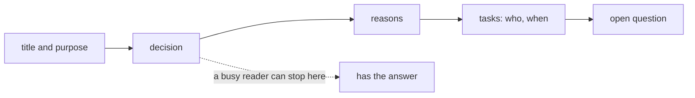

## Bạn cần biết trước

- [[management.l2.writing-for-a-reader]] — bạn biết phải gọi tên một người đọc và việc của họ trước khi viết, rồi chuyển đi hoặc bỏ những gì không phục vụ việc đó.
- [[management.l1.meetings-and-communication]] — bạn biết biên bản họp ghi quyết định, lý do, các việc kèm tên người làm, và điều còn bỏ ngỏ.

## Tình huống

Bạn ghi biên bản cuộc họp hai mươi phút về việc hủy đơn đã thanh toán, rồi gửi cho một lập trình viên vắng mặt hôm đó nhưng phải sửa app ngay sprint này. Bản nháp của bạn đi theo đúng trình tự cuộc họp: ai nói trước, mỗi người lo điều gì, những phương án được nêu ra. Quyết định nằm ở đoạn thứ tư. Một tiếng sau, người kia trả lời: "Mình đọc đoạn đầu rồi. Vậy là chưa quyết gì à?" Mọi thứ họ cần đều có trong biên bản. Vì sao họ bỏ lỡ, và biên bản lẽ ra phải sắp theo thứ tự nào?

## Khái niệm cốt lõi

- kết luận đặt ở đầu — một tài liệu công việc mở đầu bằng kết luận, quyết định hoặc yêu cầu; bối cảnh và lý do theo sau cho ai cần.
- người đọc lướt — người đọc vài dòng đầu và các tiêu đề, rồi dừng hoặc nhảy tới phần mình cần.
- tiêu đề nêu ý — một tiêu đề nói lên điều gì đó, như "Đơn đã thanh toán không hủy được trong ứng dụng", thay vì chỉ gọi tên một chủ đề, như "Thảo luận".
- hình dạng của nội dung — các bước người đọc làm theo nằm trong danh sách đánh số, còn những thứ được so sánh trên cùng các tiêu chí nằm trong bảng.

## Cơ chế hoạt động



Nhiều người đọc tài liệu công việc đang bận. Họ đọc vài dòng đầu, có thể thêm các tiêu đề, rồi dừng. Trong tình huống trên, lập trình viên đọc phần đầu biên bản, gặp một câu chuyện về cuộc họp, và dừng trước khi tới quyết định. Không có gì trong biên bản sai; chỉ có thứ tự là sai.

Kết luận đặt ở đầu sửa chính thứ tự đó. Sau tiêu đề và một dòng nói tài liệu bàn về chuyện gì, tài liệu đưa ngay điều người đọc cần nhất: quyết định, kết luận, hoặc điều bạn đang nhờ họ làm. Rồi đến lý do, rồi các việc và chi tiết, rồi điều còn bỏ ngỏ. Người đọc dừng sau vài dòng đầu vẫn mang theo được câu trả lời. Ai muốn kiểm tra lý do, hay phải làm một trong các việc, thì đọc tiếp.

Tiêu đề cũng theo cùng ý đó. Người đọc lướt đi từ tiêu đề này sang tiêu đề khác. Một tiêu đề nêu ý cho họ nội dung mà không cần đọc đoạn văn; một tiêu đề chỉ gọi tên chủ đề, như "Thảo luận", buộc họ mở đoạn văn ra mới biết được gì.

Cuối cùng, hình dạng của văn bản đi theo hình dạng của nội dung. Các bước theo một thứ tự cố định nằm trong danh sách đánh số, để người đọc làm theo và không lạc chỗ. Các phương án so sánh trên cùng các tiêu chí nằm trong bảng, để người đọc so theo dòng thay vì so giữa các đoạn văn. Đoạn văn hợp với một lập luận, nơi mỗi câu dựa vào câu trước.

## Trong hệ thống Đơn Hàng

Biên bản thật của đội từ cuộc họp đó, `docs/team/meeting-notes-example.md`, mở đầu như sau:

```markdown file=docs/team/meeting-notes-example.md tag=stage-1 lines=1-9
# Biên bản họp: chọn cách chặn hủy đơn đã thanh toán

**Mục đích:** quyết định xem đơn `paid` có được hủy hay không.
**Người dự:** product owner, hai lập trình viên, tester.
**Thời lượng:** 20 phút.

## Quyết định

Đơn `paid` **không** hủy được từ ứng dụng. Khách hàng phải yêu cầu hoàn tiền.
```

Tiêu đề nói cuộc họp để làm gì. Dòng đầu tiên bên dưới, `Mục đích`, nêu câu hỏi: đơn `paid` có được hủy hay không. Hai dòng ngắn cho biết ai dự, trong đó có product owner, người quyết định đội xây gì và theo thứ tự nào, và cuộc họp kéo dài bao lâu. Rồi tới dòng 9 là câu trả lời: đơn `paid` không hủy được từ ứng dụng, và khách phải yêu cầu hoàn tiền. Dòng 9 không phải dòng thứ hai, nhưng không có gì phía trước nó là bối cảnh: chỉ có tiêu đề, câu hỏi, hai thông tin ngắn và tiêu đề `Quyết định`. Lập trình viên chỉ đọc chín dòng này đã biết cuộc họp quyết định gì.

Mọi thứ khác đi sau, theo thứ tự người đọc có thể cần. `Lý do` đưa ra lý do, cho ai muốn kiểm tra hay phản biện. `Việc phải làm` là một bảng, vì việc nào cũng có cùng ba thông tin: làm gì, ai làm, hạn khi nào; một dòng trong đó là ẩn nút hủy với đơn `paid` ngay sprint này. `Câu chưa trả lời` giữ câu hỏi còn mở, về đơn `shipped` bị khách từ chối nhận, và ai sẽ đi hỏi.

Các tiêu đề của biên bản, `Quyết định`, `Lý do`, `Việc phải làm`, chỉ gọi tên chủ đề. Ở đây như vậy vẫn ổn, vì mỗi phần chỉ vài dòng và quyết định nằm ngay dưới tiêu đề của nó. Trong một tài liệu dài hơn, một tiêu đề như "Đơn đã thanh toán không hủy được trong ứng dụng" giúp người đọc bỏ qua đoạn văn mà vẫn có câu trả lời.

## Người mới hay nghĩ rằng…

- **"Tài liệu nên dựng bối cảnh trước, để tới lúc người đọc gặp kết luận thì nó đã dễ hiểu."** → Thực ra, nhiều người đọc không bao giờ tới được đó; kết luận nêu trước vẫn có thể có lý do theo sau cho ai đọc tiếp. Bạn sẽ nhận ra khi có người hỏi bạn một câu mà đoạn cuối tài liệu của bạn đã trả lời.
- **"Mở đầu bằng quyết định trông như thể mình chưa từng cân nhắc phương án nào khác."** → Thực ra, lý do, và mọi phương án đội đã bỏ, vẫn có thể đi ngay sau quyết định; đặt chúng ở vị trí thứ hai không phải là giấu đi. Bạn sẽ nhận ra khi người không đồng ý đi thẳng tới `Lý do` và tranh luận với lý do, chứ không phải với thứ tự.
- **"Đoạn văn dài trông kỹ lưỡng hơn danh sách và bảng."** → Thực ra, người đọc đánh giá tài liệu theo việc họ có tìm thấy và dùng được thứ mình cần hay không; các việc bị vùi trong một đoạn văn sẽ mất người làm và hạn chót. Bạn sẽ nhận ra khi có người đọc đi đọc lại một đoạn ba lần để biết ai phải làm gì.

## Thử ngay (3 phút)

Mở `docs/team/meeting-notes-example.md` ở `stage-1`.

1. Che mọi thứ phía dưới dòng 9. Ghi ra người đọc biết được gì chỉ từ chín dòng đầu.
2. Viết lại tiêu đề `Quyết định` thành một tiêu đề nêu ý, trong một dòng ngắn.

Kết quả mong đợi: bước 1 — cuộc họp quyết định đơn `paid` không hủy được từ ứng dụng, và khách phải yêu cầu hoàn tiền; cuộc họp kéo dài 20 phút, có product owner, hai lập trình viên và một tester. Bước 2 — đại loại "Đơn đã thanh toán không hủy được trong ứng dụng; khách yêu cầu hoàn tiền", bằng tiếng Việt hay tiếng Anh đều được.

Bản nháp trong tình huống mở đầu bằng chuyện ai nói trước. Hai dòng đầu của nó lẽ ra phải nói gì?

<details><summary>Gợi ý đáp án</summary>

Quyết định, và ý nghĩa của nó với người đọc này: "Đã quyết: đơn đã thanh toán không hủy được từ app; khách yêu cầu hoàn tiền. Phần của bạn: ẩn nút hủy với đơn `paid` ngay sprint này." Diễn biến cuộc họp, nếu có ai cần, đặt sau phần lý do, hoặc bỏ hẳn.

</details>

## Liên hệ

- [[management.l2.writing-for-a-reader]] — bài cần trước: người đọc là ai quyết định cái gì được đưa vào; bài này quyết định nó được đưa vào theo thứ tự nào.
- [[management.l1.meetings-and-communication]] — bài cần trước: các phần của một biên bản tốt; ở đây là phần nào đi trước và vì sao.
- [[management.l2.stakeholder-communication]] — bản cập nhật gửi chăm sóc khách hàng mở đầu bằng dự báo, rồi rủi ro, rồi các yêu cầu: kết luận đặt ở đầu, áp dụng cho một bản cập nhật.
- [[management.l2.readme]] — bài kế: một tài liệu mà mấy dòng đầu phải nói dự án là gì, trước mọi thứ khác.

## Tóm tắt 5 dòng

1. Người đọc bận có thể dừng sau vài dòng đầu, nên tài liệu công việc mở đầu bằng kết luận, quyết định hoặc yêu cầu.
2. Bối cảnh, lý do, chi tiết và câu hỏi còn mở theo sau, cho ai cần.
3. Biên bản họp của Đơn Hàng nêu mục đích ở đầu và tới dòng 9 đã có quyết định.
4. Tiêu đề nêu ý giúp người đọc lướt nhiều hơn tiêu đề chỉ gọi tên chủ đề.
5. Các bước nằm trong danh sách đánh số, các phương án so sánh nằm trong bảng, để văn bản có hình dạng của nội dung.
