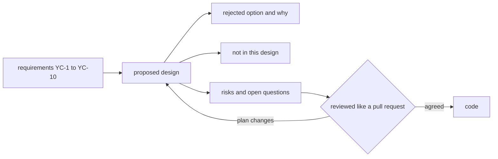

## Before you start

- [[management.l2.non-functional-requirements]] — you know YC-7 asks for an answer within 2 seconds while the payment gateway fails, and that it rules out waiting for the gateway inside the request.
- [[backend.l2.retry-with-backoff]] — you know `NotificationSender` retries a failed email later, waiting longer after each failure.
- [[backend.l2.idempotent-endpoints]] — you know an idempotency key lets a retry of the same request end with exactly one result.

## The situation

The refund requirements are written, and Sprint 15 starts on Monday. Two developers have already picked different approaches in their heads: one will call the gateway straight from the refund endpoint, because it is simpler, and the other plans a background job. If each just starts coding, the first time anyone compares the two is a pull request after three days of work, and one of them is thrown away. Worse, the simpler approach breaks YC-7, and nobody notices until review. How does the team agree on how to build the refund flow before the code exists?

## Core concepts

- **design doc** — a document describing how the team plans to build something, written before building it, so others can point out problems while changing the plan still costs only an edit.
- proposed design — the steps the team intends to build, each tied to the requirements it answers.
- rejected option — an approach the team considered and dropped, written down in a few lines with the requirement that ruled it out.
- out of scope of the design — what this design deliberately does not do, so a reviewer does not wait for it.

## How it works



In the situation above, the two approaches meet for the first time in code review, when changing course means discarding days of work. A design doc moves that meeting earlier. Before anyone writes code, one developer writes down how the team will build the flow, and the others review it. Changing the plan at that point costs an edit to a page.

The document starts from the requirements, as the diagram shows, and then keeps a fixed order. First the requirements it answers, by number, so a reviewer can check that each one is met. Then the proposed design: the steps, each pointing back to its requirement. Then the options it rejected, each with the requirement that ruled it out, in a few lines rather than pages; a reader who would have suggested the same option sees why it was dropped. Then what it deliberately leaves out, and the risks and questions still open.

The review works like a pull request: people comment, the author answers, and the document changes. It does not stop there. When the plan changes during the build, the document should change with it; Đơn Hàng's rule is to edit it in the same pull request as the code, so it describes what is being built and not just the first idea.

A design doc for one feature can stay short: it decides the shape of the solution, not every detail; the code still decides the rest.

## In the Đơn Hàng system

`docs/design/refund-design.md` opens like this:

```markdown file=docs/design/refund-design.md tag=stage-2 lines=1-12
# Thiết kế: luồng hoàn tiền

Trạng thái: đề xuất, chưa làm; đội Đơn Hàng review như một pull request trước
khi viết code. Thiết kế này trả lời `docs/team/refund-requirements.md` (YC-1
đến YC-10). Rủi ro và việc theo dõi chúng ở `docs/team/risk-register-example.md`.

## Tóm tắt

Khách gửi yêu cầu hoàn tiền; API chỉ ghi yêu cầu vào cơ sở dữ liệu và trả lời
ngay. Một job nền gửi yêu cầu sang cổng thanh toán, thử lại với backoff khi lỗi,
và mỗi lần gửi kèm cùng một idempotency key. Lý do chính: YC-7 đòi nhận yêu cầu
cả khi cổng thanh toán đang lỗi.
```

The status line says what kind of document this is: a proposal, not built yet, which the team reviews like a pull request before writing code. It names the requirements it answers, YC-1 to YC-10, and where the risks are tracked. The summary gives the whole design in four lines: the API only records the request and answers at once; a background job sends it to the gateway, retries with backoff and sends the same idempotency key each time. The main reason is YC-7.

The six steps that follow fill this in; none of them is built at this tag. In step 1, the customer would call `POST /api/v1/orders/{id}/refund` and get `202 Accepted`; the request would record a `pending` refund and never call the gateway. Step 2 adds columns to the existing `payments` table to track each refund's status and attempts. In steps 3 and 4, a job built the same way as `NotificationSender` would send due rows to the gateway with the key `refund-<id of the row>`, so a resend cannot refund twice (YC-9). In step 5, failures would be retried after 1 minute, then 2, 4 and 8, growing but never more than 1 hour apart, for 24 hours (YC-10). In step 6, once the gateway confirms, the order becomes `cancelled` and the customer gets an email (YC-5).

Then the option the team dropped:

```markdown file=docs/design/refund-design.md tag=stage-2 lines=39-43
## Phương án bị loại: gọi cổng thanh toán ngay trong request của khách

Đơn giản hơn: không cột trạng thái, không job. Nhưng khi cổng lỗi hoặc chậm,
khách chờ rồi nhận lỗi, và yêu cầu không được ghi lại. Điều đó trái YC-7, nên
phương án này bị loại.
```

Calling the gateway inside the customer's request is simpler: no status column like step 2's, no job. But when the gateway fails or is slow, the customer waits and gets an error, and the request is not recorded. That contradicts YC-7, so the option is out. A heading and three lines, one requirement, done.

The rest is short too. Not in this design: no new table, no separate payment service, no gateway calling back into the system.

Risks and open questions point to the risk register. R2: if the gateway does not accept idempotency keys, step 4 changes to asking the gateway for the refund's status before each resend. R1: if the gateway only reports results later, by calling back into the system, step 6 changes; the answer comes after the first week on the gateway's test environment. Last, `PATCH /api/v1/orders/{id}/cancel` still cancels a `paid` order today, so not every paid order would go through the refund flow; whether to block it now is left to the person who decides what the team builds. The file closes by saying it is changed in the same pull request as the code when the plan changes.

## Beginners often think…

- **"A design doc is big upfront design, the thing agile teams avoid."** → Actually, big upfront design means specifying a whole system in detail before building any of it. Agile teams, teams that plan and deliver in short rounds such as sprints, try to avoid that; a design doc for one feature can be a page or two, written days before the code, and changed as the build teaches the team something. You notice this when a two-page design catches a problem that would have cost a week of rework.
- **"A design doc is written after the code, to record what was built."** → Actually, written after, it can no longer change the plan; its value is the review before anyone builds. You notice this when the only document for a feature describes choices nobody can now question.
- **"Only architects write design docs."** → Actually, whoever will build the feature can write one, and the team reviews it like any pull request. You notice this when a junior developer's two-page design is the reason the team avoided the approach YC-7 ruled out.

## Try it (3 minutes)

Open `docs/design/refund-design.md` at `stage-2`.

1. Find which requirement each of these steps answers: the idempotency key `refund-<id>`, and the retries for 24 hours.
2. Find the line that tells you what happens to the document when the plan changes.

Expected result: step 1 — the key answers YC-9, no refund twice even when sending is retried; the 24 hours of retries answer YC-10. Step 2 — the last lines: when the plan changes, the file is edited in the same pull request as the code, so it does not keep describing the first idea.

The gateway's provider answers that it does not accept idempotency keys. What changes, and where?

<details><summary>Suggested answer</summary>

The design, before the code. The file's own risks section says so: step 4 would change to asking the gateway for the refund's status before each resend, which is R2 in the risk register. Someone edits the design doc, the team reviews the change like a pull request, and then the code follows.

</details>

## Connections

- [[management.l2.non-functional-requirements]] — prerequisite: YC-7 is the requirement that rules out the rejected option.
- [[backend.l2.retry-with-backoff]] — prerequisite: the refund job retries the way `NotificationSender` does, with its own waits and limit.
- [[backend.l2.idempotent-endpoints]] — prerequisite: the same idea, a key that makes a retry safe, here sent to the gateway.
- [[management.l2.risk-register]] — the design's open risks, R1 and R2, are tracked there, not repeated here.
- [[backend.l2.work-outside-the-request]] — the same move in code: the request records the work, and a job does it later.

## Five-line summary

1. A design doc says how the team plans to build something before building it, while changing the plan costs only an edit.
2. It starts from the requirements it answers, then the proposal, what it leaves out, and its risks and open questions.
3. The refund design calls the gateway from a background job, with backoff and an idempotency key, because YC-7 demands it.
4. It names the rejected option, calling the gateway inside the request, and the requirement that ruled it out, in a few lines.
5. A design doc is reviewed like a pull request and updated with the code when the plan changes.
