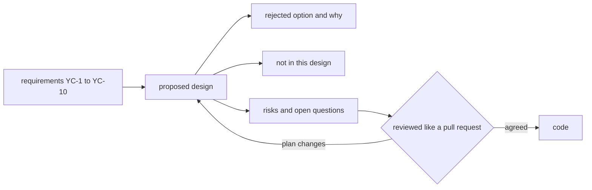

## Bạn cần biết trước

- [[management.l2.non-functional-requirements]] — bạn biết YC-7 đòi trả lời trong 2 giây khi cổng thanh toán lỗi, và nó loại việc chờ cổng ngay trong request.
- [[backend.l2.retry-with-backoff]] — bạn biết `NotificationSender` thử gửi lại email lỗi sau một lúc, mỗi lần lỗi lại chờ lâu hơn.
- [[backend.l2.idempotent-endpoints]] — bạn biết idempotency key giúp một lần gửi lại cùng request vẫn kết thúc với đúng một kết quả.

## Tình huống

Tài liệu yêu cầu hoàn tiền đã viết xong, và Sprint 15 bắt đầu vào thứ Hai. Hai lập trình viên đã chọn sẵn hai cách làm trong đầu: một người sẽ gọi cổng thẳng từ endpoint hoàn tiền, vì đơn giản hơn, còn người kia định dùng một background job. Nếu mỗi người cứ thế code, lần đầu tiên có ai so hai cách là ở một pull request sau ba ngày làm, và một trong hai bị bỏ đi. Tệ hơn, cách đơn giản phạm YC-7, mà không ai nhận ra cho tới lúc review. Làm sao để đội thống nhất cách xây luồng hoàn tiền trước khi có dòng code nào?

## Khái niệm cốt lõi

- **design doc** (tài liệu mô tả cách đội định xây một thứ, viết trước khi xây để người khác góp ý khi sửa còn rẻ) — tài liệu mô tả đội định xây một thứ thế nào, viết trước khi xây, để người khác chỉ ra vấn đề khi đổi kế hoạch vẫn chỉ tốn công sửa một trang.
- thiết kế đề xuất — các bước đội định xây, mỗi bước gắn với các yêu cầu nó trả lời.
- phương án bị loại — một hướng làm đội đã cân nhắc rồi bỏ, ghi lại trong vài dòng kèm yêu cầu đã loại nó.
- ngoài phạm vi của thiết kế — những gì thiết kế này cố ý không làm, để người review không chờ đợi nó.

## Cơ chế hoạt động



Trong tình huống trên, hai cách làm lần đầu gặp nhau ở code review, khi đổi hướng nghĩa là bỏ đi công sức của nhiều ngày. Design doc đưa cuộc gặp đó lên sớm hơn. Trước khi có ai viết code, một lập trình viên viết ra đội sẽ xây luồng này thế nào, và những người khác review. Đổi kế hoạch lúc đó chỉ tốn công sửa một trang.

Tài liệu bắt đầu từ các yêu cầu, như sơ đồ cho thấy, rồi đi theo một thứ tự cố định. Trước hết là các yêu cầu nó trả lời, theo số, để người review kiểm được từng yêu cầu đã được đáp ứng. Rồi tới thiết kế đề xuất: các bước, mỗi bước trỏ ngược về yêu cầu của nó. Rồi các phương án bị loại, mỗi phương án kèm yêu cầu đã loại nó, trong vài dòng chứ không phải vài trang; người đọc định đề xuất đúng phương án đó sẽ thấy vì sao nó bị bỏ. Rồi những gì nó cố ý để ngoài, và các rủi ro, câu hỏi còn mở.

Việc review diễn ra như một pull request: mọi người góp ý, tác giả trả lời, và tài liệu thay đổi. Nó không dừng ở đó. Khi kế hoạch đổi trong lúc xây, tài liệu nên đổi theo; quy tắc của Đơn Hàng là sửa nó trong cùng pull request với code, để nó mô tả thứ đang được xây, không chỉ ý tưởng đầu tiên.

Design doc cho một tính năng có thể giữ ngắn: nó quyết định hình dạng của giải pháp, không phải mọi chi tiết; phần còn lại vẫn do code quyết.

## Trong hệ thống Đơn Hàng

`docs/design/refund-design.md` mở đầu thế này:

```markdown file=docs/design/refund-design.md tag=stage-2 lines=1-12
# Thiết kế: luồng hoàn tiền

Trạng thái: đề xuất, chưa làm; đội Đơn Hàng review như một pull request trước
khi viết code. Thiết kế này trả lời `docs/team/refund-requirements.md` (YC-1
đến YC-10). Rủi ro và việc theo dõi chúng ở `docs/team/risk-register-example.md`.

## Tóm tắt

Khách gửi yêu cầu hoàn tiền; API chỉ ghi yêu cầu vào cơ sở dữ liệu và trả lời
ngay. Một job nền gửi yêu cầu sang cổng thanh toán, thử lại với backoff khi lỗi,
và mỗi lần gửi kèm cùng một idempotency key. Lý do chính: YC-7 đòi nhận yêu cầu
cả khi cổng thanh toán đang lỗi.
```

Dòng trạng thái nói đây là loại tài liệu gì: một đề xuất, chưa làm, đội review như một pull request trước khi viết code. Nó nêu các yêu cầu nó trả lời, YC-1 đến YC-10, và nơi theo dõi rủi ro. Phần tóm tắt đưa cả thiết kế trong bốn dòng: API chỉ ghi yêu cầu và trả lời ngay; một background job gửi yêu cầu sang cổng, thử lại với backoff và mỗi lần gửi kèm cùng một idempotency key. Lý do chính là YC-7.

Sáu bước sau đó điền chi tiết; chưa bước nào được xây ở tag này. Ở bước 1, khách sẽ gọi `POST /api/v1/orders/{id}/refund` và nhận `202 Accepted`; request sẽ ghi một khoản hoàn tiền `pending` và không bao giờ gọi cổng. Bước 2 thêm cột vào bảng `payments` sẵn có để theo dõi trạng thái và số lần thử của từng khoản hoàn tiền. Ở bước 3 và 4, một job xây cùng cách với `NotificationSender` sẽ gửi các dòng đến hạn sang cổng với key `refund-<id của dòng>`, nên một lần gửi lại không thể hoàn tiền hai lần (YC-9). Ở bước 5, lỗi sẽ được thử lại sau 1 phút, rồi 2, 4 và 8, tăng dần nhưng không bao giờ cách nhau quá 1 giờ, trong 24 giờ (YC-10). Ở bước 6, khi cổng xác nhận, đơn chuyển sang `cancelled` và khách nhận email (YC-5).

Rồi tới phương án đội đã bỏ:

```markdown file=docs/design/refund-design.md tag=stage-2 lines=39-43
## Phương án bị loại: gọi cổng thanh toán ngay trong request của khách

Đơn giản hơn: không cột trạng thái, không job. Nhưng khi cổng lỗi hoặc chậm,
khách chờ rồi nhận lỗi, và yêu cầu không được ghi lại. Điều đó trái YC-7, nên
phương án này bị loại.
```

Gọi cổng ngay trong request của khách thì đơn giản hơn: không có cột trạng thái như ở bước 2, không có job. Nhưng khi cổng lỗi hoặc chậm, khách phải chờ rồi nhận lỗi, và yêu cầu không được ghi lại. Điều đó trái YC-7, nên phương án bị loại. Một tiêu đề và ba dòng, một yêu cầu, xong.

Phần còn lại cũng ngắn. Không có trong thiết kế này: không thêm bảng, không tách service thanh toán riêng, không để cổng gọi ngược vào hệ thống.

Rủi ro và câu hỏi mở trỏ tới sổ rủi ro. R2: nếu cổng không nhận idempotency key, bước 4 đổi thành hỏi cổng trạng thái hoàn tiền trước mỗi lần gửi lại. R1: nếu cổng chỉ báo kết quả sau, bằng cách gọi ngược vào hệ thống, bước 6 phải đổi; câu trả lời có sau tuần đầu thử trên môi trường test của cổng. Cuối cùng, hôm nay `PATCH /api/v1/orders/{id}/cancel` vẫn hủy được đơn `paid`, nên không phải mọi đơn đã thanh toán đều đi qua luồng hoàn tiền; có chặn ngay đợt này không là do người quyết định đội xây gì định đoạt. File khép lại bằng câu: khi kế hoạch đổi, nó được sửa trong cùng pull request với code.

## Người mới hay nghĩ rằng…

- **"Design doc là thiết kế lớn từ đầu, thứ mà các đội agile tránh."** → Thực ra, thiết kế lớn từ đầu nghĩa là đặc tả chi tiết cả một hệ thống trước khi xây bất cứ phần nào. Các đội agile, những đội lập kế hoạch và giao hàng theo từng vòng ngắn như sprint, cố tránh điều đó; còn design doc cho một tính năng có thể chỉ một hai trang, viết vài ngày trước khi code, và đổi theo những gì đội học được khi xây. Bạn sẽ nhận ra khi một thiết kế hai trang bắt được một vấn đề mà nếu để lọt sẽ tốn một tuần làm lại.
- **"Design doc được viết sau khi code xong, để ghi lại những gì đã xây."** → Thực ra, viết sau thì nó không còn đổi được kế hoạch; giá trị của nó là được review trước khi có ai xây. Bạn sẽ nhận ra khi tài liệu duy nhất của một tính năng mô tả những lựa chọn mà giờ không ai còn đặt câu hỏi được nữa.
- **"Chỉ architect mới viết design doc."** → Thực ra, ai sẽ xây tính năng đều viết được, và đội review nó như mọi pull request. Bạn sẽ nhận ra khi một thiết kế hai trang của một lập trình viên junior là lý do đội tránh được cách làm mà YC-7 đã loại.

## Thử ngay (3 phút)

Mở `docs/design/refund-design.md` ở `stage-2`.

1. Tìm xem mỗi bước sau trả lời yêu cầu nào: idempotency key `refund-<id>`, và việc thử lại trong 24 giờ.
2. Tìm dòng cho bạn biết tài liệu sẽ ra sao khi kế hoạch đổi.

Kết quả mong đợi: bước 1 — key trả lời YC-9, không hoàn tiền hai lần kể cả khi phải gửi lại; 24 giờ thử lại trả lời YC-10. Bước 2 — mấy dòng cuối: khi kế hoạch đổi, file được sửa trong cùng pull request với code, để nó không cứ mô tả ý tưởng đầu tiên.

Bên cung cấp cổng trả lời rằng họ không nhận idempotency key. Cái gì thay đổi, và ở đâu?

<details><summary>Gợi ý đáp án</summary>

Thiết kế, trước code. Chính phần rủi ro của file đã nói: bước 4 sẽ đổi thành hỏi cổng trạng thái hoàn tiền trước mỗi lần gửi lại, tức R2 trong sổ rủi ro. Có người sửa design doc, đội review thay đổi đó như một pull request, rồi code mới đi theo.

</details>

## Liên hệ

- [[management.l2.non-functional-requirements]] — bài cần trước: YC-7 là yêu cầu loại phương án bị bỏ.
- [[backend.l2.retry-with-backoff]] — bài cần trước: job hoàn tiền thử lại theo cách `NotificationSender` làm, với thời gian chờ và giới hạn riêng.
- [[backend.l2.idempotent-endpoints]] — bài cần trước: cùng một ý, một key làm cho việc gửi lại trở nên an toàn, ở đây được gửi sang cổng.
- [[management.l2.risk-register]] — các rủi ro còn mở của thiết kế, R1 và R2, được theo dõi ở đó, không chép lại ở đây.
- [[backend.l2.work-outside-the-request]] — cùng một nước đi trong code: request ghi lại việc cần làm, còn một job làm nó sau.

## Tóm tắt 5 dòng

1. Design doc nói đội định xây một thứ thế nào trước khi xây, khi đổi kế hoạch chỉ tốn công sửa một trang.
2. Nó bắt đầu từ các yêu cầu nó trả lời, rồi tới đề xuất, những gì nó để ngoài, và các rủi ro, câu hỏi mở.
3. Thiết kế hoàn tiền gọi cổng từ một background job, với backoff và idempotency key, vì YC-7 đòi như vậy.
4. Nó nêu phương án bị loại, gọi cổng ngay trong request, và yêu cầu đã loại nó, trong vài dòng.
5. Design doc được review như một pull request và cập nhật cùng code khi kế hoạch đổi.
