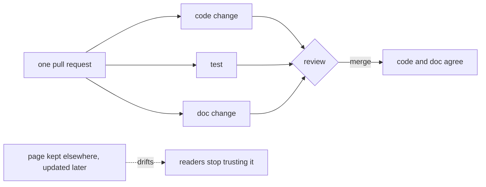

## Before you start

- [[management.l2.readme]] — you know a README says what a project is, how to run it and where to read next, and points to deeper documents instead of copying them.
- [[management.l1.code-review-basics]] — you know a pull request holds a merge open long enough for another person to read the diff and comment.
- [[management.l1.user-story-and-ac]] — you know the Definition of Done is one checklist every story must pass before it counts as finished.

## The situation

The team's meeting notes at `stage-1` list a task: add a status check to the cancel API, so that a `paid` order can no longer be cancelled. Suppose you make that change. Your pull request changes the rule and adds a test, the review passes, and it is merged. The page that describes the cancel endpoint lives on a separate wiki, a website where anyone on the team can edit pages, and you plan to update it "after the merge". Two weeks later, a developer building the app's cancel screen follows the wiki, and their code expects a `paid` order to cancel. Where should that description have lived, and when should it have changed?

## Core concepts

- **docs as code** — keeping documents as plain-text files in the same repository as the code, changed through pull requests and reviewed the same way code is.
- drift — the growing gap between what a document says and what the system does, when the code changes and the document does not.
- doc change — the edit to a document that a behaviour change needs, made in the same pull request as that change.

## How it works



In the situation above, the description of the cancel endpoint and the code that implements it changed at different times, in different places. The code changed at the merge. The wiki page waited for someone to remember. Every day in between, the page described a system that no longer existed, and the developer who trusted it paid for that.

Docs as code closes that gap. The document is a plain-text file in the same repository as the code. When a pull request changes behaviour, the same pull request changes the document that describes it, as the diagram shows. The reviewer sees the code, the test and the doc change side by side, and one merge lands all three. After the merge, the code and its description agree, because they arrived together.

A page kept elsewhere and updated later drifts. Each change that skips it widens the gap a little, and nobody notices until a reader is misled. After that happens a few times, readers stop trusting the page at all and go back to asking people or reading the code, so even its correct parts stop helping.

The review is where this is enforced. A reviewer who sees a behaviour change with no doc change can ask for one, the same way they ask for a missing test. And when a reader does find a mistake in a document, fixing it in a repository is an ordinary pull request.

## In the Đơn Hàng system

`STAGE.md` lives in the Đơn Hàng repository itself, and each tag has its own version of it. At `stage-1`, after describing what exists, it says what changed:

```markdown file=STAGE.md tag=stage-1 lines=50-55
## Changed since `stage-0`

`stage-0` had a lab and a database with no application; every `/api/v1/*`
answer was a fixed Caddy response. `stage-1` replaces those with a real,
3-layer API backed by the same database, a Flutter client that calls it, and
an EF Core migration history that starts truthfully from this tag's schema.
```

The section names the previous tag and what this one replaced: fixed answers from the web server (Caddy) with a real API, a client, and a migration history. Because `STAGE.md` is a file in the repository, checking out `stage-1` gives you this tag's code and this tag's description together. `stage-2` has its own `STAGE.md` with a `Changed since stage-1` section. Nobody has to find the matching version of a page somewhere else. The same file at `stage-1` already lists the order endpoints, `PATCH /api/v1/orders/{id}/cancel` among them, so in the situation a line about what cancel accepts could have changed right there, in your pull request.

The team also made docs part of finishing work. The Definition of Done in `docs/team/story-example.md`:

```markdown file=docs/team/story-example.md tag=stage-1 lines=23-27
- [ ] Code đã được ít nhất một người khác đọc và duyệt.
- [ ] Có test tự động cho mọi tiêu chí chấp nhận ở trên.
- [ ] Chạy được trên môi trường thử nghiệm, không chỉ trên máy người viết.
- [ ] Không thêm cảnh báo mới khi build.
- [ ] Tài liệu API đã cập nhật.
```

The last item reads "the API documentation has been updated". It sits in the same checklist as review, tests, a run on the test environment and no new build warnings, so a story whose API documentation was not updated is not done, however well its code works. In the situation, the cancel change would not have counted as done until the API documentation was updated, and a reviewer checking this list could have asked for it before the merge.

## Beginners often think…

- **"Documentation is written once the feature is finished."** → Actually, a feature whose documents are not updated is not finished; written later, the update has to compete with the next feature for time. You notice this when a document describes behaviour from two versions ago.
- **"Documents belong in a wiki; the repository is only for code."** → Actually, a document in the repository changes in the same pull request as the code, is reviewed with it, and travels with each tag; a wiki page does none of that by itself. You notice this when a wiki page and the code disagree and nobody can say which changed last.
- **"An outdated document is still better than no document."** → Actually, a reader with no document knows to check the code or ask; a reader with a wrong document acts on it with confidence. You notice this when someone builds against a described behaviour the system dropped weeks ago.

## Try it (3 minutes)

Open `STAGE.md` at `stage-1`, then at `stage-2`. In the Đơn Hàng repository, `git show stage-1:STAGE.md` prints the file as it is at that tag.

1. In each, find the section that says what changed since the previous tag.
2. In the `stage-2` version, find one sentence that describes something removed since `stage-1`.

Expected result: step 1 — `Changed since stage-0` in the first, `Changed since stage-1` in the second. Step 2 — the `stage-2` section lists `POST /api/v1/auth/login`, `AuthController` and other pieces as gone. The removal is described in the same tag as the code that removed them.

You review a pull request that makes `PATCH /api/v1/orders/{id}/cancel` refuse `paid` orders. It changes the rule and adds a test, and no document. What do you comment?

<details><summary>Suggested answer</summary>

Ask for the doc change in the same pull request, the way you would ask for a missing test: "This changes what the cancel endpoint accepts; please update the API documentation here too, as the Definition of Done asks." Mark it as must-fix, since the story is not done without it.

</details>

## Connections

- [[management.l2.readme]] — prerequisite: the README is one of the documents that must change when how to run the project changes.
- [[management.l1.code-review-basics]] — prerequisite: the review where a missing doc change is caught, before the merge.
- [[management.l1.user-story-and-ac]] — prerequisite: the Definition of Done that already lists updated API documentation.
- [[management.l1.reviewing-for-tests]] — the same habit: start from the behaviour change and look for what should come with it, a test there, a document here.

## Five-line summary

1. Docs as code keeps documents as plain-text files in the code's repository, changed and reviewed through pull requests.
2. A document changed in the same pull request as the behaviour stays true; one updated later drifts until nobody trusts it.
3. `STAGE.md` lives in the Đơn Hàng repository and says, at each tag, what changed since the previous one.
4. The team's Definition of Done includes updated API documentation, so a story without it is not done.
5. A reviewer who sees a behaviour change without a doc change asks for one, as for a missing test.
