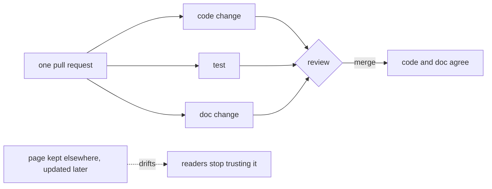

## Bạn cần biết trước

- [[management.l2.readme]] — bạn biết README nói dự án là gì, chạy thế nào và đọc gì tiếp, và trỏ tới các tài liệu sâu hơn thay vì chép lại chúng.
- [[management.l1.code-review-basics]] — bạn biết một pull request giữ việc merge lại đủ lâu để người khác đọc diff và góp ý.
- [[management.l1.user-story-and-ac]] — bạn biết Definition of Done là một danh sách kiểm tra mà mọi story phải qua mới được tính là xong.

## Tình huống

Biên bản họp của đội ở `stage-1` có một việc: thêm điều kiện trạng thái vào API hủy, để đơn `paid` không còn hủy được. Giả sử bạn làm thay đổi đó. Pull request của bạn sửa quy tắc và thêm một test, review qua, và được merge. Trang mô tả endpoint hủy nằm trên một wiki riêng, một website mà ai trong đội cũng sửa được, và bạn định cập nhật nó "sau khi merge". Hai tuần sau, một lập trình viên làm màn hình hủy đơn của app làm theo wiki, và code của họ cho rằng đơn `paid` vẫn hủy được. Lẽ ra phần mô tả đó phải nằm ở đâu, và phải đổi vào lúc nào?

## Khái niệm cốt lõi

- **docs as code** (giữ tài liệu dạng văn bản thuần trong cùng repository với code, sửa và review qua pull request như code) — giữ tài liệu thành các file văn bản thuần trong cùng repository với code, thay đổi qua pull request và được review giống như code.
- độ lệch — khoảng cách ngày càng lớn giữa điều tài liệu nói và điều hệ thống làm, khi code đổi mà tài liệu không đổi.
- phần sửa tài liệu — chỗ sửa trong tài liệu mà một thay đổi hành vi đòi hỏi, làm trong cùng pull request với thay đổi đó.

## Cơ chế hoạt động



Trong tình huống trên, phần mô tả endpoint hủy và code hiện thực nó đổi vào những thời điểm khác nhau, ở những nơi khác nhau. Code đổi lúc merge. Trang wiki thì chờ ai đó nhớ ra. Mỗi ngày ở giữa, trang mô tả một hệ thống không còn tồn tại, và người lập trình viên tin vào nó phải trả giá.

Docs as code lấp khoảng hở đó. Tài liệu là một file văn bản thuần trong cùng repository với code. Khi một pull request đổi hành vi, chính pull request đó sửa tài liệu mô tả hành vi ấy, như sơ đồ cho thấy. Người review thấy code, test và phần sửa tài liệu cạnh nhau, và một lần merge đưa cả ba vào. Sau khi merge, code và phần mô tả của nó khớp nhau, vì chúng đến cùng lúc.

Một trang giữ ở chỗ khác và cập nhật sau thì sẽ lệch. Mỗi thay đổi bỏ qua nó làm khoảng cách rộng thêm một chút, và không ai để ý cho tới khi có người đọc bị dẫn sai. Sau vài lần như vậy, người đọc thôi tin trang đó hẳn và quay lại hỏi người hoặc đọc code, nên ngay cả phần đúng của nó cũng hết giúp được ai.

Review là nơi giữ kỷ luật này. Người review thấy một thay đổi hành vi mà không có phần sửa tài liệu thì có thể yêu cầu, giống như yêu cầu một test còn thiếu. Và khi người đọc tìm ra một chỗ sai trong tài liệu, sửa nó trong repository chỉ là một pull request bình thường.

## Trong hệ thống Đơn Hàng

`STAGE.md` nằm ngay trong repository Đơn Hàng, và mỗi tag có phiên bản riêng của nó. Ở `stage-1`, sau phần mô tả những gì đang có, nó nói những gì đã đổi:

```markdown file=STAGE.md tag=stage-1 lines=50-55
## Changed since `stage-0`

`stage-0` had a lab and a database with no application; every `/api/v1/*`
answer was a fixed Caddy response. `stage-1` replaces those with a real,
3-layer API backed by the same database, a Flutter client that calls it, and
an EF Core migration history that starts truthfully from this tag's schema.
```

Mục này nêu tag trước và những gì tag này thay thế: các câu trả lời cố định từ web server (Caddy) được thay bằng một API thật, một client, và một lịch sử migration. Vì `STAGE.md` là một file trong repository, checkout `stage-1` cho bạn code của tag này và phần mô tả của tag này cùng một lúc. `stage-2` có `STAGE.md` riêng, với mục `Changed since stage-1`. Không ai phải đi tìm phiên bản khớp của một trang ở chỗ khác. Cũng file đó ở `stage-1` đã liệt kê các endpoint của đơn hàng, trong đó có `PATCH /api/v1/orders/{id}/cancel`, nên trong tình huống trên, một dòng về những gì endpoint hủy chấp nhận lẽ ra đã được sửa ngay ở đó, trong pull request của bạn.

Đội còn đưa tài liệu vào định nghĩa của việc hoàn thành. Definition of Done trong `docs/team/story-example.md`:

```markdown file=docs/team/story-example.md tag=stage-1 lines=23-27
- [ ] Code đã được ít nhất một người khác đọc và duyệt.
- [ ] Có test tự động cho mọi tiêu chí chấp nhận ở trên.
- [ ] Chạy được trên môi trường thử nghiệm, không chỉ trên máy người viết.
- [ ] Không thêm cảnh báo mới khi build.
- [ ] Tài liệu API đã cập nhật.
```

Mục cuối ghi "Tài liệu API đã cập nhật". Nó nằm trong cùng danh sách với review, test, chạy trên môi trường thử nghiệm và không thêm cảnh báo khi build, nên một story chưa cập nhật tài liệu API thì chưa xong, dù code chạy tốt đến đâu. Trong tình huống trên, thay đổi về hủy đơn sẽ không được tính là xong cho tới khi tài liệu API được cập nhật, và người review dò theo danh sách này đã có thể yêu cầu điều đó trước khi merge.

## Người mới hay nghĩ rằng…

- **"Tài liệu thì viết khi tính năng đã xong."** → Thực ra, một tính năng mà tài liệu chưa được cập nhật thì chưa xong; viết sau, việc cập nhật phải giành thời gian với tính năng kế tiếp. Bạn sẽ nhận ra khi một tài liệu mô tả hành vi của hai phiên bản trước.
- **"Tài liệu thuộc về wiki; repository chỉ để chứa code."** → Thực ra, tài liệu trong repository đổi trong cùng pull request với code, được review cùng code, và đi theo từng tag; một trang wiki tự nó không làm được điều nào trong số đó. Bạn sẽ nhận ra khi một trang wiki và code nói khác nhau và không ai biết bên nào đổi sau cùng.
- **"Tài liệu lỗi thời vẫn hơn không có tài liệu."** → Thực ra, người đọc không có tài liệu biết phải đọc code hoặc đi hỏi; người đọc có tài liệu sai thì cứ tự tin làm theo nó. Bạn sẽ nhận ra khi có người xây tính năng dựa trên một hành vi được mô tả mà hệ thống đã bỏ từ mấy tuần trước.

## Thử ngay (3 phút)

Mở `STAGE.md` ở `stage-1`, rồi ở `stage-2`. Trong repository Đơn Hàng, `git show stage-1:STAGE.md` in ra file đúng như ở tag đó.

1. Ở mỗi bản, tìm mục nói những gì đã đổi so với tag trước.
2. Trong bản `stage-2`, tìm một câu mô tả thứ đã bị bỏ đi kể từ `stage-1`.

Kết quả mong đợi: bước 1 — `Changed since stage-0` ở bản đầu, `Changed since stage-1` ở bản sau. Bước 2 — mục của `stage-2` liệt kê `POST /api/v1/auth/login`, `AuthController` và vài thứ khác là đã bị bỏ. Việc bỏ đi được mô tả ngay trong cùng tag với code đã bỏ chúng.

Bạn review một pull request làm `PATCH /api/v1/orders/{id}/cancel` từ chối đơn `paid`. Nó sửa quy tắc và thêm test, nhưng không sửa tài liệu nào. Bạn góp ý gì?

<details><summary>Gợi ý đáp án</summary>

Yêu cầu phần sửa tài liệu trong chính pull request này, như cách bạn yêu cầu một test còn thiếu: "Thay đổi này đổi những gì endpoint hủy chấp nhận; nhờ bạn cập nhật tài liệu API luôn ở đây, như Definition of Done yêu cầu." Đánh dấu là phải sửa, vì thiếu nó thì story chưa xong.

</details>

## Liên hệ

- [[management.l2.readme]] — bài cần trước: README là một trong những tài liệu phải đổi khi cách chạy dự án đổi.
- [[management.l1.code-review-basics]] — bài cần trước: review là nơi bắt được phần sửa tài liệu còn thiếu, trước khi merge.
- [[management.l1.user-story-and-ac]] — bài cần trước: Definition of Done vốn đã có mục cập nhật tài liệu API.
- [[management.l1.reviewing-for-tests]] — cùng một thói quen: bắt đầu từ thay đổi hành vi và tìm thứ phải đi kèm nó, ở đó là test, ở đây là tài liệu.

## Tóm tắt 5 dòng

1. Docs as code giữ tài liệu thành file văn bản thuần trong repository của code, sửa và review qua pull request.
2. Tài liệu đổi trong cùng pull request với hành vi thì giữ được đúng; tài liệu cập nhật sau sẽ lệch tới khi không ai tin nó.
3. `STAGE.md` nằm trong repository Đơn Hàng và, ở mỗi tag, nói những gì đã đổi so với tag trước.
4. Definition of Done của đội có mục tài liệu API đã cập nhật, nên story thiếu nó thì chưa xong.
5. Người review thấy thay đổi hành vi mà không có phần sửa tài liệu thì yêu cầu, như với một test còn thiếu.
