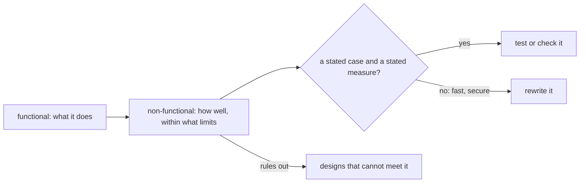

## Before you start

- [[management.l2.requirements-document]] — you know the refund requirements list YC-1 to YC-6, numbered and checkable statements of what the system must do, naming no table or endpoint.

## The situation

You sketch the simplest refund flow that meets YC-1 to YC-6: the customer taps the refund button, the API calls the payment gateway, the outside service that moves the money, waits for its answer, and shows the result. Every one of the six requirements is satisfied. Then a tester asks what the customer sees if the gateway is down at that moment. Accounting asks whether a refund's record can be edited afterwards. Nothing in YC-1 to YC-6 answers either question, yet both answers would change your sketch. Which requirements say how well the refund flow must work, and how are they written so someone can check them?

## Core concepts

- functional requirement — a requirement on what the system does, such as "a confirmed refund cancels the order"; YC-1 to YC-6 are of this kind.
- **non-functional requirement** — a requirement on how well the system must do something or within what limits, such as how fast it answers, what it does while a service it needs is down, or what it must keep.
- checkable — stated so that a test or a person can say yes or no: a stated case and a stated measure, not an adjective.
- ruled-out design — a design that cannot meet a requirement whatever its details, so the requirement removes it before anyone builds it.

## How it works



A functional requirement says what happens: a customer asks for a refund, the order is cancelled, an email goes out. In the situation above, your sketch does all of that. A non-functional requirement says how well it must happen, or within what limits: how quickly the customer gets an answer, what happens while the gateway is down, what must be kept and for how long. The diagram starts from the same feature and asks a second question about it.

A non-functional requirement is useful only when it can be checked. "Refunds are fast" cannot be tested, because nobody agreed what fast means or in which case. "The request is answered within 2 seconds, even when the gateway does not answer" can: it names a case, the gateway down, and a measure, 2 seconds. The same goes for "secure" or "reliable": each must become a stated case and a stated result before anyone can say whether it was met.

Finally, a non-functional requirement often decides more than a functional one. Many designs can cancel an order after a refund. Far fewer can answer the customer within 2 seconds while the gateway is not answering. A design that must wait for the gateway before answering cannot, however well it is built, so the requirement rules it out before anyone writes code.

## In the Đơn Hàng system

The refund requirements have a second list after YC-1 to YC-6:

```markdown file=docs/team/refund-requirements.md tag=stage-2 lines=41-50
## Yêu cầu phi chức năng

- YC-7: Yêu cầu hoàn tiền của khách được nhận và trả lời trong 2 giây, kể cả
  khi cổng thanh toán không trả lời hoặc báo lỗi.
- YC-8: Mỗi yêu cầu hoàn tiền lưu người yêu cầu và thời điểm yêu cầu; hai thông
  tin này không bị sửa hay xóa về sau, để kế toán đối soát.
- YC-9: Một đơn không bao giờ được hoàn tiền hai lần, kể cả khi việc gửi sang
  cổng thanh toán phải thử lại.
- YC-10: Khi cổng thanh toán lỗi, yêu cầu được gửi lại tự động trong ít nhất 24
  giờ trước khi chuyển cho nhân viên xử lý.
```

Four requirements, each about how well or within what limits. YC-7: the customer's refund request is received and answered within 2 seconds, even when the payment gateway does not answer or reports an error. YC-8: each request keeps who asked and when, and neither can be changed or deleted later, so accounting can match each refund against its own records. YC-9: an order is never refunded twice, even when sending to the gateway has to be retried. YC-10: when the gateway fails, the request is sent again automatically for at least 24 hours before it goes to staff.

Each one names something a person can check. YC-7 names the gateway failing and a 2-second limit; YC-10 names the gateway failing and a 24-hour minimum; YC-8 and YC-9 name what must never happen, an edited record or a second refund. A tester can stop the gateway and time the answer.

Now go back to your sketch. It calls the gateway inside the customer's request and waits. When the gateway does not answer, the customer waits with it, longer than 2 seconds, and still gets no refund. YC-7 rules that design out. Đơn Hàng's order notification had the same shape at `stage-1`: the order response waited for `notifier.Send`, the step that notifies the customer (at `stage-1` it only writes a log line), so once that step sends a real email, a slow mail server means a slow answer. How the refund design answers it is the next lesson.

## Beginners often think…

- **"Non-functional requirements are optional extras for after the features work."** → Actually, they decide which designs are possible at all; added after the features are built, they can force a rewrite. You notice this when a working refund flow has to be rebuilt because it hangs whenever the gateway is down.
- **"'The system must be fast and secure' is a good non-functional requirement."** → Actually, nobody can check it, so nobody can say whether it was met; it needs a stated case and a stated measure, like YC-7's 2 seconds while the gateway fails. You notice this when a tester and a developer argue about whether a 5-second answer is "fast".
- **"Non-functional requirements are for the operations team, not something developers write."** → Actually, they shape the code developers write, and the people who need them, such as accounting for YC-8, are often outside operations. You notice this when a requirement nobody wrote down, like keeping who asked for a refund, turns up in a complaint instead of a test.

## Try it (3 minutes)

Open `docs/team/refund-requirements.md` at `stage-2`.

1. For YC-7 and YC-10, write down the case and the measure each one names.
2. Rewrite this draft so it can be checked: "Refund emails should be reliable."

Expected result: step 1 — YC-7: the case is the gateway not answering or reporting an error, the measure is an answer within 2 seconds; YC-10: the case is the gateway failing, the measure is at least 24 hours of automatic retries before staff take over. Step 2 — something like "When the mail server is down, the refund email is retried, and it reaches the customer within one hour after the mail server is back." Your own wording is fine if it names a case and a result someone can check.

Which of your sketch's steps does YC-7 rule out, and why?

<details><summary>Suggested answer</summary>

Calling the gateway inside the customer's request and waiting for its answer before replying. If the gateway does not answer, the request cannot reply within 2 seconds, so no implementation of that step can meet YC-7. The answer to the customer cannot depend on the gateway answering; whatever talks to the gateway when it is down has to keep going after the customer already has an answer.

</details>

## Connections

- [[management.l2.requirements-document]] — prerequisite: the same document, its second list; the first said what the system does, this one how well.
- [[backend.l2.work-outside-the-request]] — the same problem in code: an order response that waited for the mail server, fixed by moving the work out of the request.
- [[management.l2.design-doc]] — next: the refund design that answers YC-7 to YC-10, and the option YC-7 ruled out.

## Five-line summary

1. A non-functional requirement says how well the system must do something or within what limits, not what it does.
2. It is useful only when checkable: a stated case and a stated measure, not "fast" or "secure".
3. The refund requirements ask for an answer within 2 seconds while the gateway fails, and permanent records of who asked and when.
4. YC-9 and YC-10 add no double refunds and at least 24 hours of automatic retries.
5. A non-functional requirement can rule out a design; YC-7 rules out waiting for the gateway inside the customer's request.
