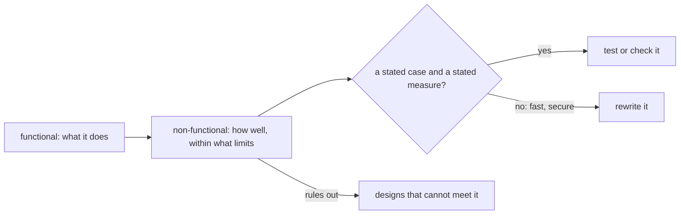

## Bạn cần biết trước

- [[management.l2.requirements-document]] — bạn biết tài liệu yêu cầu hoàn tiền liệt kê YC-1 đến YC-6, những câu đánh số, kiểm tra được, nói hệ thống phải làm gì và không nêu bảng hay endpoint nào.

## Tình huống

Bạn phác luồng hoàn tiền đơn giản nhất đáp ứng YC-1 đến YC-6: khách bấm nút hoàn tiền, API gọi cổng thanh toán, dịch vụ bên ngoài chuyển tiền, chờ cổng trả lời, rồi hiện kết quả. Cả sáu yêu cầu đều được đáp ứng. Rồi một tester hỏi khách sẽ thấy gì nếu đúng lúc đó cổng ngừng chạy. Kế toán hỏi bản ghi của một khoản hoàn tiền có bị sửa về sau được không. Không yêu cầu nào trong YC-1 đến YC-6 trả lời hai câu đó, mà cả hai câu trả lời đều sẽ làm đổi bản phác của bạn. Yêu cầu nào nói luồng hoàn tiền phải chạy tốt đến mức nào, và chúng được viết ra sao để có người kiểm tra được?

## Khái niệm cốt lõi

- yêu cầu chức năng — yêu cầu về việc hệ thống làm gì, như "hoàn tiền được xác nhận thì hủy đơn"; YC-1 đến YC-6 thuộc loại này.
- **yêu cầu phi chức năng** (non-functional requirement) — yêu cầu về việc hệ thống phải làm một điều tốt đến mức nào hay trong giới hạn nào, như trả lời nhanh cỡ nào, làm gì khi một dịch vụ nó cần đang ngừng, hay phải giữ lại những gì.
- kiểm tra được — được nêu sao cho một bài test hay một người nói được có hoặc không: một trường hợp nêu rõ và một thước đo nêu rõ, không phải một tính từ.
- thiết kế bị loại — thiết kế không thể đáp ứng một yêu cầu dù chi tiết thế nào, nên yêu cầu loại nó trước khi có ai xây.

## Cơ chế hoạt động



Yêu cầu chức năng nói điều gì xảy ra: khách yêu cầu hoàn tiền, đơn bị hủy, một email được gửi đi. Trong tình huống trên, bản phác của bạn làm đủ những điều đó. Yêu cầu phi chức năng nói điều đó phải xảy ra tốt đến mức nào, hay trong giới hạn nào: khách nhận được trả lời nhanh cỡ nào, chuyện gì xảy ra khi cổng ngừng chạy, cái gì phải giữ lại và giữ bao lâu. Sơ đồ bắt đầu từ cùng một tính năng và đặt thêm một câu hỏi thứ hai về nó.

Yêu cầu phi chức năng chỉ có ích khi kiểm tra được. "Hoàn tiền phải nhanh" không test được, vì chưa ai thống nhất nhanh là bao nhiêu, trong trường hợp nào. "Yêu cầu được trả lời trong 2 giây, kể cả khi cổng không trả lời" thì test được: nó nêu một trường hợp, cổng ngừng chạy, và một thước đo, 2 giây. "An toàn" hay "đáng tin cậy" cũng vậy: mỗi chữ phải thành một trường hợp nêu rõ và một kết quả nêu rõ thì mới có người nói được nó đã đạt hay chưa.

Cuối cùng, yêu cầu phi chức năng thường quyết định nhiều hơn yêu cầu chức năng. Nhiều thiết kế hủy được đơn sau khi hoàn tiền. Ít thiết kế hơn hẳn trả lời được khách trong 2 giây khi cổng đang không trả lời. Một thiết kế buộc phải chờ cổng rồi mới trả lời thì không làm được, dù được xây tốt đến đâu, nên yêu cầu loại nó trước khi có ai viết code.

## Trong hệ thống Đơn Hàng

Tài liệu yêu cầu hoàn tiền có danh sách thứ hai, sau YC-1 đến YC-6:

```markdown file=docs/team/refund-requirements.md tag=stage-2 lines=41-50
## Yêu cầu phi chức năng

- YC-7: Yêu cầu hoàn tiền của khách được nhận và trả lời trong 2 giây, kể cả
  khi cổng thanh toán không trả lời hoặc báo lỗi.
- YC-8: Mỗi yêu cầu hoàn tiền lưu người yêu cầu và thời điểm yêu cầu; hai thông
  tin này không bị sửa hay xóa về sau, để kế toán đối soát.
- YC-9: Một đơn không bao giờ được hoàn tiền hai lần, kể cả khi việc gửi sang
  cổng thanh toán phải thử lại.
- YC-10: Khi cổng thanh toán lỗi, yêu cầu được gửi lại tự động trong ít nhất 24
  giờ trước khi chuyển cho nhân viên xử lý.
```

Bốn yêu cầu, yêu cầu nào cũng nói về mức độ tốt hay giới hạn. YC-7: yêu cầu hoàn tiền của khách được nhận và trả lời trong 2 giây, kể cả khi cổng thanh toán không trả lời hoặc báo lỗi. YC-8: mỗi yêu cầu lưu người yêu cầu và thời điểm, và hai thông tin này không bị sửa hay xóa về sau, để kế toán đối chiếu từng khoản hoàn tiền với sổ sách của mình. YC-9: một đơn không bao giờ được hoàn tiền hai lần, kể cả khi việc gửi sang cổng phải thử lại. YC-10: khi cổng lỗi, yêu cầu được gửi lại tự động trong ít nhất 24 giờ trước khi chuyển cho nhân viên.

Yêu cầu nào cũng nêu một điều có người kiểm được. YC-7 nêu trường hợp cổng lỗi và giới hạn 2 giây; YC-10 nêu trường hợp cổng lỗi và tối thiểu 24 giờ; YC-8 và YC-9 nêu điều không bao giờ được xảy ra, một bản ghi bị sửa hay một lần hoàn tiền thứ hai. Tester có thể cho cổng ngừng rồi đo thời gian trả lời.

Giờ quay lại bản phác của bạn. Nó gọi cổng ngay trong request của khách và chờ. Khi cổng không trả lời, khách chờ theo, lâu hơn 2 giây, mà vẫn không được hoàn tiền. YC-7 loại thiết kế đó. Phần thông báo đơn hàng của Đơn Hàng cũng có cùng hình dạng ở `stage-1`: response của đơn chờ `notifier.Send`, bước báo cho khách (ở `stage-1` nó chỉ ghi một dòng log), nên khi bước đó gửi email thật, mail server chậm nghĩa là trả lời chậm. Bản thiết kế hoàn tiền giải quyết chuyện này thế nào là nội dung bài sau.

## Người mới hay nghĩ rằng…

- **"Yêu cầu phi chức năng là phần thêm tùy chọn, để sau khi tính năng chạy được."** → Thực ra, chúng quyết định thiết kế nào làm được ngay từ đầu; thêm vào sau khi tính năng đã xây thì có thể buộc phải viết lại. Bạn sẽ nhận ra khi một luồng hoàn tiền đang chạy phải xây lại vì nó treo mỗi khi cổng ngừng.
- **"'Hệ thống phải nhanh và an toàn' là một yêu cầu phi chức năng tốt."** → Thực ra, không ai kiểm được câu đó, nên không ai nói được nó đã đạt hay chưa; nó cần một trường hợp và một thước đo nêu rõ, như 2 giây khi cổng lỗi của YC-7. Bạn sẽ nhận ra khi tester và lập trình viên cãi nhau xem trả lời trong 5 giây có tính là "nhanh" không.
- **"Yêu cầu phi chức năng là việc của bộ phận vận hành, lập trình viên không viết."** → Thực ra, chúng định hình code mà lập trình viên viết, và người cần chúng, như kế toán với YC-8, thường ở ngoài bộ phận vận hành. Bạn sẽ nhận ra khi một yêu cầu không ai viết ra, như giữ lại ai đã yêu cầu hoàn tiền, xuất hiện trong một lời phàn nàn thay vì trong một bài test.

## Thử ngay (3 phút)

Mở `docs/team/refund-requirements.md` ở `stage-2`.

1. Với YC-7 và YC-10, ghi ra trường hợp và thước đo mà mỗi yêu cầu nêu.
2. Viết lại bản nháp này để nó kiểm tra được: "Refund emails should be reliable."

Kết quả mong đợi: bước 1 — YC-7: trường hợp là cổng không trả lời hoặc báo lỗi, thước đo là trả lời trong 2 giây; YC-10: trường hợp là cổng lỗi, thước đo là ít nhất 24 giờ tự động thử lại trước khi nhân viên tiếp nhận. Bước 2 — đại loại "Khi mail server ngừng, email hoàn tiền được gửi lại, và tới tay khách trong vòng một giờ sau khi mail server chạy lại." Cách diễn đạt của bạn cũng được, miễn là nó nêu một trường hợp và một kết quả có người kiểm được.

YC-7 loại bước nào trong bản phác của bạn, và vì sao?

<details><summary>Gợi ý đáp án</summary>

Bước gọi cổng ngay trong request của khách và chờ cổng trả lời rồi mới trả lời khách. Nếu cổng không trả lời, request không thể trả lời trong 2 giây, nên không cách hiện thực nào của bước đó đáp ứng được YC-7. Câu trả lời cho khách không được phụ thuộc vào việc cổng trả lời; phần nào làm việc với cổng khi cổng đang ngừng phải tiếp tục chạy sau khi khách đã nhận được câu trả lời.

</details>

## Liên hệ

- [[management.l2.requirements-document]] — bài cần trước: cùng một tài liệu, danh sách thứ hai của nó; danh sách đầu nói hệ thống làm gì, danh sách này nói làm tốt đến mức nào.
- [[backend.l2.work-outside-the-request]] — cùng vấn đề đó trong code: một response của đơn từng chờ mail server, được sửa bằng cách đưa việc ra khỏi request.
- [[management.l2.design-doc]] — bài kế: bản thiết kế hoàn tiền đáp ứng YC-7 đến YC-10, và phương án mà YC-7 đã loại.

## Tóm tắt 5 dòng

1. Yêu cầu phi chức năng nói hệ thống phải làm một điều tốt đến mức nào hay trong giới hạn nào, không phải nó làm gì.
2. Nó chỉ có ích khi kiểm tra được: một trường hợp và một thước đo nêu rõ, không phải "nhanh" hay "an toàn".
3. Tài liệu yêu cầu hoàn tiền đòi trả lời trong 2 giây khi cổng lỗi, và bản ghi vĩnh viễn về ai yêu cầu, lúc nào.
4. YC-9 và YC-10 thêm điều kiện không hoàn tiền hai lần và ít nhất 24 giờ tự động thử lại.
5. Yêu cầu phi chức năng có thể loại một thiết kế; YC-7 loại việc chờ cổng ngay trong request của khách.
