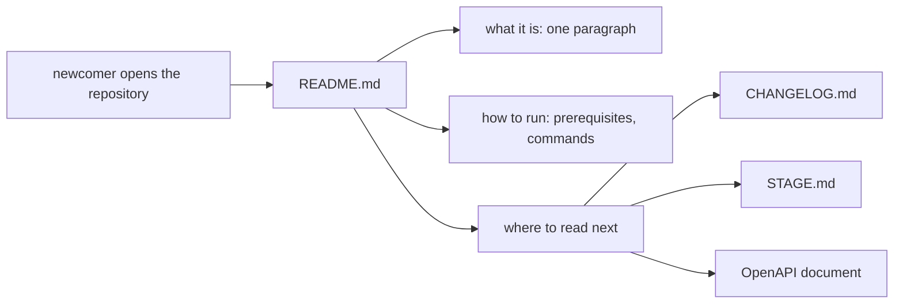

## Before you start

- [[management.l2.answer-first]] — you know a work document opens with what the reader most needs, and the details follow.
- [[devops.l2.changelog]] — you know Đơn Hàng's `CHANGELOG.md` lists, per version, the changes that matter to the people using it.

## The situation

A developer joins the team and clones the Đơn Hàng repository at `stage-2`. They want to see the system running before lunch. The repository has more than twenty folders and files at the top: `DonHang.Api`, `deploy`, `keycloak`, `scripts`, `www` and others. They open `DonHang.App`, because the app is what they will work on, and its readme file says only that this is "A new Flutter project". Which file should they have opened first, and what must it tell them?

## Core concepts

- **README** — the file at the top of a repository or a folder that a newcomer opens first; it says what the project is, how to run it, and where to read next.
- run instructions — the exact commands to copy, in order, from a fresh clone to a running system, with what must be installed beforehand.
- fresh clone — a new copy of the repository on a machine that has never run it, without files the repository leaves out, such as `.env`.
- pointer — a line in the README that names a deeper document and what it is for, instead of repeating its content.

## How it works



A newcomer opens the repository and reads the README before anything else. In the situation above, that is the root `README.md`, not the one inside `DonHang.App`. It answers three questions in order, as the diagram shows. First, what this is, in one paragraph: answer first, applied to a whole repository. Second, how to run it: what to install, then the commands. Third, where to read next.

The run instructions are easy to get wrong. An author writes them from memory, on a machine that already has everything: the secrets created months ago, the Flutter tools installed for another project. A step the author's machine no longer needs is easy to forget, and a newcomer's machine fails exactly there. So the commands are written to be copied, not described, and someone, the reviewer or the author on a clean machine, runs them from a fresh clone before the change is merged.

The last part keeps the README short. It points to deeper documents instead of repeating them: the history of versions lives in `CHANGELOG.md`, the state of each tag in `STAGE.md`, the API's endpoints in the OpenAPI document. A copy in the README would drift away from those files; a pointer only has to keep naming the right file.

A folder can have its own README, for the reader who opens that folder. When a tool creates a new project, as Flutter's command for a new app does, it writes a starter README that describes the template. If nobody decides who the folder's reader is, that starter text stays.

## In the Đơn Hàng system

The root `README.md` at `stage-2` is in Vietnamese, like the team's other documents. It opens like this:

```markdown file=README.md tag=stage-2 lines=3-26
Đơn Hàng là một hệ thống bán hàng nhỏ, cố ý đơn giản, dùng làm ví dụ cho giáo
trình Lộ Trình Architect. Khách xem sản phẩm, đăng nhập qua Keycloak và đặt
đơn; nhân viên đổi giá sản phẩm và giao đơn; khi đơn được đặt, bị hủy hay được
giao, khách nhận một email. Hệ thống gồm một API ASP.NET Core (`DonHang.Api`), một app
Flutter chạy trên trình duyệt (`DonHang.App`), PostgreSQL, Redis và Keycloak,
tất cả chạy bằng Docker Compose trên máy bạn. Mỗi tag `stage-N` là trạng thái
của repo cho một giai đoạn của giáo trình; file này mô tả tag `stage-2`.

## Cần có trên máy

- Docker Desktop.
- Flutter SDK 3.47: `scripts/up.sh` build app web trên máy bạn, không trong
  container.
- Bash. Trên Windows, dùng Git Bash; nó có sẵn `openssl` và `ssh-keygen` mà
  `scripts/dev-secrets.sh` cần.
- Chỉ khi chạy test: .NET SDK 10.0.300 (ghim trong `global.json`); test tích
  hợp cũng cần Docker đang chạy.
- Chỉ cho các bài Kubernetes: kind và kubectl (xem `STAGE.md`).

## Chạy

1. Chạy `scripts/up.sh`. Lần đầu, nó tạo secret chỉ dùng cho máy dev trong
   `.env` và `secrets/`, build app web, rồi khởi động mọi container và chờ
   chúng sẵn sàng. Lần đầu mất vài phút vì phải tải image.
```

The first paragraph says what the system is: a small, deliberately simple ordering system used as the curriculum's example, what customers and staff do with it, and what it is made of. Then `Cần có trên máy` lists the prerequisites: Docker Desktop, the program that runs containers on your machine; the Flutter SDK 3.47, the tools that build Flutter apps, because `scripts/up.sh` builds the web app on your machine; and a Bash shell, Git Bash on Windows. The .NET SDK, the tools that build and test .NET code, is needed only for tests.

Then `Chạy` gives the steps, and step 1 is one command, `scripts/up.sh`. It says that the first run creates dev-only secrets in `.env` and `secrets/`. That sentence matters on a fresh clone: both are left out of the repository, so a newcomer's machine does not have them. The rest of `Chạy` gives the app's address, `localhost:8081`; later lines show how to run the tests: `dotnet test DonHang.slnx` for the API and `flutter test` inside `DonHang.App`.

The README ends with `Đọc tiếp`, "read next", pointing elsewhere:

```markdown file=README.md tag=stage-2 lines=51-59
## Đọc tiếp

- `STAGE.md`: hệ thống ở tag này có gì, đổi gì so với tag trước (tiếng Anh,
  viết cho người soạn bài).
- `CHANGELOG.md`: mỗi phiên bản đổi gì, cho người gọi API và dùng app.
- `/openapi/v1.json` trên `localhost:8080`: hợp đồng của API.
- `docs/`: tài liệu của đội, như `docs/team/` (sprint, story, kế hoạch và yêu
  cầu hoàn tiền) và `docs/design/`.
- `deploy/k8s/` và `scripts/k8s/`: chạy Đơn Hàng trên một cluster kind.
```

Five pointers, each saying what the document is for: `STAGE.md` for the state of this tag, written in English for people preparing lessons; `CHANGELOG.md` for what each version changed; `/openapi/v1.json` for the API contract; `docs/` for the team's documents; `deploy/k8s/` and `scripts/k8s/` for running on a cluster. None of them is repeated in the README.

Meanwhile `DonHang.App/README.md` at `stage-2` is still the text Flutter's template generated, the same as at `stage-1`. Nothing in it was written for the reader who opens that folder first, a sign that nobody decided who that reader is.

## Beginners often think…

- **"The project template already created a README, so that part is done."** → Actually, a template README describes the template, not your project; it says what any new Flutter project is. You notice this when a newcomer opens `DonHang.App/README.md` and learns nothing about the app they are about to change.
- **"The README should explain everything about the project in one file."** → Actually, a README that repeats the changelog, the API contract and the design drifts from them, and buries the three answers a newcomer needs. You notice this when the README lists an endpoint the OpenAPI document no longer has.
- **"I can write the setup steps from memory; I did them once."** → Actually, your machine still has what those steps created, so the step you no longer need is the one you forget. You notice this when a newcomer's first run fails on a file your machine created months ago, such as `.env`.

## Try it (3 minutes)

Open the root `README.md` of `examples/don-hang` at `stage-2`.

1. Find the sentence that says what the system is, the list of prerequisites, and the one command that starts it.
2. In `Đọc tiếp`, find where the README sends you for the API contract, and where for what changed in each version.

Expected result: step 1 — the first paragraph says what the system is; `Cần có trên máy` lists Docker Desktop, Flutter SDK 3.47 and Bash; step 1 of `Chạy` is `scripts/up.sh`. Step 2 — the API contract is `/openapi/v1.json` on `localhost:8080`; the changes per version are in `CHANGELOG.md`.

What three things would you write first in `DonHang.App/README.md`?

<details><summary>Suggested answer</summary>

What the folder is: the Flutter web client of Đơn Hàng, which lists products, signs customers in and places orders. How to run it: `scripts/up.sh` at the root builds it and serves it on `localhost:8081`, with `flutter test` inside `DonHang.App` for its tests. Where to read next: the root `README.md` and `STAGE.md`. Before merging, someone runs those commands from a fresh clone.

</details>

## Connections

- [[management.l2.answer-first]] — prerequisite: the README's first paragraph is answer first, applied to a whole repository.
- [[devops.l2.changelog]] — prerequisite: the changelog is one of the documents the README points to instead of repeating.
- [[backend.l2.openapi-contract]] — the API contract the README points to, generated from the code, so it stays true without the README copying it.
- [[management.l2.docs-as-code]] — next: how the README and other documents stay true when the code changes.

## Five-line summary

1. A README is the file a newcomer opens first; it says what the project is, how to run it, and where to read next.
2. Đơn Hàng's root `README.md` says what the system is in one paragraph, lists prerequisites, and starts everything with `scripts/up.sh`.
3. Run instructions are exact commands, checked from a fresh clone, because the author's machine already has what a newcomer lacks.
4. A README points to deeper documents, `CHANGELOG.md`, `STAGE.md` and the OpenAPI document, instead of repeating them.
5. `DonHang.App/README.md` is still template text, a sign that nobody decided who that folder's reader is.
