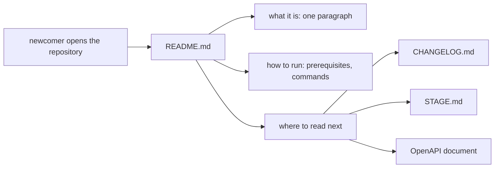

## Bạn cần biết trước

- [[management.l2.answer-first]] — bạn biết một tài liệu công việc mở đầu bằng điều người đọc cần nhất, chi tiết theo sau.
- [[devops.l2.changelog]] — bạn biết `CHANGELOG.md` của Đơn Hàng liệt kê, theo từng phiên bản, những thay đổi quan trọng với người dùng.

## Tình huống

Một lập trình viên vào đội và clone repository Đơn Hàng ở `stage-2`. Họ muốn thấy hệ thống chạy trước giờ trưa. Ở gốc repository có hơn hai mươi thư mục và file: `DonHang.Api`, `deploy`, `keycloak`, `scripts`, `www` và nhiều thứ khác. Họ mở `DonHang.App`, vì app là phần họ sẽ làm, và file readme trong đó chỉ nói đây là "A new Flutter project". Lẽ ra họ phải mở file nào trước, và file đó phải cho họ biết những gì?

## Khái niệm cốt lõi

- **README** (file ở đầu một repository hay thư mục cho người mới biết: đây là gì, chạy thế nào, đọc gì tiếp) — file nằm trên cùng của một repository hay một thư mục, thứ người mới mở đầu tiên; nó nói dự án là gì, chạy thế nào, và đọc gì tiếp.
- hướng dẫn chạy — các lệnh chính xác để chép, theo thứ tự, từ một bản clone mới tới một hệ thống đang chạy, kèm những gì phải cài trước.
- bản clone mới — một bản sao mới của repository trên một máy chưa từng chạy nó, không có những file repository cố ý để ngoài, như `.env`.
- dòng trỏ — một dòng trong README nêu tên một tài liệu sâu hơn và tài liệu đó để làm gì, thay vì chép lại nội dung của nó.

## Cơ chế hoạt động



Người mới mở repository và đọc README trước mọi thứ khác. Trong tình huống trên, đó là `README.md` ở gốc, không phải file nằm trong `DonHang.App`. Nó trả lời ba câu hỏi theo thứ tự, như sơ đồ cho thấy. Thứ nhất, đây là gì, trong một đoạn: kết luận đặt ở đầu, áp dụng cho cả một repository. Thứ hai, chạy thế nào: cài gì, rồi tới các lệnh. Thứ ba, đọc gì tiếp.

Hướng dẫn chạy là phần dễ sai. Tác giả viết nó theo trí nhớ, trên một cái máy đã có sẵn mọi thứ: secret tạo từ mấy tháng trước, bộ công cụ Flutter đã cài cho một dự án khác. Một bước mà máy tác giả không còn cần nữa rất dễ bị quên, và máy của người mới hỏng đúng ở chỗ đó. Vì vậy các lệnh được viết để chép, không phải để mô tả, và có người, người review hoặc chính tác giả trên một máy sạch, chạy chúng từ một bản clone mới trước khi merge.

Phần cuối giữ cho README ngắn. Nó trỏ tới các tài liệu sâu hơn thay vì chép lại: lịch sử phiên bản nằm ở `CHANGELOG.md`, trạng thái của từng tag ở `STAGE.md`, các endpoint của API ở tài liệu OpenAPI. Một bản sao trong README sẽ lệch dần khỏi các file đó; một dòng trỏ chỉ cần tiếp tục nêu đúng tên file.

Một thư mục có thể có README riêng, cho người đọc mở thư mục đó. Khi một công cụ tạo project mới, như lệnh tạo app mới của Flutter, nó viết sẵn một README khởi đầu mô tả cái template. Nếu không ai quyết định người đọc của thư mục là ai, đoạn chữ khởi đầu đó cứ nằm nguyên.

## Trong hệ thống Đơn Hàng

`README.md` ở gốc tại `stage-2` viết bằng tiếng Việt, như các tài liệu khác của đội. Nó mở đầu thế này:

```markdown file=README.md tag=stage-2 lines=3-26
Đơn Hàng là một hệ thống bán hàng nhỏ, cố ý đơn giản, dùng làm ví dụ cho giáo
trình Lộ Trình Architect. Khách xem sản phẩm, đăng nhập qua Keycloak và đặt
đơn; nhân viên đổi giá sản phẩm và giao đơn; khi đơn được đặt, bị hủy hay được
giao, khách nhận một email. Hệ thống gồm một API ASP.NET Core (`DonHang.Api`), một app
Flutter chạy trên trình duyệt (`DonHang.App`), PostgreSQL, Redis và Keycloak,
tất cả chạy bằng Docker Compose trên máy bạn. Mỗi tag `stage-N` là trạng thái
của repo cho một giai đoạn của giáo trình; file này mô tả tag `stage-2`.

## Cần có trên máy

- Docker Desktop.
- Flutter SDK 3.47: `scripts/up.sh` build app web trên máy bạn, không trong
  container.
- Bash. Trên Windows, dùng Git Bash; nó có sẵn `openssl` và `ssh-keygen` mà
  `scripts/dev-secrets.sh` cần.
- Chỉ khi chạy test: .NET SDK 10.0.300 (ghim trong `global.json`); test tích
  hợp cũng cần Docker đang chạy.
- Chỉ cho các bài Kubernetes: kind và kubectl (xem `STAGE.md`).

## Chạy

1. Chạy `scripts/up.sh`. Lần đầu, nó tạo secret chỉ dùng cho máy dev trong
   `.env` và `secrets/`, build app web, rồi khởi động mọi container và chờ
   chúng sẵn sàng. Lần đầu mất vài phút vì phải tải image.
```

Đoạn đầu nói hệ thống là gì: một hệ thống bán hàng nhỏ, cố ý đơn giản, dùng làm ví dụ cho giáo trình, khách và nhân viên làm gì với nó, và nó gồm những phần nào. Rồi `Cần có trên máy` liệt kê những gì phải có: Docker Desktop, chương trình chạy container trên máy bạn; Flutter SDK 3.47, bộ công cụ build app Flutter, vì `scripts/up.sh` build app web trên máy bạn; và một shell Bash, trên Windows là Git Bash. .NET SDK, bộ công cụ build và test code .NET, chỉ cần khi chạy test.

Rồi `Chạy` đưa ra các bước, và bước 1 là đúng một lệnh, `scripts/up.sh`. Nó nói lần chạy đầu tạo các secret chỉ dùng cho máy dev trong `.env` và `secrets/`. Câu đó quan trọng với một bản clone mới: cả hai đều bị để ngoài repository, nên máy của người mới không có chúng. Phần còn lại của `Chạy` cho địa chỉ của app, `localhost:8081`; các dòng sau đó chỉ cách chạy test: `dotnet test DonHang.slnx` cho API và `flutter test` trong `DonHang.App`.

README kết thúc bằng `Đọc tiếp`, trỏ sang chỗ khác:

```markdown file=README.md tag=stage-2 lines=51-59
## Đọc tiếp

- `STAGE.md`: hệ thống ở tag này có gì, đổi gì so với tag trước (tiếng Anh,
  viết cho người soạn bài).
- `CHANGELOG.md`: mỗi phiên bản đổi gì, cho người gọi API và dùng app.
- `/openapi/v1.json` trên `localhost:8080`: hợp đồng của API.
- `docs/`: tài liệu của đội, như `docs/team/` (sprint, story, kế hoạch và yêu
  cầu hoàn tiền) và `docs/design/`.
- `deploy/k8s/` và `scripts/k8s/`: chạy Đơn Hàng trên một cluster kind.
```

Năm dòng trỏ, mỗi dòng nói tài liệu đó để làm gì: `STAGE.md` cho trạng thái của tag này, viết bằng tiếng Anh cho người soạn bài; `CHANGELOG.md` cho việc mỗi phiên bản đổi gì; `/openapi/v1.json` cho hợp đồng của API; `docs/` cho tài liệu của đội; `deploy/k8s/` và `scripts/k8s/` để chạy trên một cluster. README không chép lại cái nào trong số đó.

Trong khi đó, `DonHang.App/README.md` ở `stage-2` vẫn là đoạn chữ template của Flutter sinh ra, y như ở `stage-1`. Không có gì trong đó được viết cho người đọc mở thư mục ấy đầu tiên, một dấu hiệu cho thấy chưa ai quyết định người đọc đó là ai.

## Người mới hay nghĩ rằng…

- **"Template của project đã tạo sẵn README rồi, phần đó coi như xong."** → Thực ra, README của template mô tả cái template, không phải dự án của bạn; nó nói một project Flutter mới bất kỳ là gì. Bạn sẽ nhận ra khi người mới mở `DonHang.App/README.md` và không biết thêm gì về cái app họ sắp sửa.
- **"README nên giải thích mọi thứ về dự án trong một file."** → Thực ra, một README chép lại changelog, hợp đồng API và thiết kế sẽ lệch dần khỏi chúng, và vùi mất ba câu trả lời người mới cần. Bạn sẽ nhận ra khi README liệt kê một endpoint mà tài liệu OpenAPI không còn nữa.
- **"Mình viết các bước cài đặt theo trí nhớ được; mình đã làm một lần rồi."** → Thực ra, máy bạn vẫn giữ những gì các bước đó tạo ra, nên bước bạn không còn cần chính là bước bạn quên. Bạn sẽ nhận ra khi lần chạy đầu của người mới lỗi ở một file máy bạn đã tạo từ mấy tháng trước, như `.env`.

## Thử ngay (3 phút)

Mở `README.md` ở gốc của `examples/don-hang` tại `stage-2`.

1. Tìm câu nói hệ thống là gì, danh sách những gì cần có trên máy, và lệnh duy nhất khởi động nó.
2. Trong `Đọc tiếp`, tìm chỗ README đưa bạn tới để xem hợp đồng API, và chỗ để xem mỗi phiên bản đổi gì.

Kết quả mong đợi: bước 1 — đoạn đầu nói hệ thống là gì; `Cần có trên máy` liệt kê Docker Desktop, Flutter SDK 3.47 và Bash; bước 1 của `Chạy` là `scripts/up.sh`. Bước 2 — hợp đồng API là `/openapi/v1.json` trên `localhost:8080`; thay đổi theo phiên bản nằm ở `CHANGELOG.md`.

Bạn sẽ viết ba điều gì đầu tiên trong `DonHang.App/README.md`?

<details><summary>Gợi ý đáp án</summary>

Thư mục này là gì: client web Flutter của Đơn Hàng, liệt kê sản phẩm, cho khách đăng nhập và đặt đơn. Chạy thế nào: `scripts/up.sh` ở gốc build nó và phục vụ ở `localhost:8081`, còn `flutter test` trong `DonHang.App` chạy test của nó. Đọc gì tiếp: `README.md` ở gốc và `STAGE.md`. Trước khi merge, có người chạy các lệnh đó từ một bản clone mới.

</details>

## Liên hệ

- [[management.l2.answer-first]] — bài cần trước: đoạn đầu của README là kết luận đặt ở đầu, áp dụng cho cả một repository.
- [[devops.l2.changelog]] — bài cần trước: changelog là một trong những tài liệu README trỏ tới thay vì chép lại.
- [[backend.l2.openapi-contract]] — hợp đồng API mà README trỏ tới, sinh ra từ code, nên vẫn đúng mà README không cần chép lại.
- [[management.l2.docs-as-code]] — bài kế: README và các tài liệu khác giữ được đúng thế nào khi code thay đổi.

## Tóm tắt 5 dòng

1. README là file người mới mở đầu tiên; nó nói dự án là gì, chạy thế nào, và đọc gì tiếp.
2. `README.md` ở gốc của Đơn Hàng nói hệ thống là gì trong một đoạn, liệt kê những gì cần có, và khởi động mọi thứ bằng `scripts/up.sh`.
3. Hướng dẫn chạy là các lệnh chính xác, được thử từ một bản clone mới, vì máy tác giả đã có sẵn thứ người mới còn thiếu.
4. README trỏ tới các tài liệu sâu hơn, `CHANGELOG.md`, `STAGE.md` và tài liệu OpenAPI, thay vì chép lại chúng.
5. `DonHang.App/README.md` vẫn là chữ template, dấu hiệu cho thấy chưa ai quyết định người đọc của thư mục đó là ai.
