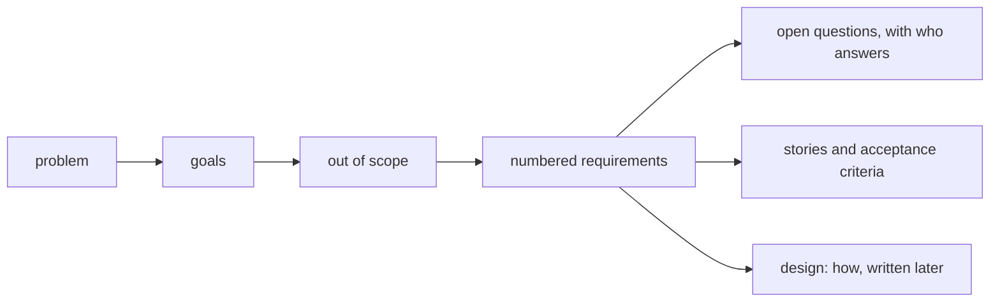

## Before you start

- [[management.l2.docs-as-code]] — you know documents live in the repository and change through pull requests, like code.
- [[management.l2.scope-change]] — you know the meeting notes kept refunds out of that sprint, with a reason, and turned them into later work.
- [[management.l1.user-story-and-ac]] — you know a story states who wants what and why, and its acceptance criteria make it checkable.

## The situation

Sprint 15 is about to start, and the refund flow is about to become stories. You pick up the first one: "As a customer, I want to request a refund for my paid order, so that I do not have to call." Questions arrive before you write a line. Can a customer get part of the money back, what about orders already `shipped`, does accounting need anything recorded, and who handles a refund the payment gateway, the outside service that moves the money, refuses? None of that fits in one story, and the next story will need the same answers. Where do the answers shared by every refund story live?

## Core concepts

- **requirements document** — a document stating a piece of work's problem, goals, what is out of scope, its checkable requirements and its open questions, written before anyone designs how to build it.
- out of scope — what this piece of work deliberately does not do, written down so nobody builds it or expects it.
- requirement — one numbered, checkable statement of what the system must do, written like an acceptance criterion and naming no class, table or endpoint.
- open question — something nobody can answer yet, written down with the person who will answer it and by when.

## How it works



A story is small on purpose: one person, one want, one reason. A feature such as refunds is several stories, and they share things none of them has room for: the problem behind them, the people affected, and the limits. In the situation above, partial refunds, `shipped` orders and accounting's needs are questions for the whole feature, not for one story. A requirements document is where those shared answers live.

It is written in the order of the diagram. The problem comes first, because every later line must serve it. The goals say what success looks like. Out of scope says what the work will not do, so nobody quietly adds it later. Then the requirements: each one numbered, so a story or a test can name it; each one checkable, like an acceptance criterion; each one about what the system must do, not how. A requirement that names a table or an endpoint has already made a design decision, before anyone has designed anything.

Last come the open questions. A question nobody can answer yet is not guessed; it is written down with the person who will answer it and a date. A guess hidden inside a requirement looks like a decision, and nobody knows to check it.

Stories and their acceptance criteria are then cut from the requirements. A separate document describes how to build them, later.

## In the Đơn Hàng system

The refund requirements, `docs/team/refund-requirements.md`, open like this:

```markdown file=docs/team/refund-requirements.md tag=stage-2 lines=1-25
# Yêu cầu: khách tự yêu cầu hoàn tiền cho đơn đã thanh toán

Bản nháp của product owner và đội Đơn Hàng, để các bên liên quan góp ý trước
Sprint 15 planning. Cách làm ở `docs/design/refund-design.md`.

## Vấn đề

Biên bản họp chặn hủy đơn (`meeting-notes-example.md`) quyết định: đơn `paid`
không hủy được từ ứng dụng, khách phải yêu cầu hoàn tiền. Hôm nay khách chỉ làm
được việc đó bằng cách gọi chăm sóc khách hàng. Nhân viên hoàn tiền bằng tay
trên trang quản trị của cổng thanh toán rồi báo kế toán qua email. Khách phải
chờ một cuộc gọi, chăm sóc khách hàng mất thời gian, kế toán đối soát từ email.

## Mục tiêu

1. Khách tự yêu cầu hoàn tiền cho đơn đã thanh toán, không cần gọi điện.
2. Kế toán đối soát được mỗi khoản hoàn tiền mà không phải hỏi lại ai.

## Ngoài phạm vi

- Hoàn một phần số tiền của đơn.
- Đơn `shipped`, kể cả đơn khách từ chối nhận: đó là câu hỏi còn mở từ biên bản
  họp, bộ phận vận hành trả lời.
- Đơn thanh toán khi nhận hàng.
- Nhân viên tạo yêu cầu hoàn tiền thay khách.
```

The opening says who wrote it, the product owner and the team, as a draft for the people affected to comment on before Sprint 15 planning, and where the design lives. The problem starts from the meeting notes' decision that a `paid` order cannot be cancelled from the app, so the customer must ask for a refund. That is the app; the API's cancel endpoint, `PATCH /api/v1/orders/{id}/cancel`, still cancels a `paid` order at this tag. Today a refund means a phone call, a manual refund on the admin page of the payment gateway, and an email to accounting.

Two goals follow: customers ask for refunds without calling, and accounting can check every refund without asking anyone. Out of scope lists four things, including partial refunds and `shipped` orders. For `shipped` orders it gives the reason: they are still an open question from the meeting notes, which the operations department will answer.

The requirements:

```markdown file=docs/team/refund-requirements.md tag=stage-2 lines=27-39
## Yêu cầu chức năng

- YC-1: Khách đã đăng nhập yêu cầu hoàn tiền được cho đơn của chính mình khi
  đơn ở trạng thái `paid`.
- YC-2: Khách không yêu cầu hoàn tiền được cho đơn của người khác; hệ thống từ
  chối và không thay đổi gì.
- YC-3: Số tiền hoàn bằng toàn bộ số tiền khách đã thanh toán cho đơn.
- YC-4: Sau khi gửi yêu cầu, khách thấy đơn đang hoàn tiền và không gửi được
  yêu cầu thứ hai cho cùng đơn.
- YC-5: Khi cổng thanh toán xác nhận đã hoàn tiền, đơn chuyển sang `cancelled`
  và khách nhận một email báo đã hoàn tiền.
- YC-6: Khi cổng thanh toán từ chối, nhân viên thấy yêu cầu đó trong danh sách
  cần xử lý, kèm lý do cổng trả về.
```

Six numbered statements, YC-1 to YC-6, each checkable: a customer refunds only their own `paid` order, the amount is the full amount paid, a second request is impossible, a confirmed refund cancels the order and sends an email, a refused one reaches staff with the gateway's reason. None names a class, a table or an endpoint. A second list, YC-7 to YC-10, describes how well the system must do this; the next lesson is about it.

The file ends with a table of open questions: what, who answers, by when. How many days after payment the gateway allows a refund, and whether bank-transfer orders can be refunded through it, go to the gateway's provider, asked by the product owner, in the first week of Sprint 15. The question of which refund list format accounting needs, and how often, goes to accounting itself, by the end of Sprint 15.

## Beginners often think…

- **"Agile teams use user stories, so they never need a requirements document."** → Actually, stories split a feature into small pieces, and the problem, limits and open questions they share still need one home. You notice this when three stories each answer "do we allow partial refunds?" differently.
- **"A requirements document should already say which tables and endpoints to use."** → Actually, naming a table or an endpoint is a design decision; written into the requirements, it is made before anyone weighed the options. You notice this when a design that would meet every need is rejected because a requirement named another table.
- **"What is out of scope is obvious, so it does not need writing down."** → Actually, what is obvious to the writer is a guess to everyone else, and an unwritten limit gets built by someone who meant well. You notice this when a story for partial refunds appears halfway through the sprint.

## Try it (3 minutes)

Open `docs/team/refund-requirements.md` at `stage-2`.

1. A teammate proposes letting staff create refund requests on a customer's behalf. Find the line that answers them.
2. Rewrite this draft requirement so it is checkable and names no table: "A unique index on the `payments` table handles duplicate refund requests properly."

Expected result: step 1 — out of scope, "Nhân viên tạo yêu cầu hoàn tiền thay khách": staff creating requests for customers is not part of this work. Step 2 — something like "Once a customer has sent a refund request for an order, they cannot send a second one for the same order." That is close to the file's YC-4; how duplicates are blocked is the design's choice.

Where would the question "Can a bank-transfer order be refunded through the gateway?" go if nobody knows the answer yet?

<details><summary>Suggested answer</summary>

Into the open questions table, with who answers it and by when, as the file does: the gateway's provider answers, the product owner asks, in the first week of Sprint 15. It is not written as a requirement until it is answered.

</details>

## Connections

- [[management.l2.docs-as-code]] — prerequisite: the requirements are a file in the repository, changed through pull requests like the code they lead to.
- [[management.l2.scope-change]] — prerequisite: the decision that kept refunds out of an earlier sprint is the problem this document starts from.
- [[management.l1.user-story-and-ac]] — prerequisite: the stories and acceptance criteria that are cut from these requirements.
- [[management.l2.risk-register]] — the risks of building the refund flow, kept in their own document; the requirements say what must happen, the register what could go wrong.
- [[management.l2.non-functional-requirements]] — next: the second list, how well the system must do it.

## Five-line summary

1. A requirements document states a work's problem, goals, out of scope, requirements and open questions, before anyone designs how.
2. It holds what one feature's stories share, the problem, the people and the limits, which no single story has room for.
3. The refund requirements start from the decision that paid orders cannot be cancelled in the app, and exclude partial refunds.
4. Each requirement is numbered and checkable like an acceptance criterion, and names no class, table or endpoint.
5. A question nobody can answer yet is written down with who will answer it, not guessed.
