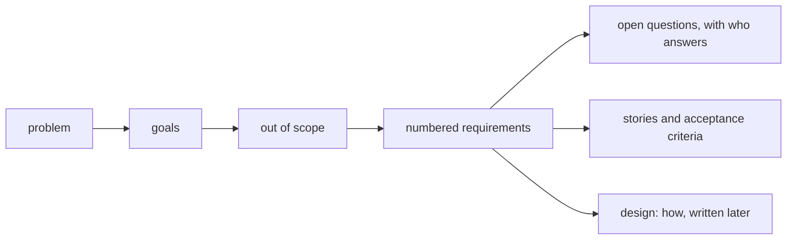

## Bạn cần biết trước

- [[management.l2.docs-as-code]] — bạn biết tài liệu nằm trong repository và đổi qua pull request, giống code.
- [[management.l2.scope-change]] — bạn biết biên bản họp đã để việc hoàn tiền ra ngoài sprint đó, kèm lý do, và biến nó thành việc của sau này.
- [[management.l1.user-story-and-ac]] — bạn biết một story nói ai muốn gì và vì sao, còn tiêu chí chấp nhận làm cho nó kiểm tra được.

## Tình huống

Sprint 15 sắp bắt đầu, và luồng hoàn tiền sắp được chia thành các story. Bạn nhận story đầu tiên: "Là khách hàng, tôi muốn yêu cầu hoàn tiền cho đơn đã thanh toán, để không phải gọi điện." Chưa viết dòng nào, câu hỏi đã tới. Khách có được hoàn một phần tiền không, đơn đã `shipped` thì sao, kế toán có cần ghi lại gì không, và ai xử lý một yêu cầu hoàn tiền bị cổng thanh toán, dịch vụ bên ngoài chuyển tiền, từ chối? Một story không chứa nổi những điều đó, và story kế tiếp sẽ cần đúng các câu trả lời ấy. Những câu trả lời mà mọi story hoàn tiền dùng chung nằm ở đâu?

## Khái niệm cốt lõi

- **tài liệu yêu cầu** (requirements document) — tài liệu nêu vấn đề, mục tiêu, những gì ngoài phạm vi, các yêu cầu kiểm tra được và các câu hỏi còn mở của một khối việc, viết trước khi ai đó thiết kế cách xây.
- ngoài phạm vi — những gì khối việc này cố ý không làm, được viết ra để không ai xây nó hay chờ đợi nó.
- yêu cầu — một câu đánh số, kiểm tra được, nói hệ thống phải làm gì, viết giống một tiêu chí chấp nhận và không nêu class, bảng hay endpoint nào.
- câu hỏi mở — điều chưa ai trả lời được, được ghi lại kèm người sẽ trả lời và hạn.

## Cơ chế hoạt động



Story nhỏ là có chủ ý: một người, một mong muốn, một lý do. Một tính năng như hoàn tiền gồm nhiều story, và chúng dùng chung những thứ mà không story nào đủ chỗ chứa: vấn đề đứng sau chúng, những người bị ảnh hưởng, và các giới hạn. Trong tình huống trên, hoàn một phần, đơn `shipped` và nhu cầu của kế toán là câu hỏi cho cả tính năng, không phải cho một story. Tài liệu yêu cầu là nơi những câu trả lời dùng chung đó nằm.

Nó được viết theo thứ tự của sơ đồ. Vấn đề đứng đầu, vì mọi dòng sau đều phải phục vụ nó. Mục tiêu nói thành công trông thế nào. Ngoài phạm vi nói việc này sẽ không làm gì, để không ai lặng lẽ thêm vào sau. Rồi tới các yêu cầu: mỗi yêu cầu được đánh số, để story hay test gọi tên được; mỗi yêu cầu kiểm tra được, như một tiêu chí chấp nhận; mỗi yêu cầu nói hệ thống phải làm gì, không phải làm thế nào. Một yêu cầu nêu tên bảng hay endpoint là đã ra một quyết định thiết kế, trước khi ai đó kịp thiết kế gì.

Cuối cùng là các câu hỏi mở. Câu hỏi chưa ai trả lời được thì không đoán; nó được ghi lại kèm người sẽ trả lời và một ngày. Một phỏng đoán giấu trong yêu cầu trông như một quyết định, và không ai biết phải kiểm lại.

Sau đó các story và tiêu chí chấp nhận của chúng được cắt ra từ các yêu cầu. Một tài liệu khác mô tả cách xây chúng, về sau.

## Trong hệ thống Đơn Hàng

Tài liệu yêu cầu hoàn tiền, `docs/team/refund-requirements.md`, mở đầu thế này:

```markdown file=docs/team/refund-requirements.md tag=stage-2 lines=1-25
# Yêu cầu: khách tự yêu cầu hoàn tiền cho đơn đã thanh toán

Bản nháp của product owner và đội Đơn Hàng, để các bên liên quan góp ý trước
Sprint 15 planning. Cách làm ở `docs/design/refund-design.md`.

## Vấn đề

Biên bản họp chặn hủy đơn (`meeting-notes-example.md`) quyết định: đơn `paid`
không hủy được từ ứng dụng, khách phải yêu cầu hoàn tiền. Hôm nay khách chỉ làm
được việc đó bằng cách gọi chăm sóc khách hàng. Nhân viên hoàn tiền bằng tay
trên trang quản trị của cổng thanh toán rồi báo kế toán qua email. Khách phải
chờ một cuộc gọi, chăm sóc khách hàng mất thời gian, kế toán đối soát từ email.

## Mục tiêu

1. Khách tự yêu cầu hoàn tiền cho đơn đã thanh toán, không cần gọi điện.
2. Kế toán đối soát được mỗi khoản hoàn tiền mà không phải hỏi lại ai.

## Ngoài phạm vi

- Hoàn một phần số tiền của đơn.
- Đơn `shipped`, kể cả đơn khách từ chối nhận: đó là câu hỏi còn mở từ biên bản
  họp, bộ phận vận hành trả lời.
- Đơn thanh toán khi nhận hàng.
- Nhân viên tạo yêu cầu hoàn tiền thay khách.
```

Phần mở đầu nói ai viết, product owner và đội, như một bản nháp để những người bị ảnh hưởng góp ý trước Sprint 15 planning, và bản thiết kế nằm ở đâu. Vấn đề bắt đầu từ quyết định trong biên bản họp: đơn `paid` không hủy được từ ứng dụng, nên khách phải yêu cầu hoàn tiền. Đó là ứng dụng; endpoint hủy của API, `PATCH /api/v1/orders/{id}/cancel`, ở tag này vẫn hủy được đơn `paid`. Hôm nay, hoàn tiền nghĩa là một cuộc gọi, một lần hoàn tiền bằng tay trên trang quản trị của cổng thanh toán, và một email cho kế toán.

Tiếp theo là hai mục tiêu: khách yêu cầu hoàn tiền mà không cần gọi điện, và kế toán đối soát được từng khoản hoàn tiền mà không phải hỏi ai. Ngoài phạm vi liệt kê bốn thứ, trong đó có hoàn một phần và đơn `shipped`. Với đơn `shipped`, nó nêu lý do: đó vẫn là câu hỏi còn mở từ biên bản họp, bộ phận vận hành sẽ trả lời.

Các yêu cầu:

```markdown file=docs/team/refund-requirements.md tag=stage-2 lines=27-39
## Yêu cầu chức năng

- YC-1: Khách đã đăng nhập yêu cầu hoàn tiền được cho đơn của chính mình khi
  đơn ở trạng thái `paid`.
- YC-2: Khách không yêu cầu hoàn tiền được cho đơn của người khác; hệ thống từ
  chối và không thay đổi gì.
- YC-3: Số tiền hoàn bằng toàn bộ số tiền khách đã thanh toán cho đơn.
- YC-4: Sau khi gửi yêu cầu, khách thấy đơn đang hoàn tiền và không gửi được
  yêu cầu thứ hai cho cùng đơn.
- YC-5: Khi cổng thanh toán xác nhận đã hoàn tiền, đơn chuyển sang `cancelled`
  và khách nhận một email báo đã hoàn tiền.
- YC-6: Khi cổng thanh toán từ chối, nhân viên thấy yêu cầu đó trong danh sách
  cần xử lý, kèm lý do cổng trả về.
```

Sáu câu đánh số, YC-1 đến YC-6, câu nào cũng kiểm tra được: khách chỉ hoàn tiền được đơn `paid` của chính mình, số tiền là toàn bộ số đã trả, không gửi được yêu cầu thứ hai, hoàn tiền được xác nhận thì hủy đơn và gửi email, hoàn tiền bị từ chối thì tới tay nhân viên kèm lý do cổng trả về. Không câu nào nêu class, bảng hay endpoint. Danh sách thứ hai, YC-7 đến YC-10, mô tả hệ thống phải làm việc này tốt đến mức nào; bài sau nói về nó.

File kết thúc bằng một bảng câu hỏi mở: câu hỏi gì, ai trả lời, hạn khi nào. Cổng cho hoàn tiền tới bao nhiêu ngày sau khi thanh toán, và đơn chuyển khoản ngân hàng có hoàn qua cổng được không, được giao cho bên cung cấp cổng, product owner đi hỏi, trong tuần đầu Sprint 15. Câu hỏi kế toán cần danh sách hoàn tiền dạng nào, bao lâu một lần, giao cho chính kế toán, hạn cuối Sprint 15.

## Người mới hay nghĩ rằng…

- **"Đội agile dùng user story, nên không bao giờ cần tài liệu yêu cầu."** → Thực ra, story chia tính năng thành từng mẩu nhỏ, còn vấn đề, giới hạn và câu hỏi mở mà chúng dùng chung vẫn cần một chỗ ở. Bạn sẽ nhận ra khi ba story trả lời câu "có cho hoàn một phần không?" theo ba kiểu.
- **"Tài liệu yêu cầu nên nói luôn dùng bảng nào, endpoint nào."** → Thực ra, nêu tên bảng hay endpoint là một quyết định thiết kế; viết vào tài liệu yêu cầu thì nó được quyết trước khi ai cân nhắc các phương án. Bạn sẽ nhận ra khi một thiết kế đáp ứng mọi nhu cầu bị loại chỉ vì một yêu cầu đã nêu tên bảng khác.
- **"Cái gì ngoài phạm vi thì ai cũng thấy, không cần viết ra."** → Thực ra, điều hiển nhiên với người viết là phỏng đoán với mọi người khác, và một giới hạn không được viết ra sẽ bị ai đó có thiện ý xây luôn. Bạn sẽ nhận ra khi một story cho hoàn tiền một phần xuất hiện giữa sprint.

## Thử ngay (3 phút)

Mở `docs/team/refund-requirements.md` ở `stage-2`.

1. Một đồng đội đề xuất cho nhân viên tạo yêu cầu hoàn tiền thay khách. Tìm dòng trả lời họ.
2. Viết lại yêu cầu nháp này để nó kiểm tra được và không nêu tên bảng: "A unique index on the `payments` table handles duplicate refund requests properly."

Kết quả mong đợi: bước 1 — mục ngoài phạm vi, "Nhân viên tạo yêu cầu hoàn tiền thay khách": nhân viên tạo yêu cầu thay khách không thuộc khối việc này. Bước 2 — đại loại "Khi khách đã gửi yêu cầu hoàn tiền cho một đơn, họ không gửi được yêu cầu thứ hai cho cùng đơn đó." Câu này gần với YC-4 trong file; chặn yêu cầu trùng bằng cách nào là lựa chọn của bản thiết kế.

Nếu chưa ai biết câu trả lời, câu hỏi "Đơn chuyển khoản ngân hàng có hoàn qua cổng thanh toán được không?" sẽ được đặt ở đâu?

<details><summary>Gợi ý đáp án</summary>

Vào bảng câu hỏi mở, kèm ai trả lời và hạn khi nào, đúng như file đã làm: bên cung cấp cổng trả lời, product owner đi hỏi, trong tuần đầu Sprint 15. Nó không được viết thành yêu cầu cho tới khi có câu trả lời.

</details>

## Liên hệ

- [[management.l2.docs-as-code]] — bài cần trước: tài liệu yêu cầu là một file trong repository, đổi qua pull request như chính code mà nó dẫn tới.
- [[management.l2.scope-change]] — bài cần trước: quyết định để việc hoàn tiền ra ngoài một sprint trước là vấn đề mà tài liệu này bắt đầu từ đó.
- [[management.l1.user-story-and-ac]] — bài cần trước: các story và tiêu chí chấp nhận được cắt ra từ các yêu cầu này.
- [[management.l2.risk-register]] — các rủi ro khi xây luồng hoàn tiền, giữ trong tài liệu riêng; tài liệu yêu cầu nói điều gì phải xảy ra, sổ rủi ro nói điều gì có thể hỏng.
- [[management.l2.non-functional-requirements]] — bài kế: danh sách thứ hai, hệ thống phải làm việc đó tốt đến mức nào.

## Tóm tắt 5 dòng

1. Tài liệu yêu cầu nêu vấn đề, mục tiêu, ngoài phạm vi, các yêu cầu và câu hỏi mở của một khối việc, trước khi ai thiết kế cách làm.
2. Nó giữ những gì các story của một tính năng dùng chung, vấn đề, con người và giới hạn, mà không story nào đủ chỗ chứa.
3. Tài liệu yêu cầu hoàn tiền bắt đầu từ quyết định đơn đã thanh toán không hủy được trong ứng dụng, và loại hoàn một phần.
4. Mỗi yêu cầu được đánh số, kiểm tra được như một tiêu chí chấp nhận, và không nêu class, bảng hay endpoint.
5. Câu hỏi chưa ai trả lời được thì ghi lại kèm người sẽ trả lời, không đoán.
