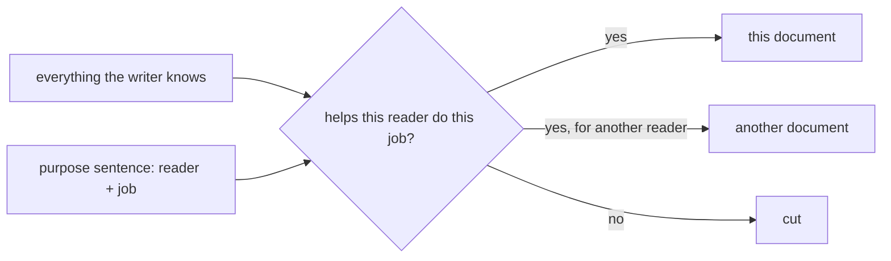

## Before you start

- [[management.l2.stakeholder-communication]] — you know an update works when it carries the part of the plan one reader needs, in that reader's words.
- [[foundation.l2.reading-docs]] — you know, from the reader's side, that a page answers some questions and not others, and that readers search for their part instead of reading from the top.

## The situation

A developer from another team joins Đơn Hàng next week. Their first job is to add a screen to `DonHang.App`, the Flutter client. Your team lead asks you to write them a page. You open a new file and start listing what you know: the three layers of the API, every middleware, the reverse proxy's routes, the EF Core migration, then the app's widgets one by one. Two pages later, the draft still does not say how to start the app. What decides what belongs in this page, and what stays out?

## Core concepts

- reader — the one person or role a document is written for, named before writing, such as "a developer new to this repository".
- reader's job — what that reader must be able to do once they finish reading, such as "start the app and find where screens live".
- purpose sentence — one sentence written before the document that names both: "For <reader>, so that they can <job>."
- move or cut — what happens to content that does not serve the purpose sentence: it moves to a document for another reader, or it is cut.

## How it works



Without a reader in mind, the writer's own knowledge decides what goes in. The writer knows a lot, so the document grows into a list of everything the writer knows, in the order the writer learned it. That is your two-page draft: accurate, and of little use to someone who wants to add a screen on Monday.

The fix starts before the first line. Write the purpose sentence: "For a developer new to Đơn Hàng, so that they can start the app and add a screen to it." In the situation above, the reader is the new developer and the job is starting the app and adding a screen.

Then hold each piece of content up to that sentence, as the diagram shows. How to run `scripts/up.sh` and where the screens live in `DonHang.App` serve the job, so they stay. The middleware order and the EF Core migration are true and useful, but to someone working on the API, not on this screen. They go to a document for that reader, or they are left to the code and its existing documents. Whatever serves no reader at all is cut.

The purpose sentence also decides the words. A reader new to the repository does not know the team's nicknames for things, so the page names files and commands exactly. For this reader, a shorter document that does its one job is the goal, not a complete one.

## In the Đơn Hàng system

At `stage-1`, `STAGE.md` describes what the tag contains. Its last table:

```markdown file=STAGE.md tag=stage-1 lines=59-70
| Path | What a lesson learns from it |
|---|---|
| `DonHang.Domain/*`, `DonHang.Infrastructure/*` | layers, DI, EF Core mapping, migrations, the repository interface |
| `DonHang.Api/Controllers/*`, `Program.cs` | REST resources, DTOs, status codes, middleware order, JWT |
| `DonHang.Api/Middleware/*` | exception handling, structured logging |
| `DonHang.Tests/*` | test doubles, a fake repository, what a green suite does not prove |
| `samples/DonHang.Samples/Samples/Design/*` | SOLID violations, contrasted with `Samples/Oop/*` |
| `DonHang.App/lib/*` | the widget tree, state, calling an API with `package:http` |
| `DonHang.App/lib/widgets/*` | LayoutBuilder list vs. grid, Semantics labels and 48-pixel tap targets (tested, not yet used by a screen) |
| `Caddyfile`, `docker-compose.yml` | reverse proxy, Docker images and layers, volumes, networks, Compose |
| `scripts/dev-secrets.sh` | secrets vs. config, where a JWT signing key lives |
| `docs/team/kanban-board-example.md` | Kanban, alongside `docs/team/sprint-example.md`'s Scrum |
```

This table has a clear reader: someone preparing lessons. Each row maps a new place in the repository to what a lesson can learn from it, and the lines after the table point lesson writers to the full list of files the tag must contain. The new developer in the situation is not this reader. The table tells them that `DonHang.App/lib/*` teaches "the widget tree", not how to start the app. `STAGE.md` is a good document for its reader, which is exactly why it is a poor fit for yours.

Now the file sitting in the folder your new teammate will open first:

```markdown file=DonHang.App/README.md tag=stage-1 lines=1-7
# donhang_app

A new Flutter project.

## Getting Started

This project is a starting point for a Flutter application.
```

This is the text Flutter's project template generated, unchanged. It says the folder is a new Flutter project and a starting point, and the rest of the file lists general Flutter learning resources. It says nothing about this app: not that it lists products and places orders, not that it calls the Đơn Hàng API, not how `scripts/up.sh` builds it. Nobody ever wrote a purpose sentence for this file.

## Beginners often think…

- **"A good document covers everything about the topic, so no reader ever misses anything."** → Actually, a document that covers everything makes each reader dig for their part, because it was written for nobody in particular. You notice this when a newcomer reads your two pages and still asks how to start the app.
- **"Technical writing should use as many technical terms as possible, because that makes it precise."** → Actually, precision comes from naming the exact file, command or value the reader needs; a term the reader does not know makes the sentence unreadable to them, however exact it is. You notice this when a reader asks what a word means before they can follow the next step.
- **"If the code is clean, nobody needs a document to understand it."** → Actually, clean code shows how something works once you have found it; it does not tell a newcomer which folder to open, which command starts the system, or why it was built this way. You notice this when someone spends their first morning finding out how to run what they were asked to change.

## Try it (3 minutes)

Open `DonHang.App/README.md` at `stage-1`, then the `STAGE.md` table quoted above.

1. Write a purpose sentence for `DonHang.App/README.md`: who opens that folder first, and what must they be able to do?
2. From the `STAGE.md` table, pick one row that serves your reader and one that does not.

Expected result: step 1 — something like "For a developer who opens `DonHang.App` for the first time, so that they can build and run the app and find where its screens are." Step 2 — `DonHang.App/lib/*` points at the right place, though its column is written for lesson writers; for example, the `samples/` row or the `scripts/dev-secrets.sh` row serves a different reader.

Where should the API's middleware order be described, if not in the app's page?

<details><summary>Suggested answer</summary>

In a document for someone working on the API, or left to the code under `DonHang.Api/Middleware/*` and `Program.cs`. It is true and useful, but not to someone adding a screen to the app. Leaving it out of the app's page is not hiding it; it is putting it where its reader looks.

</details>

## Connections

- [[management.l2.stakeholder-communication]] — prerequisite: the same idea, one reader and their part in their words, applied there to updates and here to any document.
- [[foundation.l2.reading-docs]] — prerequisite: the reader's side of the same page; here you write the page a reader can search.
- [[foundation.l2.asking-good-questions]] — a question is a short document for one reader whose job is to answer it.
- [[foundation.l2.writing-bug-reports]] — a bug report is written for one reader whose job is to reproduce the failure alone.
- [[management.l2.answer-first]] — next: once you know the reader, the order the content appears in.

## Five-line summary

1. Before writing, name one reader and what they must be able to do afterwards, and let that decide what goes in.
2. Without a named reader, a document grows into a list of everything the writer knows.
3. `STAGE.md`'s last table is written for people preparing lessons, mapping each new place to what a lesson can learn.
4. `DonHang.App/README.md` is still Flutter's template text and says nothing about this app.
5. Content that does not serve the reader's job moves to another reader's document or is cut.
