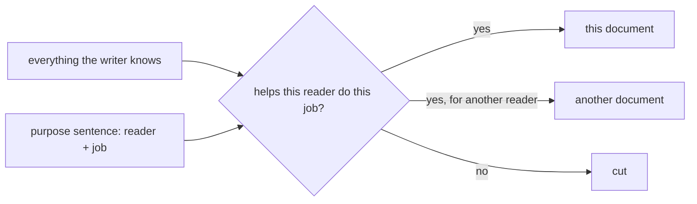

## Bạn cần biết trước

- [[management.l2.stakeholder-communication]] — bạn biết một bản cập nhật có tác dụng khi nó mang đúng phần kế hoạch mà một người đọc cần, bằng chữ của chính người đó.
- [[foundation.l2.reading-docs]] — từ phía người đọc, bạn biết một trang trả lời được một số câu hỏi chứ không phải mọi câu, và người đọc tìm phần của mình thay vì đọc từ đầu.

## Tình huống

Tuần sau, một lập trình viên từ đội khác chuyển sang Đơn Hàng. Việc đầu tiên của họ là thêm một màn hình vào `DonHang.App`, client Flutter. Trưởng nhóm nhờ bạn viết cho họ một trang. Bạn mở file mới và bắt đầu liệt kê những gì mình biết: ba tầng của API, từng middleware, các route của reverse proxy, migration EF Core, rồi lần lượt từng widget của app. Hai trang sau, bản nháp vẫn chưa nói cách chạy app. Điều gì quyết định cái gì thuộc về trang này, cái gì để ra ngoài?

## Khái niệm cốt lõi

- người đọc — một người hay một vai trò cụ thể mà tài liệu viết cho, được gọi tên trước khi viết, ví dụ "một lập trình viên mới với repository này".
- việc của người đọc — điều người đọc phải làm được khi đọc xong, ví dụ "chạy được app và tìm ra các màn hình nằm ở đâu".
- câu mục đích — một câu viết trước tài liệu, nêu cả hai điều trên: "Cho <người đọc>, để họ <làm được việc>."
- chuyển hoặc bỏ — số phận của nội dung không phục vụ câu mục đích: nó chuyển sang tài liệu cho một người đọc khác, hoặc bị bỏ.

## Cơ chế hoạt động



Khi không có người đọc trong đầu, chính hiểu biết của người viết quyết định cái gì được đưa vào. Người viết biết rất nhiều, nên tài liệu phình thành danh sách mọi thứ người viết biết, theo đúng thứ tự người viết đã học. Đó là bản nháp hai trang của bạn: chính xác, nhưng chẳng giúp được bao nhiêu cho người muốn thêm một màn hình vào thứ Hai.

Cách sửa bắt đầu trước dòng đầu tiên. Hãy viết câu mục đích: "Cho một lập trình viên mới với Đơn Hàng, để họ chạy được app và thêm một màn hình vào đó." Trong tình huống trên, người đọc là lập trình viên mới, còn việc của họ là chạy app và thêm màn hình.

Rồi đem từng phần nội dung so với câu đó, như sơ đồ cho thấy. Cách chạy `scripts/up.sh` và chỗ các màn hình nằm trong `DonHang.App` phục vụ đúng việc, nên được giữ. Thứ tự middleware và migration EF Core đúng và có ích, nhưng cho người làm API, không cho người làm màn hình này. Chúng chuyển sang tài liệu cho người đọc đó, hoặc để lại cho code và các tài liệu sẵn có. Thứ gì không phục vụ người đọc nào thì bỏ.

Câu mục đích còn quyết định cả cách dùng chữ. Người mới với repository chưa biết những cái tên đội hay gọi tắt, nên trang phải nêu đúng tên file và lệnh. Với người đọc này, mục tiêu là một tài liệu ngắn làm tròn một việc, không phải một tài liệu đầy đủ.

## Trong hệ thống Đơn Hàng

Ở `stage-1`, `STAGE.md` mô tả tag này có gì. Bảng cuối của nó:

```markdown file=STAGE.md tag=stage-1 lines=59-70
| Path | What a lesson learns from it |
|---|---|
| `DonHang.Domain/*`, `DonHang.Infrastructure/*` | layers, DI, EF Core mapping, migrations, the repository interface |
| `DonHang.Api/Controllers/*`, `Program.cs` | REST resources, DTOs, status codes, middleware order, JWT |
| `DonHang.Api/Middleware/*` | exception handling, structured logging |
| `DonHang.Tests/*` | test doubles, a fake repository, what a green suite does not prove |
| `samples/DonHang.Samples/Samples/Design/*` | SOLID violations, contrasted with `Samples/Oop/*` |
| `DonHang.App/lib/*` | the widget tree, state, calling an API with `package:http` |
| `DonHang.App/lib/widgets/*` | LayoutBuilder list vs. grid, Semantics labels and 48-pixel tap targets (tested, not yet used by a screen) |
| `Caddyfile`, `docker-compose.yml` | reverse proxy, Docker images and layers, volumes, networks, Compose |
| `scripts/dev-secrets.sh` | secrets vs. config, where a JWT signing key lives |
| `docs/team/kanban-board-example.md` | Kanban, alongside `docs/team/sprint-example.md`'s Scrum |
```

Bảng này có một người đọc rõ ràng: người soạn bài học. Mỗi dòng nối một chỗ mới trong repository với điều một bài học rút ra được từ đó, và những dòng ngay sau bảng chỉ cho người soạn bài danh sách đầy đủ các file mà tag phải có. Lập trình viên mới trong tình huống không phải người đọc này. Bảng cho họ biết `DonHang.App/lib/*` dạy "the widget tree", chứ không dạy cách chạy app. `STAGE.md` là tài liệu tốt cho người đọc của nó, và chính vì thế mà nó không hợp với người đọc của bạn.

Giờ đến file nằm trong thư mục mà đồng đội mới sẽ mở đầu tiên:

```markdown file=DonHang.App/README.md tag=stage-1 lines=1-7
# donhang_app

A new Flutter project.

## Getting Started

This project is a starting point for a Flutter application.
```

Đây là đoạn chữ template project của Flutter sinh ra, chưa ai sửa. Nó nói thư mục là một project Flutter mới, một điểm khởi đầu, còn phần còn lại của file liệt kê tài liệu học Flutter chung chung. Nó không nói gì về app này: không nói app liệt kê sản phẩm và đặt đơn, không nói app gọi API Đơn Hàng, không nói `scripts/up.sh` build nó thế nào. Chưa ai từng viết câu mục đích cho file này.

## Người mới hay nghĩ rằng…

- **"Tài liệu tốt phải bao quát mọi thứ về chủ đề, để không người đọc nào bỏ sót gì."** → Thực ra, tài liệu bao quát mọi thứ bắt từng người đọc tự đào tìm phần của mình, vì nó không viết cho ai cụ thể. Bạn sẽ nhận ra khi người mới đọc hết hai trang của bạn mà vẫn hỏi cách chạy app.
- **"Viết tài liệu kỹ thuật thì càng dùng nhiều thuật ngữ càng tốt, vì như thế mới chính xác."** → Thực ra, chính xác là nêu đúng file, lệnh hay giá trị người đọc cần; một thuật ngữ người đọc không biết làm câu văn trở nên không đọc được với họ, dù nó chính xác đến đâu. Bạn sẽ nhận ra khi người đọc phải hỏi một chữ nghĩa là gì rồi mới làm tiếp được bước sau.
- **"Code sạch thì không ai cần tài liệu để hiểu."** → Thực ra, code sạch cho thấy một thứ chạy thế nào khi bạn đã tìm ra nó; nó không cho người mới biết mở thư mục nào, lệnh nào khởi động hệ thống, hay vì sao hệ thống được xây như vậy. Bạn sẽ nhận ra khi có người mất cả buổi sáng đầu tiên chỉ để tìm cách chạy thứ họ được giao sửa.

## Thử ngay (3 phút)

Mở `DonHang.App/README.md` ở `stage-1`, rồi mở bảng `STAGE.md` đã trích ở trên.

1. Viết câu mục đích cho `DonHang.App/README.md`: ai là người mở thư mục đó đầu tiên, và họ phải làm được gì?
2. Từ bảng `STAGE.md`, chọn một dòng phục vụ người đọc của bạn và một dòng không phục vụ.

Kết quả mong đợi: bước 1 — đại loại "Cho một lập trình viên mở `DonHang.App` lần đầu, để họ build và chạy được app và tìm ra các màn hình nằm ở đâu." Bước 2 — `DonHang.App/lib/*` trỏ đúng chỗ, dù cột bên cạnh viết cho người soạn bài; còn ví dụ như dòng `samples/` hay dòng `scripts/dev-secrets.sh` thì phục vụ một người đọc khác.

Nếu không phải trong trang của app, thứ tự middleware của API nên được mô tả ở đâu?

<details><summary>Gợi ý đáp án</summary>

Trong một tài liệu cho người làm API, hoặc để lại cho code trong `DonHang.Api/Middleware/*` và `Program.cs`. Nó đúng và có ích, nhưng không cho người thêm màn hình vào app. Để nó ngoài trang của app không phải là giấu đi; đó là đặt nó ở chỗ người đọc của nó sẽ tìm.

</details>

## Liên hệ

- [[management.l2.stakeholder-communication]] — bài cần trước: cùng một ý, một người đọc và phần của họ bằng chữ của họ, ở đó áp dụng cho bản cập nhật, ở đây cho mọi tài liệu.
- [[foundation.l2.reading-docs]] — bài cần trước: phía người đọc của cùng một trang; ở đây bạn viết trang mà người đọc tìm được phần mình cần.
- [[foundation.l2.asking-good-questions]] — một câu hỏi là một tài liệu ngắn cho một người đọc có việc là trả lời nó.
- [[foundation.l2.writing-bug-reports]] — một bug report được viết cho một người đọc có việc là tự tái hiện được lỗi.
- [[management.l2.answer-first]] — bài kế: khi đã biết người đọc, đến thứ tự trình bày nội dung.

## Tóm tắt 5 dòng

1. Trước khi viết, gọi tên một người đọc và điều họ phải làm được sau khi đọc, rồi để điều đó quyết định nội dung.
2. Không có người đọc cụ thể, tài liệu phình thành danh sách mọi thứ người viết biết.
3. Bảng cuối của `STAGE.md` viết cho người soạn bài, nối mỗi chỗ mới với điều một bài học rút ra được.
4. `DonHang.App/README.md` vẫn là chữ template của Flutter và không nói gì về app này.
5. Nội dung không phục vụ việc của người đọc thì chuyển sang tài liệu của người đọc khác hoặc bỏ.
