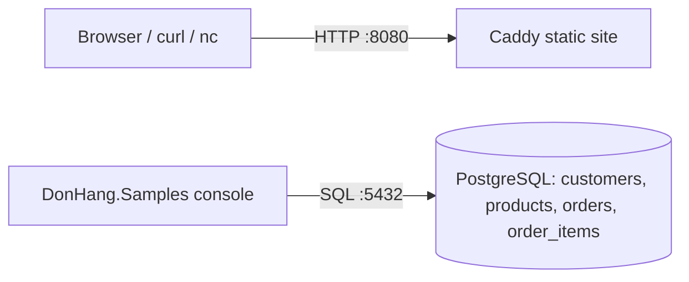

# Đơn Hàng — STAGE.md for tag `stage-0` (sample, to be produced by prompt 08)

## What exists at this tag
No .NET web API yet. `scripts/up.sh` starts the lab (learners only run this script; what is inside it is a stage-1 topic): a static site (`www/`)
served by Caddy on port 8080, PostgreSQL on 5432 with `db/schema.sql` + `db/seed.sql`, and a small Linux "lab box" reachable with
`scripts/terminal/ssh-into-lab.sh` on port 2222 (for the terminal, SSH and networking lessons — a second machine without needing one).
Also: `scripts/<module>/*.sh` for every command the lessons show, with outputs captured under `outputs/stage-0/scripts/<module>/<name>.txt`;
`samples/DonHang.Samples` console project (one file per lesson under `Samples/<Module>/`) reading the same database; `git-playground/`
builder for the Git lessons; `docs/<module>/*.md` quotable prose (team examples, question and bug-report templates, commit-message examples,
doc-reading checklist, a reading-order guide). The mandatory file list is `tools/validate --manifest 0`.

## Data flow

## Changed since previous tag
First tag.

## Quotable files
| File | What a lesson learns from it |
|---|---|
| `db/schema.sql` | tables, primary/foreign keys, one-to-many |
| `db/queries/*.sql` | one query per SQL lesson |
| `scripts/http/raw-request.sh` | a hand-written HTTP/1.1 request via `nc` (output in `outputs/stage-0/scripts/http/raw-request.txt`) |
| `scripts/http/*.sh` | methods, status codes, cookies, cache headers with `curl -i` |
| `samples/DonHang.Samples/Samples/Oop/*.cs` | encapsulation, polymorphism, interfaces on Order/Shipping/Notifier |
| `samples/DonHang.Samples/Samples/Debug/*.cs` | a wrong-total bug to debug; a deep throw for stack traces |
| `docs/team/*.md`, `docs/craft/*.md`, `docs/git/*.md`, `docs/clean-code/*.md` | quotable prose for management, craft, git and reading-code lessons |
