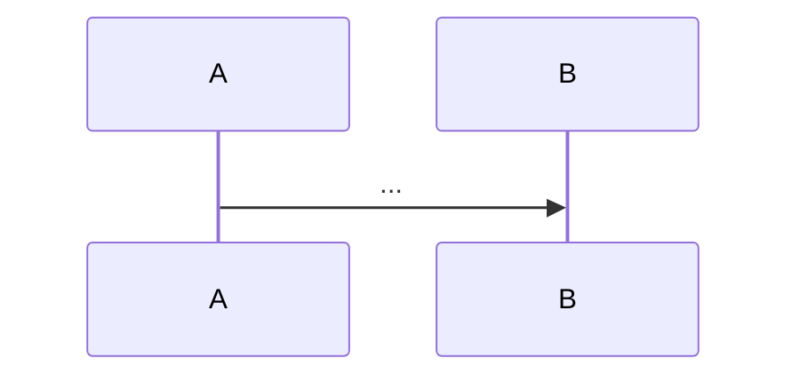

<!-- Optional, ONLY when main_path is false:
> Skip this if: ...one sentence naming who can safely skip and what they lose...
-->

## Before you start

- [[{{prereq_1}}]] — one clause on which idea from it this lesson builds on
- [[{{prereq_2}}]] — ...
<!-- Exactly one bullet per prereq id in frontmatter (1–4). A lesson with prereqs: [] has exactly one bullet:
     `- No prerequisites — start here.` -->

## The situation

<!-- 60–120 words. Concrete moment inside the Đơn Hàng system at tag {{example_tag}}.
     Name the actor (you, a customer, the on-call dev), the action, and the surprise.
     End with ONE question the rest of the lesson answers. No definitions here. -->

## Core concepts

<!-- 3–6 terms. Each = one sentence definition, in the order they appear in "How it works".
     Terms from `vocab` are **bold** here and ONLY here (sections 1–2 may use the word plainly; later sections do not re-bold). -->

- **term** — definition in one sentence, tied to the situation above.

## How it works

<!-- Exactly ONE mermaid block. Then 150–300 words walking through the diagram in order.
     Introduce each concept as "in the situation above, X is..." before generalising.
     Diagram: sequenceDiagram for flows, flowchart LR for decisions/pipelines, erDiagram for schema. ≤ 8 nodes. -->



## In the Đơn Hàng system

<!-- 1–2 code blocks, ≤ 25 lines each, copied VERBATIM from the example repo.
     Fence info: ```csharp file=src/DonHang.Api/Program.cs tag={{example_tag}} lines=12-31
     After each block: 2–5 sentences saying what to look at and why it matters for THIS lesson only.
     Optional: a ```text output=true block right after a command block, captured from CI. -->

```csharp file={{example_file}} tag={{example_tag}}
```

## Beginners often think…

<!-- Heading follows the STAGE: 0–2 "Beginners often think…", 3–4 "Seniors often assume…".
     LEVEL-4 lessons insert two sections BEFORE this one: "## Trade-offs" (table options × criteria) and
     "## What would you choose if…" (2–3 contexts), making this section 8 of 11.
     ≥ 2 items, each: "X" → actually Y, because Z. You notice it when W (a real symptom). -->

- **"..."** → Actually ... because ... You notice this when ...
- **"..."** → Actually ... because ... You notice this when ...

## Try it (3 minutes)

<!-- One action, one observation, one expected result. Only tools already in the example repo or the terminal.
     For concept-only lessons (management, architecture): a thinking exercise with a hidden suggested answer. -->

1. ...
2. ...

Expected result: ...

<details><summary>Suggested answer</summary>

...

</details>

## Connections

<!-- ≥ 2 links. State the RELATION, not just the link:
     "same idea one layer up in", "prerequisite for", "the fix for the problem in", "the opposite of". -->

- [[{{related_1}}]] — relation in one clause
- [[{{related_2}}]] — relation in one clause

## Five-line summary

1. ...
2. ...
3. ...
4. ...
5. ...
<!-- Exactly 5 numbered lines, ≤ 25 words each. Line 1 must be the single sentence this lesson exists to teach. -->
